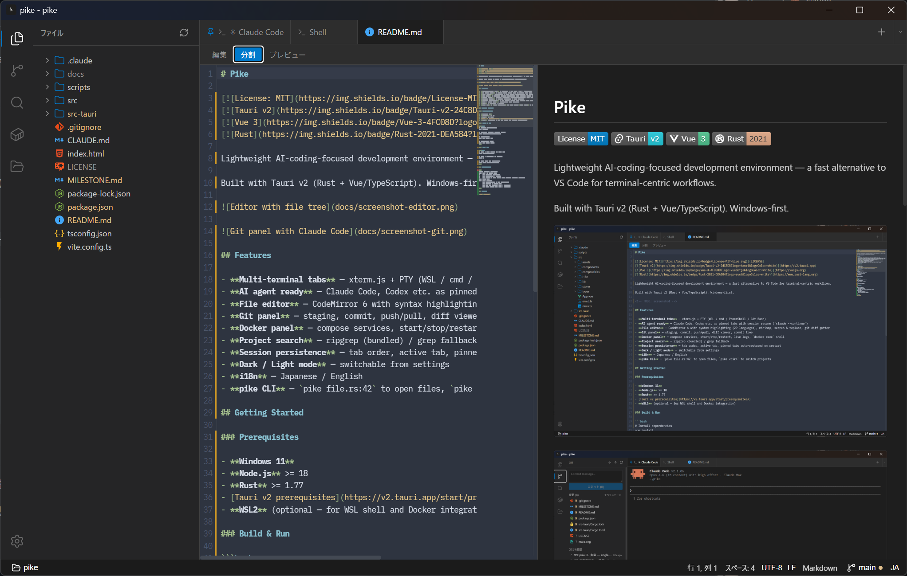
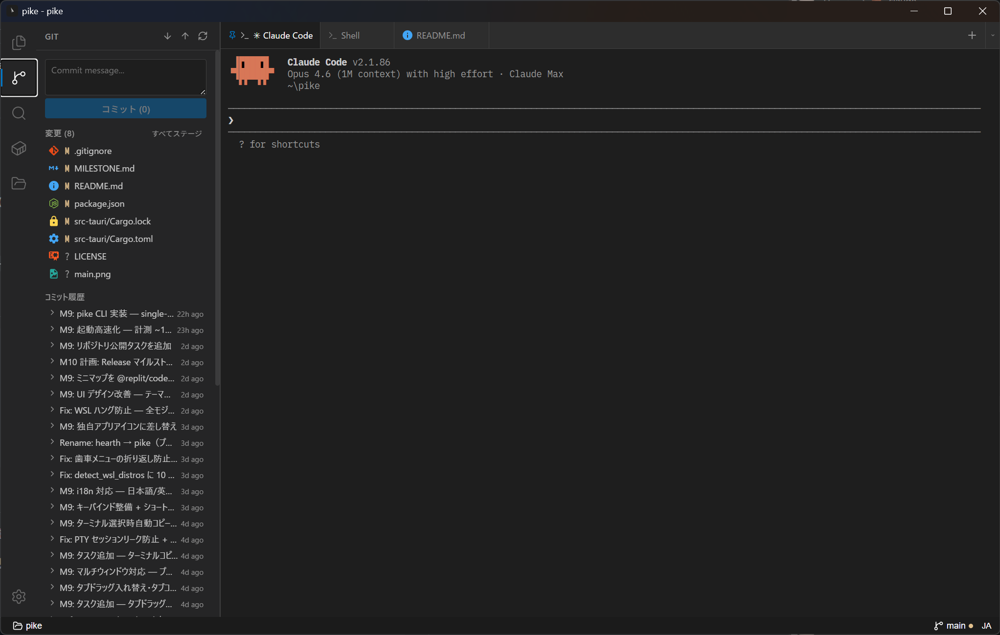

# Pike

[](LICENSE)
[](https://v2.tauri.app)
[](https://vuejs.org)
[](https://www.rust-lang.org)

Lightweight AI-coding-focused development environment — a fast alternative to VS Code for terminal-centric workflows.

Built with Tauri v2 (Rust + Vue/TypeScript). Windows-first.





## Features

- **Multi-terminal tabs** — xterm.js + PTY (WSL / cmd / PowerShell / Git Bash)
- **AI agent ready** — Claude Code, Codex etc. as pinned tabs with session resume (`claude --continue`)
- **File editor** — CodeMirror 6 with syntax highlighting (29 languages), minimap, search & replace, git diff gutter
- **Git panel** — staging, commit, push/pull, diff viewer, commit tree
- **Docker panel** — compose services, start/stop/restart, live logs, `docker exec` shell
- **Project search** — ripgrep (bundled) / grep fallback
- **Session persistence** — tab order, active tab, pinned tabs auto-restored on restart
- **Dark / Light mode** — switchable from settings
- **i18n** — Japanese / English
- **pike CLI** — `pike file.rs:42` to open files, `pike <dir>` to switch projects

## Getting Started

### Prerequisites

- **Windows 11**
- **Node.js** >= 18
- **Rust** >= 1.77
- [Tauri v2 prerequisites](https://v2.tauri.app/start/prerequisites/)
- **WSL2** (optional — for WSL shell and Docker integration)

### Build & Run

```bash
# Install dependencies
npm install

# Download bundled ripgrep binary
bash scripts/download-rg.sh

# Development
npm run tauri dev

# Production build
npm run tauri build
```

### pike CLI

```bash
# Open a file (jumps to line 42)
pike src/main.rs:42

# Open a directory as project
pike .

# Open file via subcommand
pike open path/to/file.ts
```

## Architecture

```
Tauri WebView (Windows)
├── Vue 3 + Pinia (UI)
│   ├── xterm.js terminals
│   ├── CodeMirror 6 editor
│   └── Panels — file tree, git, search, docker, projects
├── Tauri IPC
└── Rust backend
    ├── portable-pty — PTY management
    ├── bollard — Docker API
    ├── git CLI wrapper (WSL + Windows)
    └── File system ops (WSL + Windows)
```

## License

[MIT](LICENSE)
