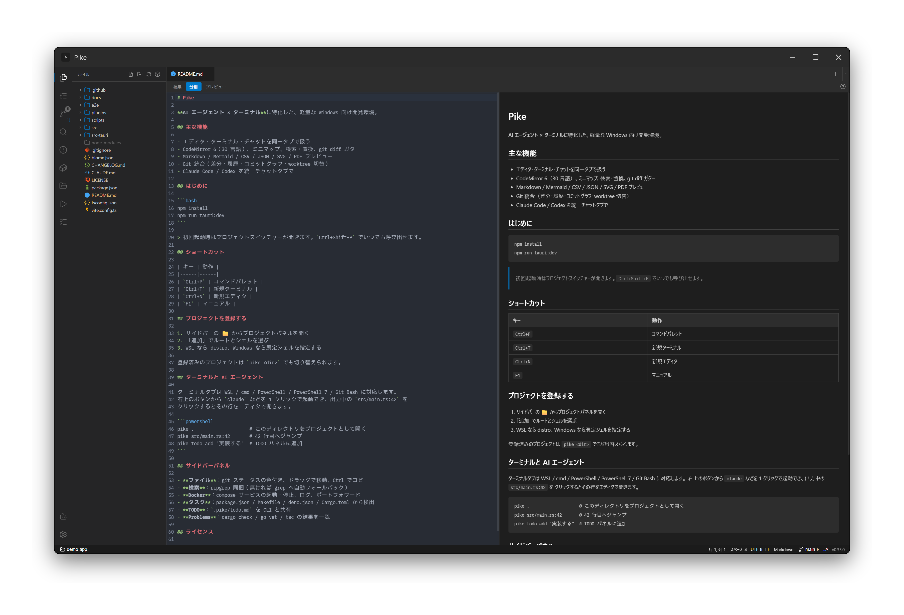
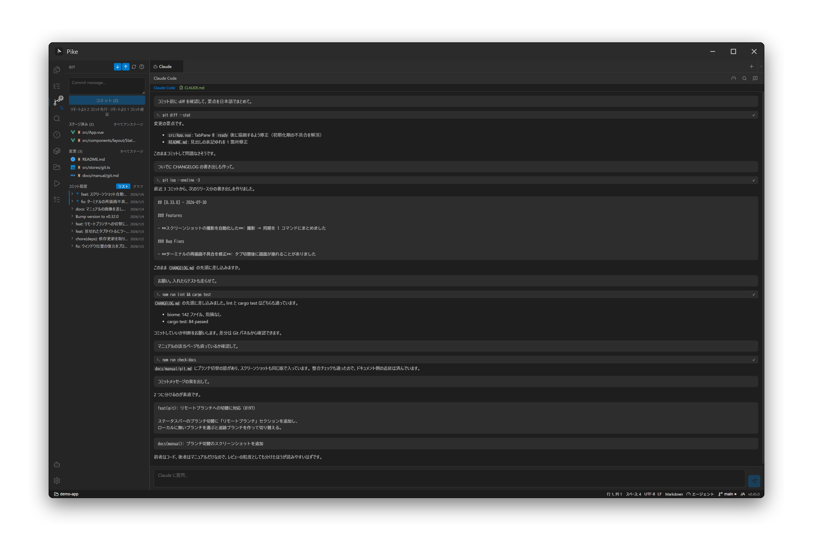

# Pike

[](LICENSE)
[](https://v2.tauri.app)
[](https://vuejs.org)
[](https://www.rust-lang.org)

**「AI エージェント × ターミナル」に特化した、軽量な Windows 向け開発環境です。** ターミナル中心で作業する開発者が VS Code の代わりに使えることを目指しています。

Tauri v2（Rust + Vue / TypeScript）製。Windows を主対象としています。

<picture>
  <source media="(prefers-color-scheme: light)" srcset="docs/screenshot-editor-light.png">
  
</picture>

<picture>
  <source media="(prefers-color-scheme: light)" srcset="docs/screenshot-git-light.png">
  
</picture>

## 主な機能

- **マルチターミナル**：xterm.js + PTY（WSL / cmd / PowerShell / PowerShell 7 / Git Bash）、タスクバーとトレイのメニューからのシェル選択
- **AI エージェント**：Claude Code と Codex を統一チャットタブで。`@` メンションでのファイル参照、セッション復帰
- **エージェント状態**：アカウント・利用率・トークン使用量とコストを Claude と Codex で並べて確認。複数アカウント（`CLAUDE_CONFIG_DIR`）にも追従
- **ターミナルの AI 補助**：`claude` 等をターミナルで使うための、ワンクリック起動 / 過去セッションの再開 / 定型プロンプト挿入、出力中のパスをクリックしてファイル・画像・ディレクトリを開く、エディタ選択範囲や診断をターミナルへ送る
- **エディタ**：CodeMirror 6（30+ 言語）、ミニマップ、検索・置換、git diff ガター、コンフリクトの解消、定義ジャンプ、文字コード/改行コード対応
- **プレビュー**：Markdown / Mermaid / CSV / JSON / SVG / PDF、外部画像はドメイン単位で許可、表示専用の画像ビューア
- **Git**：ステージング、コミット、push/pull、diff、コミットグラフ、コンフリクトの解消、止まった rebase / merge の再開、ブランチ切替、worktree 切替
- **サイドバーパネル**：ファイルツリー、検索（ripgrep 同梱）、Docker（モノレポの compose も検出）、タスクランナー（npm / pnpm / just / cargo ほか）、TODO、アウトライン、Problems
- **プロジェクト管理**：WSL / Windows プロジェクト、グループ整理（絞り込み・ドラッグでの並べ替え・絵文字アイコン）、マルチウィンドウ、セッション復元、プロジェクトごとのウィンドウ位置とサイズ、手元に無いプロジェクトの clone
- **設定**：UI / ターミナル / エディタの個別フォント設定、ダーク/ライト、日英 i18n、設定同期、自動更新
- **pike CLI**：`pike file.rs:42` でファイルを開く、`pike <dir>` でプロジェクト切替、`--wait` で `GIT_EDITOR` 連携、`pike todo` で TODO 操作
- **エージェントスキル**：`pike todo` の使い方を説明する Claude Code / Codex 向けスキルを [`plugins/`](plugins/README.md) に同梱

## 使い方

詳しい使い方は **[ユーザーマニュアル](docs/manual/README.md)** を参照してください。

- [はじめに（インストール・初回起動・画面構成）](docs/manual/getting-started.md)
- [プロジェクトとウィンドウ](docs/manual/projects-and-windows.md)
- [ターミナルと AI エージェント](docs/manual/terminal-and-agents.md)
- [エディタとプレビュー](docs/manual/editor-and-preview.md)
- [Git](docs/manual/git.md)
- [サイドバーパネル](docs/manual/panels.md)
- [設定](docs/manual/settings.md)
- [ショートカットと CLI](docs/manual/shortcuts-and-cli.md)

## インストール

[GitHub Releases](https://github.com/kan/pike/releases/latest) から最新のインストーラをダウンロードして実行します。

| ファイル | 種類 |
|----------|------|
| `Pike_x.x.x_x64-setup.exe` | Windows インストーラ（NSIS、推奨） |
| `Pike_x.x.x_x64_en-US.msi` | Windows インストーラ（MSI） |

インストール後は自動でアップデートを確認します。手動で確認するときは歯車メニュー →「更新を確認」から行えます。

## ソースからビルド

### 必要なもの

- **Windows 11**
- **Node.js** >= 20
- **Rust** >= 1.77
- [Tauri v2 の前提条件](https://v2.tauri.app/start/prerequisites/)
- **[just](https://just.systems/)**（タスクランナー。`winget install Casey.Just`）
- **WSL2**（任意。WSL シェルや Docker 連携を使う場合に必要）

### ビルドと実行

開発タスクは [`justfile`](justfile) にまとめてあります。`just` だけで一覧が出ます。
レシピは Git Bash で走るため、Windows では Git for Windows が必要です。

```bash
# 依存をインストール
npm install

# 同梱用の ripgrep バイナリをダウンロード
just fetch-rg

# 開発版（インストール版と共存して起動できます）
just dev

# 本番ビルド
just build

# コミット前チェック一式（Biome / vue-tsc / ドキュメント整合 / clippy / cargo test）
just check
```

## 開発・コントリビュート

アーキテクチャ、実装ルール、コミット規約などの開発者向け情報は **[CLAUDE.md](CLAUDE.md)** にまとまっています。

## ライセンス

[MIT](LICENSE)
