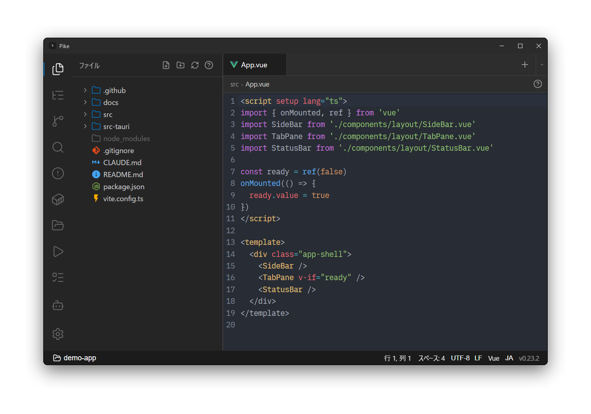

# Pike ユーザーマニュアル

Pike は「AI エージェント × ターミナル」に特化した、**軽量な Windows 向け開発環境**です。VS Code より軽いことを最大の差別化点としつつ、エディタ・ターミナル・Git・Docker・AI チャットを 1 つのタブ UI に統合しています。

このマニュアルは Pike の使い方を機能ごとにまとめたものです。はじめての方は [はじめに](getting-started.md) から読んでください。

<picture>
  <source media="(prefers-color-scheme: light)" srcset="img/overview-light.png">
  
</picture>

> Pike 内でこのマニュアルを表示しているときは、右上のツールバーから戻る・目次・ライト/ダーク切替・再読み込みが行えます。ライト/ダーク切替はマニュアル表示のみに効き、アプリ本体のテーマは変わりません。

## 目次

| ページ | 内容 |
|--------|------|
| [はじめに](getting-started.md) | インストール・初回起動・画面構成・最初のプロジェクト登録 |
| [プロジェクトとウィンドウ](projects-and-windows.md) | WSL / Windows プロジェクト、グループ、マルチウィンドウ、worktree |
| [グローバルモード](global-mode.md) | プロジェクトに依らないウィンドウ。ファイルを開く、ターミナル専用、GIT_EDITOR 連携 |
| [ターミナルと AI エージェント](terminal-and-agents.md) | ターミナル操作、シェル選択、エージェント補助ボタン、Claude Code / Codex チャット |
| [エディタとプレビュー](editor-and-preview.md) | コード編集、各種プレビュー、画像ビューア、定義ジャンプ、検索、文字コード |
| [Git](git.md) | ステージング・コミット・push/pull、diff、コミットグラフ、コンフリクト、worktree |
| [サイドバーパネル](panels.md) | ファイルツリー、検索、Docker、タスク、アウトライン、Problems、ファイル添付 |
| [設定](settings.md) | 外観・フォント・UI サイズ、全般（トレイ常駐）、ターミナル、エディタ、エージェント、設定同期、更新 |
| [ショートカットと CLI](shortcuts-and-cli.md) | キーボードショートカット、コマンドパレット、`pike` CLI、`--wait`、タスクバーとシステムトレイ |

## Pike の考え方（30 秒で把握）

- **タブ統一**：エディタやターミナル、Docker ログをすべて同じタブバーで扱います。`+` で増やし、ドラッグで並べ替え、ピン留めで固定できます。
- **左サイドバー**：ファイル / Git / 検索 / Docker / プロジェクト / タスク / アウトライン / Problems を、アイコンで切り替えます。
- **下部ステータスバー**：ブランチ、worktree セレクタ、ahead/behind、AI のトークン使用量、文字コード、改行コードなどを表示・操作します。
- **AI はターミナルでもチャットでも**：`claude` や `codex` をターミナルで直接使う運用と、専用チャットタブ（Claude Code / Codex）の両方に対応します。

## 関連

- インストール・概要・ビルド方法はリポジトリの [README](../../README.md) を参照してください。
- Pike の開発（コントリビュート・内部構造）については [CLAUDE.md](../../CLAUDE.md) を参照してください。
