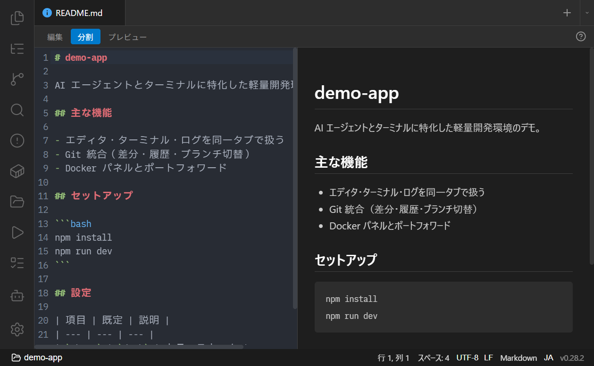
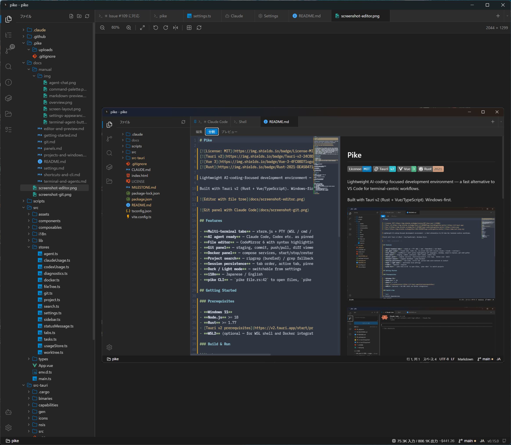

# エディタとプレビュー

Pike のエディタは **CodeMirror 6** ベースで、軽さを優先してシンタックスハイライトに特化しています（LSP・補完は搭載しません）。

- [コード編集](#コード編集)
- [検索と置換](#検索と置換)
- [定義ジャンプ](#定義ジャンプ)
- [Git diff ガターとコンフリクト表示](#git-diff-ガターとコンフリクト表示)
- [文字コードと改行コード](#文字コードと改行コード)
- [プレビュー（Markdown / CSV / JSON / Mermaid / SVG）](#プレビューmarkdown--csv--json--mermaid--svg)
- [画像ビューア](#画像ビューア)
- [PDF プレビュー](#pdf-プレビュー)

## コード編集


- **30+ 言語**のシンタックスハイライト。
- **保存**：`Ctrl+S`。未保存はタブタイトルに `*` が付きます。
- **新規ファイル**：存在しないパスを開くと空の新規ファイルになり、タブに「new」バッジが付きます。最初の保存でファイルが作成されます。
- **バイナリファイルの保護**：実行ファイルや ZIP などのバイナリはエディタで開かず、エラーを表示します。ステータスバーから文字コードを明示して開き直した場合は除きます（UTF-16 は BOM があればテキスト扱い）。
- **Undo / Redo**：`Ctrl+Z` / `Ctrl+Shift+Z`。
- **ミニマップ**：右端に表示（設定で ON/OFF）。シンタックスカラーと git diff も反映します。
- **コンテキストメニュー**：Undo/Redo/Cut/Copy/Paste/Git History。
- **外部変更の検知**：ディスク上でファイルが変わると、未編集タブは自動リロード、編集中タブはインライン警告バー（Reload / Overwrite / Dismiss）を出します。

エディタのフォント・サイズは設定タブの Editor セクションで、ターミナルとは独立して設定できます。→ [設定](settings.md)

## 検索と置換

- **`Ctrl+F`**：エディタ内検索（右上にフローティングパネル、マッチ数表示）。
- **`Ctrl+H`**：置換。

ファイル横断のプロジェクト検索は別パネルです。→ [サイドバーパネル](panels.md#検索ripgrep--grep)

## 定義ジャンプ

識別子を **`Ctrl+Click`** または **`F12`** で定義に移動できます。

- 同一ファイル内の宣言（構文木ベース）と、import 経由のクロスファイル定義の両方に対応。
- TS / JS / Vue / Go の import パスをたどります。Vue コンポーネントは `<script setup>` の PascalCase import / Options-API `components` / `app.component()` グローバル登録を解決します。
- tsconfig/jsconfig の `paths`、vite.config の `resolve.alias`（モノレポ対応）も解決します。
- 進捗・結果（開いたファイル名 / 見つからない 等）はステータスバーに表示されます。

## Git diff ガターとコンフリクト表示

- **diff ガター**：追加行（緑）・変更行（黄）・削除行（赤三角）を行番号の脇に表示します。
- **マージコンフリクト**：`<<<<<<<` / `=======` / `>>>>>>>` などのマーカー行と各セクション本文を色分けハイライトします（表示のみ）。コンフリクトしているファイルは Git パネルの「Conflicts」セクションからも開けます。→ [Git](git.md)

## 文字コードと改行コード

- **文字コード**：自動検出して開きます。ステータスバーから別エンコードで開き直し / 保存ができます。
- **改行コード**：ステータスバーの `LF` / `CRLF` 表示をクリックで切り替え、保存時に適用されます。

## プレビュー（Markdown / CSV / JSON / Mermaid / SVG）

これらの形式は専用タブではなく、エディタタブの **Edit / Split / Preview** トグルで切り替えて表示します。



- **Markdown** (`.md`): Edit / Split / Preview の 3 モード、スクロール同期。本文中の ```mermaid``` ブロックは図として描画。外部 URL リンクは確認のうえ外部ブラウザで開き、ローカルリンクはプロジェクト内に限定してエディタで開きます。
- **CSV / TSV**：テーブル表示（RFC 4180 準拠の引用符対応、先頭 10,000 行まで、ヘッダ固定）。
- **JSON / JSONL**：キー/文字列/数値/真偽/null を色分け（JSONL は 1000 件まで）。改行を含む文字列値はクリックでデコード表示。
- **Mermaid** (`.mermaid` / `.mmd`): 図として描画（ズーム対応）。
- **SVG**：サニタイズして安全に描画。

## 画像ビューア

画像ファイルは**表示専用**のビューアで開きます（ファイルは一切変更しません）。



- 拡大 / 縮小 / 100% / **ウィンドウに合わせる (fit)**
- 90° 回転（左右）・左右反転
- **Ctrl+ホイール**でカーソル位置を中心にズーム、ドラッグでパン、ダブルクリックで fit ⇔ 100%
- キーボード: `+` / `-` ズーム、`0`=100%、`f`=fit、`r` / `Shift+R`=回転
- 透過グリッド（チェッカーボード）背景の切替、画像実寸（W×H）表示

## PDF プレビュー

PDF は WebView 内蔵レンダラ（iframe）で表示します。

---

ファイルを開く経路（ファイルツリー / 検索結果 / `file:line` クリック / `pike` CLI）はそれぞれのページを参照してください。

関連: [サイドバーパネル](panels.md) / [Git](git.md) / [ショートカットと CLI](shortcuts-and-cli.md)
