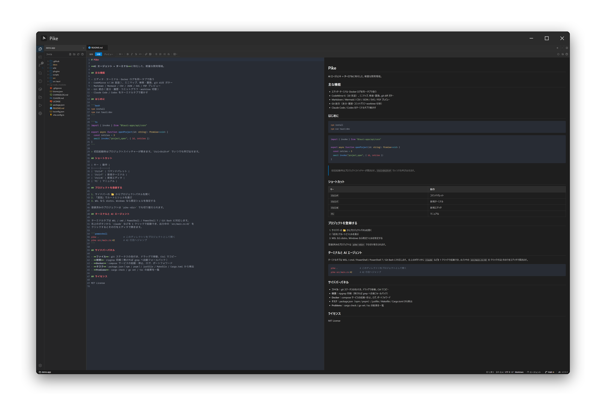
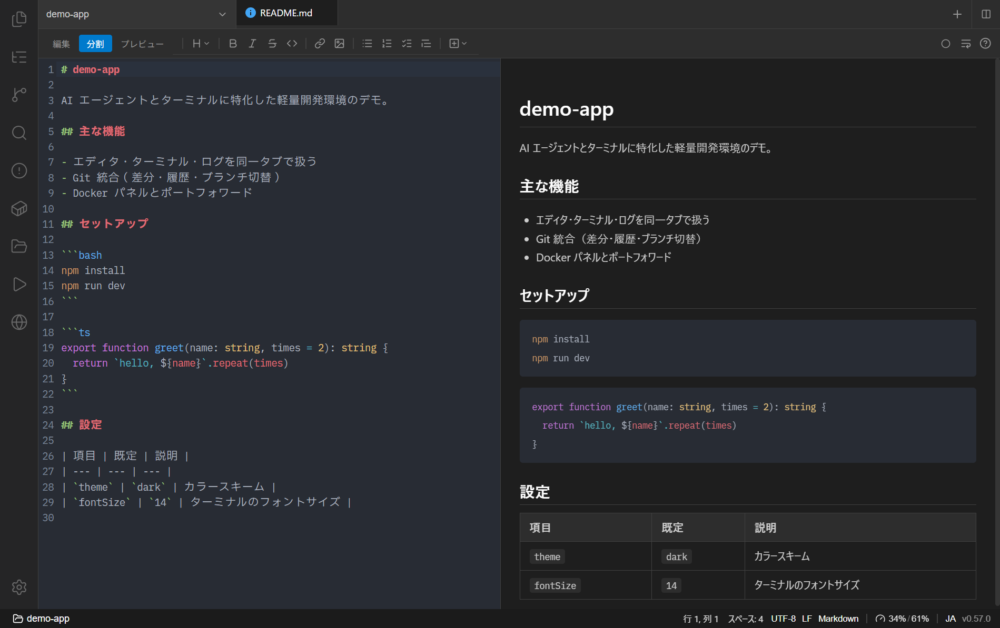
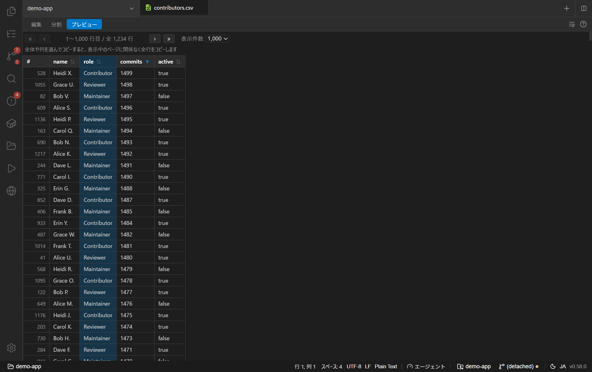
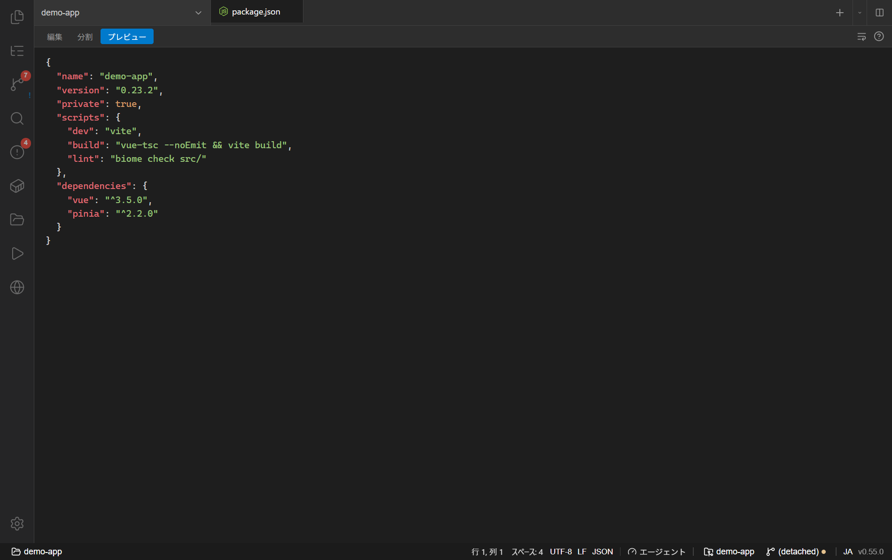
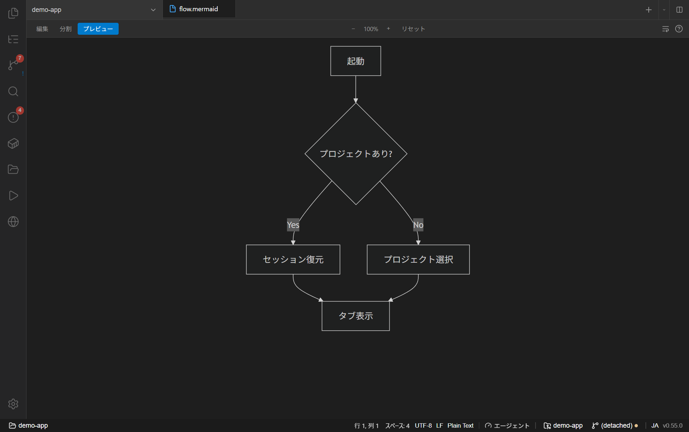
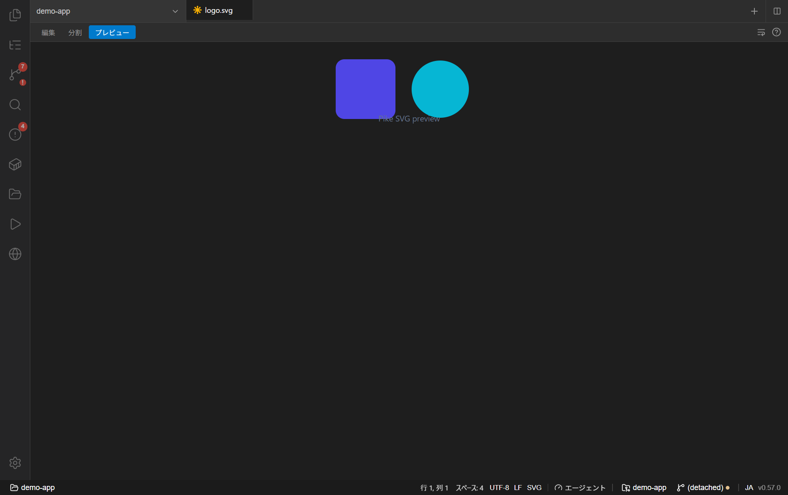
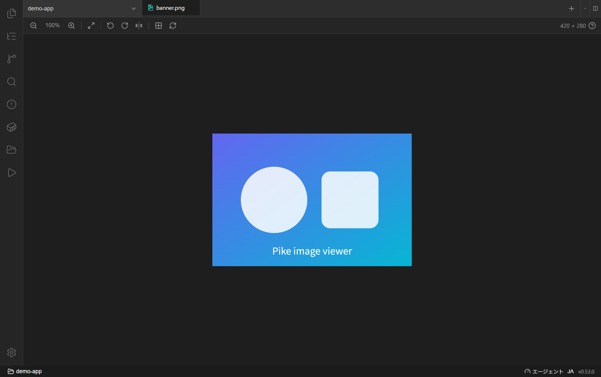
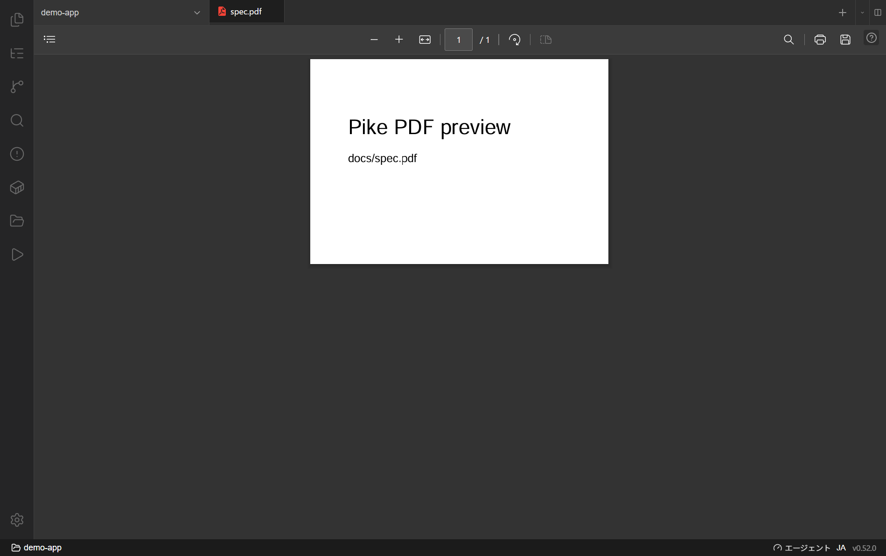

# エディタとプレビュー

Pike のエディタは **CodeMirror 6** ベースで、軽さを優先してシンタックスハイライトに特化しています（LSP・補完は搭載しません）。

- [コード編集](#コード編集)
- [検索と置換](#検索と置換)
- [定義ジャンプ](#定義ジャンプ)
- [Git diff ガターとコンフリクトの解消](#git-diff-ガターとコンフリクトの解消)
- [文字コードと改行コード](#文字コードと改行コード)
- [Markdown の入力支援](#markdown-の入力支援)
- [プレビュー（Markdown / rst / CSV / JSON / Mermaid / SVG）](#プレビューmarkdown--rst--csv--json--mermaid--svg)
- [リンクを開く](#リンクを開く)
- [外部ドメインの画像](#外部ドメインの画像)
- [画像ビューア](#画像ビューア)
- [PDF プレビュー](#pdf-プレビュー)

## コード編集

<picture>
  <source media="(prefers-color-scheme: light)" srcset="img/screenshot-editor-light.png">
  
</picture>

- **30+ 言語**のシンタックスハイライト。
- **保存**：`Ctrl+S`。未保存はタブタイトルに `*` が付きます。設定の[自動保存](settings.md#エディタ)を有効にすると、フォーカスが外れたとき、または打鍵が止まってから一定時間後に保存されます（`*` の表示と、閉じるときの確認はそのままです）。
- **新規ファイル**：存在しないパスを開くと空の新規ファイルになり、タブに「new」バッジが付きます。最初の保存でファイルが作成されます。
- **バイナリファイルの保護**：実行ファイルや ZIP などのバイナリはエディタで開かず、エラーを表示します。ステータスバーから文字コードを明示して開き直した場合は除きます（UTF-16 は BOM があればテキスト扱い）。
- **Undo / Redo**：`Ctrl+Z` / `Ctrl+Shift+Z`（`Ctrl+Y` も使えます）。
- **ミニマップ**：右端に本文と並べて表示（設定で ON/OFF、[タブごとの切り替え](#ミニマップの切り替え)もできます）。シンタックスカラーと git diff も反映します。
- **コンテキストメニュー**：Undo/Redo/Cut/Copy/Paste/Git History。
- **外部変更の検知**：ディスク上でファイルが変わると、未編集タブは自動リロード、編集中タブはインライン警告バー（Reload / Overwrite / Dismiss）を出します。

エディタのフォント・サイズは設定タブの「エディタ」セクションで、ターミナルとは独立して設定できます。→ [設定](settings.md)

## 検索と置換

- **`Ctrl+F`**：エディタ内検索（右上にフローティングパネル、マッチ数表示）。
- **`Ctrl+H`**：置換（検索パネルを置換行付きで開きます。パネル左端の折り畳みボタンからも開けます）。macOS では **`⌥⌘F`** です（`⌘H` は OS の「アプリを隠す」に割り当てられているため）。

このページの `Ctrl` は、macOS では `⌘` に読み替えてください。例外の一覧は [ショートカットと CLI](shortcuts-and-cli.md#macos-での読み替え) にあります。

ファイル横断のプロジェクト検索は別パネルです。→ [サイドバーパネル](panels.md#検索ripgrep--grep)

## 定義ジャンプ

識別子を **`Ctrl+Click`** または **`F12`** で定義に移動できます。

- 同一ファイル内の宣言（構文木ベース）と、import 経由のクロスファイル定義の両方に対応。
- TS / JS / Vue / Go の import パスをたどります。Vue コンポーネントは `<script setup>` の PascalCase import / Options-API `components` / `app.component()` グローバル登録を解決します。
- tsconfig/jsconfig の `paths`、vite.config の `resolve.alias`（モノレポ対応）も解決します。
- 進捗・結果（開いたファイル名 / 見つからない 等）はステータスバーに表示されます。

## Git diff ガターとコンフリクトの解消

- **diff ガター**：追加行（緑）・変更行（黄）・削除行（赤三角）を行番号の脇に表示します。
- **マージコンフリクト**：`<<<<<<<` / `|||||||` / `=======` / `>>>>>>>` のマーカー行と各セクション本文を色分けハイライトします。あわせて、各コンフリクトの上に採用する側を選ぶボタンが並び、エディタ上部には、件数とファイル全体へ一括適用するボタンのバーが出ます。詳しくは [Git のエディタ上で解消する](git.md#エディタ上で解消する) を参照してください。
- コンフリクトしているファイルは Git パネルの「Conflicts」セクションからも開けます。→ [Git](git.md)

## 文字コードと改行コード

- **文字コード**：自動検出して開きます。ステータスバーから別エンコードで開き直し / 保存ができます。
- **改行コード**：ステータスバーの `LF` / `CRLF` 表示をクリックで切り替え、保存時に適用されます。

## Markdown の入力支援

Markdown ファイル（`.md` / `.markdown`）を開くと、Edit / Split / Preview のトグルの右に記法を挿入するボタンが並びます。ボタンは選択範囲に対して働き、押すたびに付け外しが切り替わります。

| ボタン | 動作 |
|---|---|
| 見出し | 選択行を見出し 1〜6 にする。同じレベルをもう一度選ぶと本文に戻る |
| 太字 / 斜体 / 打ち消し線 / インラインコード | 選択範囲を囲む。すでに囲まれていれば外す |
| リンク | `[テキスト](URL)` を挿入。選択した文字列が URL ならリンク先に、クリップボードの URL はリンク先の初期値に入る |
| 画像 | ファイルを選んで `` を挿入。プロジェクト内の画像はそのまま相対パスで参照し、プロジェクトの外にある画像は Markdown ファイルと同じディレクトリにコピーします |
| 箇条書き / 番号付き / タスク / 引用 | 選択行の行頭マーカーを切り替える。番号付きは選択範囲内で振り直す |
| ブロックを挿入 | コードブロック、表、水平線、折りたたみ（`<details>`）、脚注のテンプレート。表は行数と列数を指定して挿入します |

- 1 回の操作は 1 回の Undo で戻せます。
- テンプレートの空欄は選択された状態で入るので、そのまま入力すると置き換わります。脚注は本文に `[^1]` を、ファイル末尾に定義行を足し、カーソルを定義側へ移します。
- リストと引用は `Enter` で継続し、番号は自動で増えます。空の項目で `Enter` を押すとマーカーが外れます。`Tab` / `Shift+Tab` で入れ子にできます。
- 選択したテキストの上に URL を貼り付けると、リンクになります（後述の[URL の貼り付け](#url-の貼り付け)も参照）。
- 脚注はプレビューでも番号付きで表示します。本文の番号を押すと注釈へ、注釈の ↩ を押すと本文へ戻ります。
- 表には見出し行が入ります（Markdown の表は見出し行と区切り行が前提のため）。指定する行数は見出しを除いた本文の行数です。
- 画像は貼り付け（`Ctrl+V`）とドラッグ&ドロップでも入ります。クリップボードの画像やエクスプローラーからのファイルは Markdown と同じディレクトリに保存し、ファイルツリーからドロップした画像はコピーせず相対パスで参照します。
- 保存前の無題タブでは画像を挿入できません（置き場所が決まらないため）。先に保存してください。
- 読み取り専用のタブ（コミットの内容を表示したものなど）にはボタンを出しません。

### URL の貼り付け

選択範囲がある状態で URL を貼ると、選んだ文字をリンクテキストにしたリンクができます。カーソルだけの位置に貼ると、そのまま URL が入ります。

**設定「貼り付けた URL をタイトル付きリンクにする」を ON にすると**、後者の場合はページのタイトルを読んで `[タイトル](URL)` に変えます。URL は先に入るので、取得できなくても貼り付けそのものは普通に終わります。Undo を 1 回押すと素の URL に戻ります。

この設定は**外部への通信を伴う唯一の編集機能**なので、既定は OFF です。初めて URL を貼ったときに 1 度だけ有効化するか尋ね、答えたあとは訊きません。設定 → エディタでいつでも変えられます。

### 折り返しの切り替え

ツールバーの折り返しボタンで、そのタブだけ折り返しを切り替えられます。Split 表示ではエディタ側が半分の幅になるので、その文書だけ折り返したいときに使います。

- 押していないタブは設定の既定値に従います。一度押したタブは、以後その値のままです。
- 切り替えはタブを開いているあいだだけ保たれます。設定を変えたいときは設定 → エディタの「折り返し（Word Wrap）」を使ってください。

### ミニマップの切り替え

折り返しボタンの隣のミニマップボタンで、そのタブだけミニマップの表示を切り替えられます。押していないタブは設定の既定値に従い、切り替えはタブを開いているあいだだけ保たれます（どちらも折り返しと同じです）。既定値は設定 → エディタの「ミニマップ」で変えられます。

## プレビュー（Markdown / rst / CSV / JSON / Mermaid / SVG）

これらの形式は専用タブではなく、エディタタブの **Edit / Split / Preview** トグルで切り替えて表示します。

<picture>
  <source media="(prefers-color-scheme: light)" srcset="img/markdown-preview-light.png">
  
</picture>

- **Markdown**（`.md`）：Edit / Split / Preview の 3 モード、スクロール同期。本文中の ```mermaid``` ブロックは図として描画。外部 URL リンクは確認のうえ外部ブラウザで開き、ローカルリンクはプロジェクト内に限定してエディタで開きます。ファイル先頭のフロントマターは本文から切り離して扱います（後述）。
- **reStructuredText**（`.rst`）：見出し・箇条書き・番号付きリスト・リテラルブロック・`code-block`・`note` などのアドモニション・フィールドリスト・リンク、表 4 種（grid / simple / `list-table` / `csv-table`）に対応します。表は全角を含む桁も揃えて読み取ります。**セルを結合した表と、`toctree` や `math` のような未対応のディレクティブは、解釈せず字面のまま出します**（読むためのプレビューなので、変換できない箇所を消すより残すほうが分かりやすいためです）。
  - **置換記法**：`.. |name| replace:: テキスト` と `.. |name| image:: 画像` を差し替えます。定義は本文のどこに書いても、参照より後ろでもかまいません。`unicode::` のように扱えない書き方で定義したものは、その定義と参照を字面のまま残します。
  - **`.. meta::`**：本文ではなく文書のメタデータなので、折り畳んだ表にして先頭に出します（Markdown のフロントマターと同じ見た目です）。文書の末尾に書いた場合も同じです。
- **CSV / TSV**：テーブル表示（RFC 4180 準拠の引用符対応、先頭 10,000 行まで、ヘッダ固定）。
- **JSON / JSONL**：キー/文字列/数値/真偽/null を色分け（JSONL は 1000 件まで）。改行を含む文字列値はクリックでデコード表示。
- **Mermaid**（`.mermaid` / `.mmd`）：図として描画（ズーム対応）。
- **SVG**：スクリプトやイベント属性を除去（サニタイズ）してから描画。

CSV / JSON / Mermaid / SVG の表示はそれぞれ次のようになります。

<picture>
  <source media="(prefers-color-scheme: light)" srcset="img/csv-preview-light.png">
  
</picture>

<picture>
  <source media="(prefers-color-scheme: light)" srcset="img/json-preview-light.png">
  
</picture>

<picture>
  <source media="(prefers-color-scheme: light)" srcset="img/mermaid-preview-light.png">
  
</picture>

<picture>
  <source media="(prefers-color-scheme: light)" srcset="img/svg-preview-light.png">
  
</picture>


### Markdown のフロントマター

Hugo、Jekyll、Astro、Zola、Obsidian などが使うフロントマターを、Markdown プレビューでは本文と分けて表示します。プレビュー冒頭に折り畳んだ「フロントマター」ブロックが出て、開くとキーと値の表になります。

対応する記法は 3 つです。

| 記法 | 開始 | 終了 |
|---|---|---|
| YAML | `---` | `---` |
| TOML | `+++` | `+++` |
| JSON | `{` | `}` |

判定はファイル 1 行目のデリミタだけで行います。本文の途中にある `---` は水平線のままです。

入れ子のキーは `nested.x` のようにドットでつないだ 1 行にまとめます。パースに失敗したときは、ブロックを開いた状態でエラー文と元のテキストを表示します。

フロントマターはアウトラインパネルの見出し一覧にも出ません。

## リンクを開く

Markdown プレビューやマニュアル、issue タブの本文にあるリンクと、ターミナルや Docker ログの出力に出た URL は、クリックすると確認ダイアログを挟んで外部ブラウザで開きます。

ダイアログの **「（ドメイン名）のリンクは今後確認しない」** にチェックを入れて開くと、そのドメインのリンクは以後確認なしで開きます。許可したドメインの一覧は設定タブの「エディタ」セクションにあり、行の削除ボタンで取り消せます。

判定はドメイン名の完全一致です。`github.com` を許しても `raw.githubusercontent.com` は別のドメインとして扱い、あらためて確認します。[外部ドメインの画像](#外部ドメインの画像)とは別の一覧です。画像を許可したドメインでも、リンクを開くときは確認します。

メールアドレスへのリンク（`mailto:`）は、確認のうえ既定のメールソフトで開きます。こちらはドメイン単位の省略の対象外で、毎回確認します。

これ以外のリンク（`ftp:` や `tel:` など）は、Pike が開けないためリンクにしません。文字としてはそのまま読めます。

## 外部ドメインの画像

Markdown プレビューは、外部ドメインの画像を既定では読み込みません。README のバッジのように、開いただけで第三者のサーバーへ接続してしまうためです。

画像のあった場所には **画像を表示（ドメイン名）** のボタンが出ます。押すと確認ダイアログが出て、許可するとそのドメインの画像を以後は確認なしで表示します。取得に失敗したときはボタンがその旨に変わり、押すと同じ画像を取り直します。

許可したドメインの一覧は設定タブの「エディタ」セクションにあり、行の削除ボタンで取り消せます。取り消すと、その場でボタン表示に戻ります。

対象は `https` の画像だけです。`http` の画像にはボタンを出しません。

プロジェクト内の画像は相対パスでも `/` で始まるパス（プロジェクトルート起点）でも表示します。`.svg` や、`?` `#` の付いたパスも同じように扱います。プロジェクトの外を指すパスは読み込みません。

## 画像ビューア

画像ファイルは表示専用のビューアで開きます。以下の操作はすべて見え方だけを変え、ファイルは書き換えません。

<picture>
  <source media="(prefers-color-scheme: light)" srcset="img/image-viewer-light.png">
  
</picture>

- 拡大 / 縮小 / 100% / **ウィンドウに合わせる (fit)**
- 90° 回転（左右）・左右反転
- **Ctrl+ホイール**でカーソル位置を中心にズーム、ドラッグでパン、ダブルクリックで fit ⇔ 100%
- **キーボード**：`+` / `-` ズーム、`0`=100%、`f`=fit、`r` / `Shift+R`=回転
- 透過グリッド（チェッカーボード）背景の切替、画像実寸（W×H）表示

## PDF プレビュー

PDF は WebView 内蔵レンダラ（iframe）で表示します。
<picture>
  <source media="(prefers-color-scheme: light)" srcset="img/pdf-tab-light.png">
  
</picture>


---

ファイルの開き方（ファイルツリー / 検索結果 / `file:line` クリック / `pike` CLI）はそれぞれのページを参照してください。

関連: [サイドバーパネル](panels.md) / [Git](git.md) / [ショートカットと CLI](shortcuts-and-cli.md)
