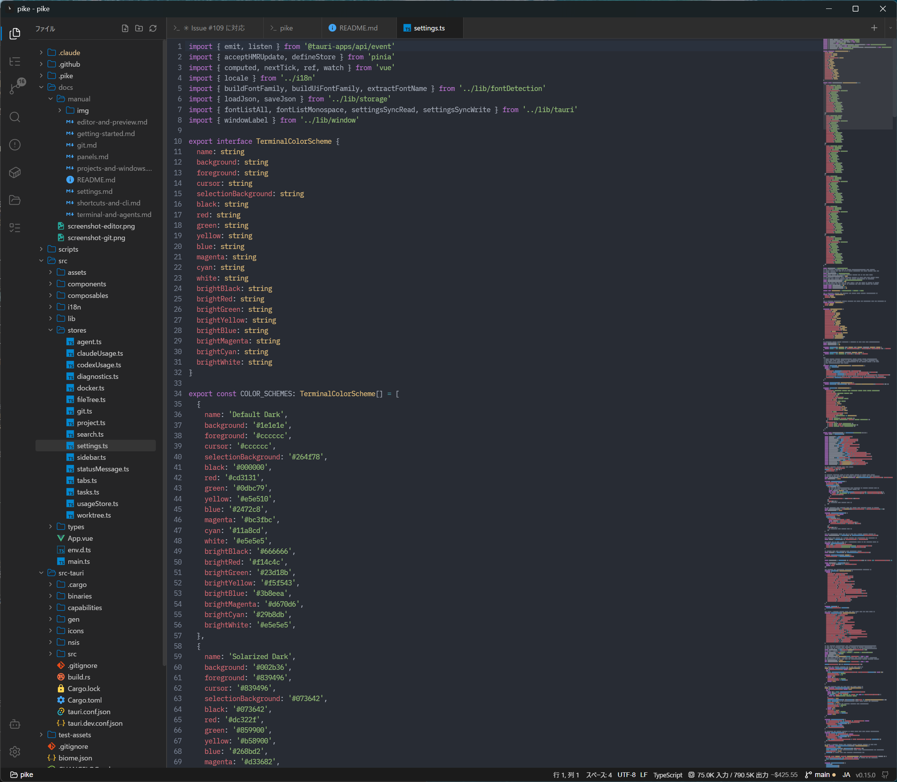
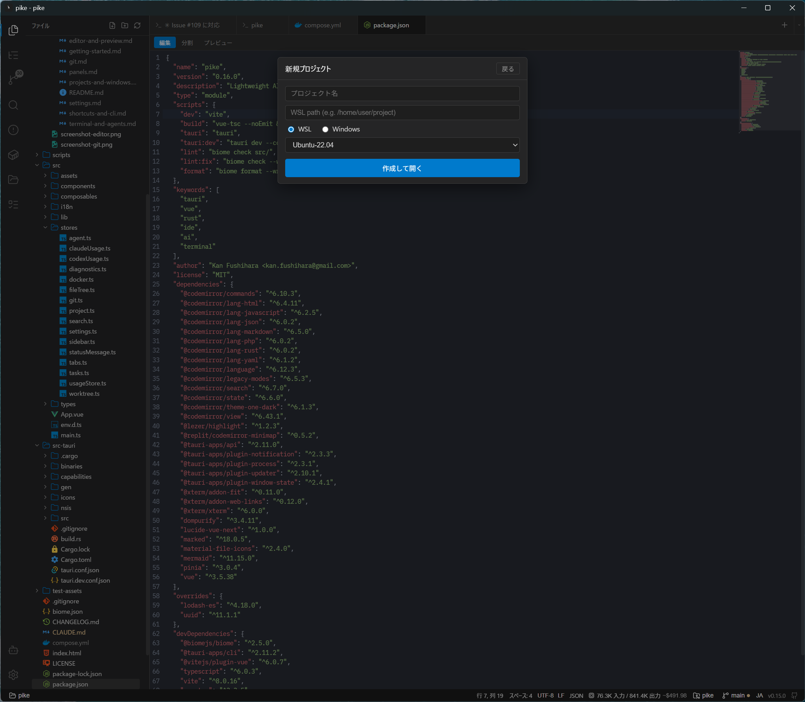

# はじめに

Pike を初めて使うときの流れをまとめます。

- [インストール](#インストール)
- [初回起動](#初回起動)
- [画面構成](#画面構成)
- [最初のプロジェクトを登録する](#最初のプロジェクトを登録する)
- [タブの基本操作](#タブの基本操作)

## インストール

[GitHub Releases](https://github.com/kan/pike/releases/latest) から最新のインストーラをダウンロードして実行します。

| ファイル | 種類 |
|----------|------|
| `Pike_x.x.x_x64-setup.exe` | NSIS インストーラ（推奨） |
| `Pike_x.x.x_x64_en-US.msi` | MSI インストーラ |

インストール後は GitHub Releases を参照して**自動でアップデートを確認**します。手動で確認したい場合は、左下の歯車メニュー → 「更新を確認」、または設定タブの About セクションから行えます。

> **WSL を使う場合**: WSL シェルや Docker 連携を使うには WSL2 が必要です。ファイル監視の自動更新には WSL 側に `inotify-tools`（`sudo apt install inotify-tools`）を入れておくと快適です（無くても動作します）。

## 初回起動

初回はプロジェクトが登録されていないため、空の状態で起動します。左サイドバーの **📁 プロジェクト** アイコンを開き、プロジェクトを登録するところから始めます。

2 回目以降は、前回開いていたプロジェクトとタブ（並び順・アクティブタブ・ピン留め）が**自動で復元**されます。

## 画面構成

| 部位 | 役割 |
|------|------|
| **左サイドバー（アイコンナビ）** | ファイル / Git / 検索 / Docker / プロジェクト / タスク / アウトライン / Problems の切り替え。下部に AI エージェント起動と歯車（設定）アイコン |
| **タブバー** | エディタ・ターミナル・チャット・各種プレビューを同じ場所で扱う。`+` で新規ターミナル、ドラッグで並べ替え |
| **タブコンテンツ** | アクティブなタブの中身（ターミナル / エディタ / チャットなど） |
| **ステータスバー（下端）** | ブランチ、worktree セレクタ、ahead/behind、トークン使用量、文字コード、改行コード、リポジトリリンク |

サイドバーのパネルは**幅をドラッグで調整**でき、開閉状態・幅は記憶されます。

## 最初のプロジェクトを登録する

1. 左サイドバーの **📁 プロジェクト** を開く
2. 「新規作成」からプロジェクトを追加する
3. プラットフォームを選ぶ
   - **WSL プロジェクト**: ディストロを指定し、ルートを WSL パスで指定
   - **Windows プロジェクト**: デフォルトシェル（cmd / PowerShell / Git Bash）を選び、ルートを Windows パスで指定
4. 登録したプロジェクトをクリックすると切り替わり、固定タブ（既定では Claude Code）とファイルツリーが読み込まれます

プロジェクトは**グループ**にまとめて折りたたんで整理できます。詳しくは [プロジェクトとウィンドウ](projects-and-windows.md) を参照してください。

> **コマンドラインから開く**: `pike .`（カレントディレクトリをプロジェクトとして開く）、`pike path/to/file.rs:42`（ファイルを開いて 42 行目へジャンプ）も使えます。→ [ショートカットと CLI](shortcuts-and-cli.md)

## タブの基本操作

- **新規ターミナル**: タブバー右の `+`。Windows プロジェクトでは横の `▾` から別シェルも選べます
- **新規エディタ**: `Ctrl+N`、またはタブバーの空き領域をダブルクリック
- **タブを閉じる**: タブの `✕`、`Ctrl+W`、またはマウス中ボタンクリック
- **並べ替え**: タブをドラッグ
- **ピン留め**: タブを右クリック → Pin（ピン留めタブは自動クローズや一括クローズの対象外）
- **右クリックメニュー**: Pin/Unpin、Close、Close Others、Close to the Right、Close Saved、Close All（ファイル系タブでは Copy Path、エディタタブでは Git History も）

次のステップ: [プロジェクトとウィンドウ](projects-and-windows.md) / [ターミナルと AI エージェント](terminal-and-agents.md)
