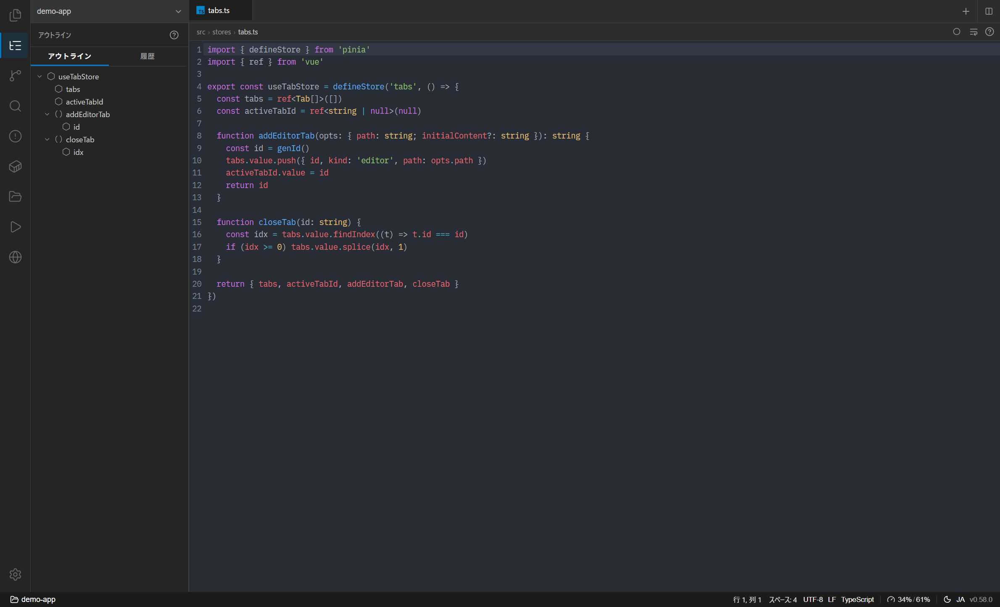
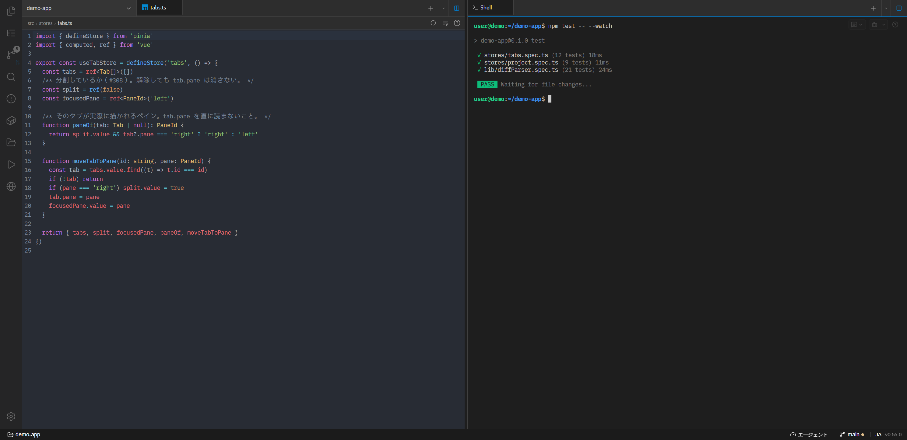

# はじめに

インストールから最初のプロジェクト登録までを順に説明します。

- [インストール](#インストール)
- [初回起動](#初回起動)
- [画面構成](#画面構成)
- [最初のプロジェクトを登録する](#最初のプロジェクトを登録する)
- [タブの基本操作](#タブの基本操作)

## インストール

[GitHub Releases](https://github.com/kan/pike/releases/latest) から最新のインストーラをダウンロードして実行します。

| ファイル | 種類 |
|----------|------|
| `Pike_x.x.x_x64-setup.exe` | Windows・NSIS インストーラ（推奨） |
| `Pike_x.x.x_x64_en-US.msi` | Windows・MSI インストーラ |
| `Pike_x.x.x_aarch64.dmg` | macOS（Apple Silicon） |

NSIS インストーラは 2 つの登録をします。インストール先をユーザーの PATH に加えて `pike` コマンドをターミナルから使えるようにし、エクスプローラーの「プログラムから開く」候補に Pike を追加します（既定の関連付けは変更しません。どちらもアンインストールで削除されます）。MSI インストーラでは、このどちらも登録されません。

インストール後、GitHub Releases を参照して自動でアップデートを確認します。手動で確認したい場合は、左下の歯車メニュー → 「更新を確認」、または設定タブの「バージョン情報」セクションから行えます。

> **macOS 版について**：Apple Silicon 版だけを配布しています。Apple Developer ID で署名して公証しているため、ダウンロードしてそのまま開けます。自動アップデートも Windows 版と同じように働きます。WSL・ジャンプリスト・管理者ターミナル・ウィンドウ背景の透過など、Windows の機能に依存するものは動きません。

> **WSL を使う場合**：WSL シェルや Docker 連携を使うには WSL2 が必要です。ファイル監視には WSL 側の `inotify-tools`（`sudo apt install inotify-tools`）を使います。入れておくと、WSL 側でのファイル変更がファイルツリーとエディタに自動で反映されます。無くても Pike は動作しますが、変更は自動では反映されません。

## 初回起動

初回はプロジェクトが登録されていないため、空の状態で起動します。左サイドバーの **📁 プロジェクト** アイコンを開き、プロジェクトを登録するところから始めます。

2 回目以降は、前回開いていたプロジェクトとタブ（並び順・アクティブタブ・ピン留め）が自動で復元されます。

## 画面構成

<picture>
  <source media="(prefers-color-scheme: light)" srcset="img/screen-layout-light.png">
  
</picture>

| 部位 | 役割 |
|------|------|
| **左サイドバー（アイコンナビ）** | ファイル / アウトライン / Git / 検索 / Problems / Docker / プロジェクト / タスクランナー の切り替え。下部に歯車（設定）アイコン。プロジェクトカラーを設定していると、この列がその色になります |
| **プロジェクトバー** | 開いているプロジェクトの名前。クリックで保持しているプロジェクトへ切り替え。パネルを開いているときはサイドバーの最上部、閉じているときはタブバーの左端に出ます（[切り替え](projects-and-windows.md#タブを保持したまま行き来する)） |
| **タブバー** | エディタ・ターミナル・各種プレビューを同じ場所で扱う。`+` で開くものを選ぶメニュー、ドラッグで並べ替え。溢れたら横スクロールし、`+` の左の一覧から選べます |
| **タブコンテンツ** | アクティブなタブの中身（ターミナル / エディタ / プレビューなど） |
| **ステータスバー（下端）** | ブランチ、worktree セレクタ、ahead/behind、AI エージェントの利用率、文字コード、改行コード、リポジトリリンク、テーマと言語の切り替え |

サイドバーのパネルは幅をドラッグで調整でき、開閉状態・幅は記憶されます。

## 最初のプロジェクトを登録する

<picture>
  <source media="(prefers-color-scheme: light)" srcset="img/project-panel-light.png">
  
</picture>

1. 左サイドバーの **📁 プロジェクト** を開く
2. 「ディレクトリを登録」を押して、プロジェクトにしたいフォルダを選ぶ
3. 選ぶとそのまま登録して開きます。名前はフォルダ名、プラットフォーム（WSL / Windows / macOS）とシェルは選んだパスから決まります

**聞かれるのはフォルダだけです。** 名前・色・アイコン・シェルを変えたいときは、登録したあとにプロジェクトパネルの行の鉛筆から直します。→ [プロジェクトとウィンドウ](projects-and-windows.md)

WSL のフォルダも同じ手順で選べます。フォルダ選択ダイアログの左側（ナビゲーションペイン）の「Linux」から辿ってください。

プロジェクトは**グループ**にまとめて折りたたんで整理できます。詳しくは [プロジェクトとウィンドウ](projects-and-windows.md) を参照してください。

> **コマンドラインから開く**：`pike .`（カレントディレクトリをプロジェクトとして開く）、`pike path/to/file.rs:42`（ファイルを開いて 42 行目へジャンプ）も使えます。→ [ショートカットと CLI](shortcuts-and-cli.md)

## タブの基本操作

- **新規タブ**：タブバー右の `+`。押すとメニューが開き、ターミナル・エディタ・ブラウザのタブ・エージェント（起動コマンドを実行するターミナル）から選べます。Windows プロジェクトでは別シェルも選べます（macOS はログインシェル 1 つです）。押したら特定の種類を直接開く設定にもできます → [設定](settings.md#全般) の「タブバーの「+」を押したとき」
- **新規エディタ**：`Ctrl+N`、またはタブバーの空き領域をダブルクリック
- **タブを閉じる**：タブの `✕`、`Ctrl+W`、またはマウス中ボタンクリック
- **並べ替え**：タブをドラッグ
- **タブの切り替え**：`Ctrl+Tab` / `Ctrl+Shift+Tab`、または `Ctrl+PageDown` / `Ctrl+PageUp`
- **タブが多いとき**：タブバーは横にスクロールします。マウスホイールを回すか、タブバー下端のスクロールバーをドラッグしてください。`+` の左に出る `▾` を押すと全タブの一覧が開き、選んだタブへ直接移動できます。開いたタブや切り替えた先のタブは自動で見える位置まで送られるので、右端に隠れたままになりません
- **長いタイトルの確認**：タブに収まらず省略されているときは、マウスを乗せると全文がツールチップで出ます
- **エクスプローラーからドロップ**：ファイルをタブバーへドラッグ&ドロップすると、対応するタブ（エディタ・画像・PDF）で開きます。フォルダをドロップすると、そのフォルダを作業ディレクトリにしたターミナルタブが開きます（Windows プロジェクトとグローバルモードのみ。macOS では OS からのドロップに対応していません）
- **ピン留め**：タブを右クリック → Pin。ピン留めしたタブは**タブバーの左端にまとまり、スクロールしても動きません**（ブラウザの固定タブと同じです）。自動クローズや一括クローズの対象外で、`✕` も出ません。並べ替えのドラッグはピン留めどうし、ピン留めしていないものどうしでできます
- **右クリックメニュー**：Pin/Unpin、Close、Close Others、Close to the Right、Close Saved、Close All（ファイル系タブでは Copy Path、エディタタブでは Git History も）

## 作業領域を左右に分ける

エディタとターミナルを並べたいときは、作業領域を 2 つのペインに分けられます。既定は 1 つです。

<picture>
  <source media="(prefers-color-scheme: light)" srcset="img/split-panes-light.png">
  
</picture>

- **分割する / 解除する**：`Ctrl+\`（macOS は `⌘\`）、またはタブバー右端の分割ボタン。分割すると、そのとき見ていたタブが右へ移ります
- **タブを移す**：タブを反対側のタブバーへドラッグするか、右クリック →「右のペインへ移動」
- **幅を変える**：ペインのあいだの境界をドラッグします。ダブルクリックで半々に戻ります。幅はプロジェクトごとに覚えます
- **操作の対象**：ペインをクリックすると、そちらに切り替わります。対象のペインはタブバーの下線が青くなり、`Ctrl+W`（閉じる）や `Ctrl+Tab`（切り替え）はそのペインの中で働きます
- **解除したとき**：右にあったタブは左のタブバーに合流し、見ていたタブはそのまま残ります。もう一度分割したときに右へ移るのは、そのとき見ていたタブだけです
- **右のタブが無くなったとき**：右の最後のタブを閉じるか左へ移すと、分割は自動で解除されます

ターミナルは同じものを左右に並べられません（同じシェルの画面を 2 つに描けないため）。並べたいときは、それぞれのペインで別のターミナルを開いてください。

次のステップ: [プロジェクトとウィンドウ](projects-and-windows.md) / [ターミナルと AI エージェント](terminal-and-agents.md)
