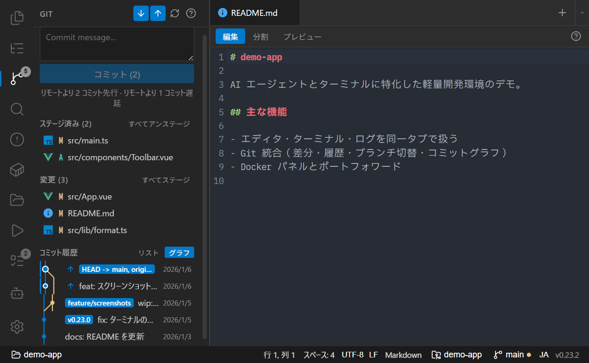

# Git

Pike の Git 統合は `git` CLI 経由で、WSL / Windows の両方に対応します。ステータスバーとサイドバーの Git パネルから操作します。

- [ステータスバー表示](#ステータスバー表示)
- [Git パネル](#git-パネル)
- [コミットグラフ](#コミットグラフ)
- [diff タブ](#diff-タブ)
- [コンフリクトの確認](#コンフリクトの確認)
- [ファイル履歴（Git History）](#ファイル履歴git-history)
- [worktree](#worktree)

## ステータスバー表示

<picture>
  <source media="(prefers-color-scheme: light)" srcset="../screenshot-git-light.png">
  
</picture>

ステータスバー（下端）には以下が表示されます。

- 現在の**ブランチ名**とダーティ表示（クリックでブランチ切替）
- **worktree セレクタ**（worktree が 2 つ以上あるとき）
- **ahead / behind**（リモートとの差分件数）
- リポジトリへのリンク

## Git パネル

左サイドバーの **🌿 Git** アイコンで開きます。

- **ステージング / アンステージ**：変更ファイルを個別に、または一括で。
- **コミット**：メッセージを入力してコミット。
- **push / pull / refresh**：パネルのボタン、またはサイドバーのアイコン（ahead/behind があると強調表示）。
- **変更の破棄**：ファイルごとに作業ツリーの変更を元に戻す（確認ダイアログあり）。
- コミット履歴は List / Graph で切り替えられ、各コミットはホバーで全文ツールチップを表示します。

サイドバーの Git アイコンには変更件数のバッジが付き、コンフリクトがあるときは赤バッジになります。

## コミットグラフ

`git log --all` と親ハッシュ・refs を使って、ブランチのマージグラフを SVG で描画します。Git パネルで **List / Graph** を切り替えて表示します。

<picture>
  <source media="(prefers-color-scheme: light)" srcset="img/git-graph-light.png">
  
</picture>

## diff タブ

ファイルの差分は左右分割の diff タブで表示します。文字単位のハイライト（共通の接頭辞/接尾辞方式）で、変更箇所が分かりやすくなっています。

## コンフリクトの確認

マージコンフリクト（unmerged）のファイルは、Git パネル最上部の専用 **「Conflicts」** セクションに赤字で表示されます。クリックすると作業ツリーのそのファイルをエディタで開きます。

エディタ側では、`<<<<<<<` / `|||||||` / `=======` / `>>>>>>>` のマーカー行と各セクション本文が色分けハイライトされます（表示のみ。解消ツールは未搭載なので、編集して解消します）。→ [エディタとプレビュー](editor-and-preview.md#git-diff-ガターとコンフリクト表示)

## ファイル履歴（Git History）

特定ファイルの git log を専用タブで表示できます。

- ファイルツリーやエディタタブの右クリックメニュー →「Git History」、エディタでは `Alt+H`。
- 履歴の行をクリックすると、その差分を diff タブで開きます。
- 行範囲を指定した履歴（`git log -L`）にも対応します。

## worktree

複数 worktree を 1 ウィンドウで切り替えてレビューできます。ステータスバーの worktree セレクタで参照先を変えると、Git パネルを含む各パネルとエディタが選んだ worktree を参照します。詳しくは [プロジェクトとウィンドウ](projects-and-windows.md#git-worktree-の切り替え) を参照してください。

関連: [エディタとプレビュー](editor-and-preview.md) / [サイドバーパネル](panels.md)
