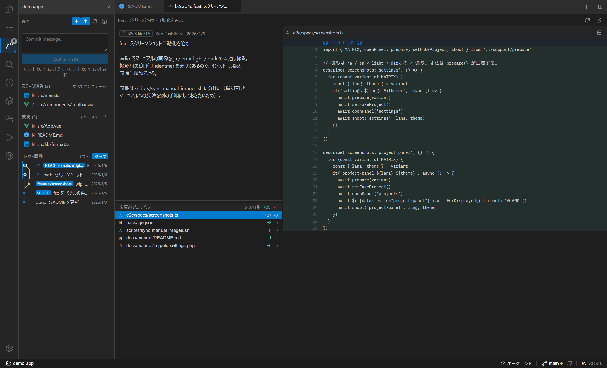

# Git

Pike の Git 統合は `git` CLI 経由で、WSL・Windows・macOS のいずれでも同じように動きます。ステータスバーとサイドバーの Git パネルから操作します。

- [ステータスバー表示](#ステータスバー表示)
  - [ブランチ切替](#ブランチ切替)
- [Git パネル](#git-パネル)
  - [ファイルの右クリックメニュー](#ファイルの右クリックメニュー)
  - [オプション付きの pull / push](#オプション付きの-pull--push)
- [コミットグラフ](#コミットグラフ)
- [コミットタブ](#コミットタブ)
- [diff タブ](#diff-タブ)
- [途中で止まった操作の再開](#途中で止まった操作の再開)
  - [コミットを作れずに止まったとき](#コミットを作れずに止まったとき)
- [コンフリクトの確認](#コンフリクトの確認)
  - [エディタ上で解消する](#エディタ上で解消する)
- [ファイル履歴（Git History）](#ファイル履歴git-history)
- [worktree](#worktree)

## ステータスバー表示

<picture>
  <source media="(prefers-color-scheme: light)" srcset="img/screenshot-git-light.png">
  
</picture>

ステータスバー（下端）には以下が表示されます。

- 現在の**ブランチ名**とダーティ表示（クリックでブランチ切替）
- **worktree セレクタ**（worktree が 2 つ以上あるとき）
- **ahead / behind**（リモートとの差分件数）
- リポジトリへのリンク

### ブランチ切替

<picture>
  <source media="(prefers-color-scheme: light)" srcset="img/branch-switcher-light.png">
  
</picture>

ブランチ名をクリックすると切替用のドロップダウンが開きます。上段がローカルブランチ、「リモートブランチ」の見出しから下がリモートにだけあるブランチです。上部の入力欄で両方を絞り込めます。

- ローカルブランチを選ぶと、そのブランチに切り替えます。
- リモートブランチを選ぶと、それを追跡するローカルブランチを作成して切り替えます（`git checkout --track origin/<ブランチ名>`）。
- ドロップダウンを開くと `git fetch --prune` を裏で実行して一覧を更新します（直近 1 分以内に取得済みなら通信は省略）。取得中は見出しの右に回転アイコンが出ます。

## Git パネル

左サイドバーの **🌿 Git** アイコンで開きます。

- **ステージング / アンステージ**：変更ファイルを個別に、または一括で。
- **コミット**：メッセージを入力してコミット。
- **push / pull / refresh**：パネルのボタン、またはサイドバーのアイコン（ahead/behind があると強調表示）。
- **変更の破棄**：ファイルごとに作業ツリーの変更を元に戻す（確認ダイアログあり）。
- コミット履歴は List / Graph で切り替えられ、各コミットにホバーすると、パネルの右隣にメッセージ全文のツールチップを表示します。
- 履歴は 200 件ずつ読み込みます。末尾までスクロールすると、続きを自動で読み込みます。
- List でコミットをクリックすると、変更ファイルの一覧を開閉します。Graph でクリックすると[コミットタブ](#コミットタブ)を開きます。
- **いま開いているファイル**の行は、ファイルツリーと同じ塗りで示します。
- **日時はコミット日時**（committer date）です。git が持っているのは、変更を書いた日時（author date）と、コミットを作った日時の 2 つだけで、push した時刻という情報はありません。rebase や cherry-pick、amend で更新されるのは後者なので、その履歴に載った時刻としてはこちらが近く、SourceTree の既定の表示とも揃います。ファイル履歴やコミットタブの日時も同じです。

サイドバーの Git アイコンには変更件数のバッジが付き、コンフリクトがあるときは赤バッジになります。未 push か未 pull のコミットがあると、右下に丸い印が付きます。どちらが何件あるかは、アイコンのツールチップで確認できます。rebase や merge が途中で止まっているときは、右下が赤い「!」になります。

Git リポジトリでないフォルダを開いているときは、生の git エラーではなく「このフォルダは Git リポジトリではありません」と表示します。**「リポジトリを初期化」**ボタンで `git init` を実行でき、初期化するとパネルは通常の表示に戻ります。

### ファイルの右クリックメニュー

パネルのファイル行を右クリックすると、その行に対する操作のメニューが出ます。項目は行の種類で変わります。

- **変更（unstaged）**：差分を開く、ファイルを開く、ステージ、変更を元に戻す、Git 履歴。追跡されていないファイル（`?`）では「.gitignore に追加」も出ます。
- **ステージ済み**：差分を開く、ファイルを開く、アンステージ、Git 履歴。
- **コンフリクト**：ファイルを開く、解決済みとしてステージ。
- **コミット配下のファイル**：そのコミットでの差分、そのコミット時点のファイル、Git 履歴。

「パスをコピー」と「相対パスをコピー」はどの行にもあります。前者はシェルの区切りに揃えた絶対パス、後者はプロジェクトのルートからの相対パスです。

ステージと破棄の動作は、行にホバーしたときのボタンと同じです。追跡されていないファイルの「変更を元に戻す」はファイルの削除になり、ステージ済みの新規ファイルを外すときはファイルを消してよいか確認します。

「.gitignore に追加」は、プロジェクトのルート直下の `.gitignore` に、そこからの相対パスを 1 行足します（worktree を切り替えているときはその worktree が基準です）。同じ行が既にあるときは何もしません。追跡済みのファイルに出ないのは、`.gitignore` に書いても git が追跡をやめないためです。

### オプション付きの pull / push

pull / push ボタンを**右クリック**すると、オプション付きで実行するメニューが出ます。左クリックはオプションなしの `git pull` / `git push` です。

<picture>
  <source media="(prefers-color-scheme: light)" srcset="img/git-sync-menu-light.png">
  
</picture>

| pull | push |
|------|------|
| `git pull` | `git push` |
| `git pull --rebase` | `git push -u origin HEAD` |
| `git pull --rebase --autostash` | `git push --tags` |
| `git pull --ff-only` | `git push --force-with-lease` |

- `-u origin HEAD` は、upstream が未設定のブランチを初めて push するときに使います。
- `--force-with-lease` はリモートの履歴を書き換えるため、メニューで赤く表示し、実行前に確認ダイアログを出します。

### 鍵にパスフレーズが付いているとき

Pike が内部で実行する git には入力用の端末がありません。そのため、SSH 鍵のパスフレーズを聞かれる状態のままでは pull / push は失敗します。

- **ssh-agent に鍵を預けているとき**：そのまま通ります。WSL と macOS / Linux のプロジェクトでは、ターミナルと同じログインシェルに `SSH_AUTH_SOCK` を尋ねて内部の git へ渡します。Windows のシェル（cmd / PowerShell / Git Bash）では、Pike 自身の環境変数を引き継ぎます。
- **agent に鍵が入っていないとき**：**伏せ字の入力欄がそのまま開きます**。入力すると鍵を ssh-agent へ預けて、失敗した操作をやり直します。以後の pull / push では聞かれません。
  - **キャンセルすると**、Git パネルにエラーと 2 つのボタン（「パスフレーズを入力」「ターミナルで実行」）が出ます。あとから入力し直せます。
  - 預ける鍵は `ssh -G` が返すもの（`~/.ssh/config` の `IdentityFile` の指定を含みます）から選ぶので、既定以外の場所に置いた鍵でも当たります。**1 回に預けられるのは 1 つ**です。
  - ssh-agent が 1 つも見つからないときは Pike が起動し、Pike を終了するときに止めます。起動済みの agent があるときはそちらへ預けるので、ターミナルで打つ git とも共有されます。
  - この入力欄は WSL と macOS / Linux のプロジェクトで出ます。Windows のシェル（cmd / PowerShell / Git Bash）では、1Password や Windows の agent が鍵を持つため対象外です。
- **ホスト鍵の確認など、パスフレーズ以外を聞かれるとき**：「ターミナルで実行」ボタンを押します。ターミナルタブが開いて同じ操作を走らせ直すので、そこで答えられます。

パスフレーズを覚えているのは ssh-agent です。Pike は受け取った値を `ssh-add` へ渡すだけで、どこにも保存しません。

> 内部の git は「聞かずに失敗する」設定（`BatchMode`）で実行します。設定済みの `core.sshCommand` は残したまま、このオプションだけを足します。パスフレーズ入力用のダイアログ（`SSH_ASKPASS`）を使っている場合、そのダイアログは出ずに、上記のターミナル実行に切り替わります。

## コミットグラフ

ブランチ・リモートブランチ・タグの履歴から、ブランチのマージグラフを SVG で描画します（stash は含めません）。Git パネルで **List / Graph** を切り替えて表示します。読み込んだ範囲より前に親があるコミットは、点線の短い線で止めます（スクロールして続きを読み込むと、線がつながります）。

コミットは日付順（`git log --date-order`）に並べます。SourceTree の既定の並びと同じで、子のコミットは必ず親より上に来ます。

<picture>
  <source media="(prefers-color-scheme: light)" srcset="img/git-graph-light.png">
  
</picture>

グラフの列の幅は、グラフとコミットメッセージの境目をドラッグして変えられます。既定ではレーン 8 本ぶんで止まり、それより深いグラフは右端で切れます（切れているときは境目に線が出ます）。右端までドラッグするとすべてのレーンを表示し、ダブルクリックで既定の幅に戻ります。幅はすべてのプロジェクトで共通です。

## コミットタブ

Graph でコミットをクリックすると、そのコミットの中身をタブで開きます。

画面は 3 つに分かれます（SourceTree の下半分と同じ並びです）。

- **左上**：ハッシュ・作者・日時・メッセージ全文。ハッシュを押すとコピーします。
- **左下**：変更したファイルの一覧。行を選ぶと、そのファイルの差分が右に出ます。
- **右**：選んだファイルの差分。

<picture>
  <source media="(prefers-color-scheme: light)" srcset="img/commit-tab-light.png">
  
</picture>

右の見出しのボタンで、差分の出し方を**統合形式**（追加と削除を 1 つに並べたもの。既定）と**新旧を上下に並べた表示**で切り替えられます。上下では、上に変更後・下に変更前のファイルが出ます。押した状態は覚えるので、次にコミットタブを開いたときも同じ出し方で始まります。

境目はドラッグで動かせます（左の列の幅、メタ情報の高さ、上下に並べたときの境目）。動かした位置も覚えます（すべてのプロジェクトで共通です）。

- マージコミットは第 1 親との差分を表示します。
- 差分が 1MB を超えるときは、そこまでで表示を止めます。
- リモートが GitHub などのときは、ツールバーのボタンでコミットのページを開けます。

## diff タブ

ファイルの差分は左右分割の diff タブで表示します。行の中で変わった文字だけを色付けするため、1 行に小さな変更が複数あっても位置を追えます。
<picture>
  <source media="(prefers-color-scheme: light)" srcset="img/diff-tab-light.png">
  
</picture>

変更のない行は前後 3 行までしか出ませんが、省略された部分には帯が出ます。下向き・上向きのボタンで 20 行ずつ広げ、右の「省略された N 行を表示」で残り全部を出せます（一度に出せるのは 2000 行までで、それを超える帯では「N 行のうち 2000 行」と出ます）。広げたあとは帯に折りたたみのボタンが増えるので、いつでも元に戻せます。広げた行は検索の対象にもなります。ファイルを読み込むのはボタンを押したときだけです。

エディタと同じ **`Ctrl+F`** で検索パネルが開きます。左右どちらのペインの一致も探し、差分の文字ハイライトと重ねて表示します。大文字小文字の区別を切り替えられ、件数を表示し、`Enter` / `Shift+Enter` で前後の一致へ移動、`Esc` で閉じます。移動すると現在の一致が中央に来るようスクロールします。

左右のペインはウィンドウの中に収まります。長い行は下端のバーで横スクロールして読み、左右は連動して動きます。`Shift` を押しながらのホイールとタッチパッドの横スワイプも使えます。極端に長い行（欄の幅の 2 倍を超えるもの）を含む差分は、最初から折り返した状態で開きます。

中央の分割線はドラッグして左右の比率を変えられます。ダブルクリックで半々に戻ります。比率はそのタブだけのもので、開き直すと半々に戻ります。

折り返しはタブ右上のボタンでそのタブだけ切り替えられます。横スクロールが必要な差分では、このボタンは常に表示されます。既定の振る舞いは設定 → エディタの「diff の折り返し（Word Wrap）」で変えられます（[設定](settings.md#エディタ)）。

**選択とコピーは片側だけに効きます。** 最後にクリックした側の欄だけが選択の対象になるので、左をドラッグしても右の内容は混ざりません。反対側を選ぶには、その欄をクリックしてからドラッグします。行番号は選択に入りません。

**作業ツリーの差分は、ファイルが変わると自動で更新します。** Pike のエディタで保存しても、外部のエディタやエージェントが書き換えても、開いたままの diff タブが追いつきます。コミットの差分とステージ済みの差分は、その時点の内容を見るものなので変わりません。

## 途中で止まった操作の再開

`git pull` がコンフリクトなどで途中停止すると、Git パネルの最上部にバナーが出ます。何が止まっているか（リベース / マージ / cherry-pick / revert）と、リベースなら対象ブランチと進捗（`3/7`）を表示します。
<picture>
  <source media="(prefers-color-scheme: light)" srcset="img/git-operation-light.png">
  
</picture>

- **続行**：`git <操作> --continue` をターミナルタブで実行します。コミットメッセージのエディタや署名の承認ダイアログが出ても、そのタブで応答できます。コンフリクトが残っている間は押せません（git 自身が拒否するためです）。解消してステージすると押せるようになります。
- **中止**：確認のうえ `git <操作> --abort` を実行し、開始前の状態に戻します。

`--rebase` を付けない `git pull`（マージ）でも同じように出ます。マージが途中で止まる状況では、続行がそのままコミットをやり直します。

コンフリクトを解消してステージし終えた後もバナーは残ります。リベースやマージが終わっていない状態は、変更一覧からは分からないためです。

### コミットを作れずに止まったとき

コンフリクトが無いのに止まることがあります。多いのはコミット署名（1Password などの承認）やフックの失敗です。このときリベースは「変更はステージ済み、コンフリクトなし」という紛らわしい状態で止まります。

バナーはこの状態を見分けて専用の文言を出し、**コミットし直して続行** ボタンを表示します。押すと対象のコミットと実行するコマンドが確認ダイアログに出ます。同意すると `git commit -C <コミット>` で作者と作成日時を保ったままコミットを作り直し、続けて `git rebase --continue` を実行します。

`git am` と `git bisect` は種類の表示だけで、ボタンは出しません。

サイドバーの Git アイコンには、操作が止まっている間だけ `!` マークが出ます。署名の失敗で止まった `git pull` はコンフリクトが無く、変更件数も 0 件です。パネルを閉じていると、他に気付く手がかりがありません。

## コンフリクトの確認

マージコンフリクト（unmerged）のファイルは、Git パネル最上部の専用 **「Conflicts」** セクションに赤字で表示されます。クリックすると作業ツリーのそのファイルをエディタで開きます。

エディタ側では、`<<<<<<<` / `|||||||` / `=======` / `>>>>>>>` のマーカー行と各セクション本文が色分けハイライトされます。→ [エディタとプレビュー](editor-and-preview.md#git-diff-ガターとコンフリクトの解消)

### エディタ上で解消する

各コンフリクトの上にボタンが並びます。マーカー行にブランチ名が書かれていれば、それをボタンのラベルに使います。
<picture>
  <source media="(prefers-color-scheme: light)" srcset="img/editor-conflict-light.png">
  
</picture>

- **HEAD を採用**（現在の変更） / **feat を採用**（入力側の変更） / **両方**

エディタ上部にはコンフリクトの件数と、ファイル全体をまとめて片側に寄せる **すべて現在の変更** / **すべて入力側** が出ます。一括適用も 1 回の操作としてまとまっているので、`Ctrl+Z` で元に戻せます。

解消してもファイルは自動保存されません。`Ctrl+S` で保存してください。

保存しただけでは、git から見たコンフリクトはまだ解決していません。作業ツリーからマーカーを消しても index は unmerged のままで、`git add` するまで一覧に残ります。Git パネルの **Conflicts** セクションで、各行のチェックボタン（**解決済みとしてステージ**）か見出しの **すべて解決済みに** を押してください。マーカーが残ったままのファイルは、確認ダイアログで名前を挙げてから聞きます。

ステージし終えると、停止した操作のバナーの **続行** が押せるようになります。

## ファイル履歴（Git History）

特定ファイルの git log を専用タブで表示できます。
<picture>
  <source media="(prefers-color-scheme: light)" srcset="img/history-tab-light.png">
  
</picture>

- ファイルツリーやエディタタブの右クリックメニュー →「Git History」、エディタでは `Alt+H`。
- 履歴の行をクリックすると、その差分を diff タブで開きます。
- 行範囲を指定した履歴（`git log -L`）にも対応します。

## worktree

複数 worktree を 1 ウィンドウで切り替えてレビューできます。ステータスバーの worktree セレクタで参照先を変えると、Git パネルを含む各パネルとエディタが選んだ worktree を参照します。詳しくは [プロジェクトとウィンドウ](projects-and-windows.md#git-worktree-の切り替え) を参照してください。

関連: [エディタとプレビュー](editor-and-preview.md) / [サイドバーパネル](panels.md)
