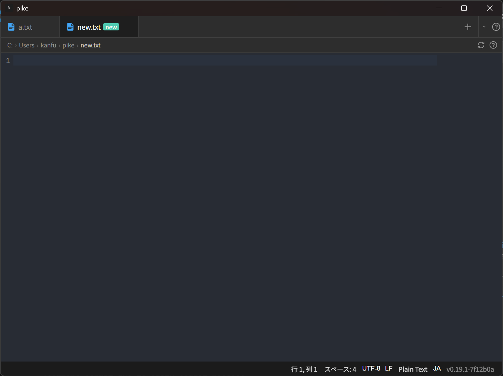
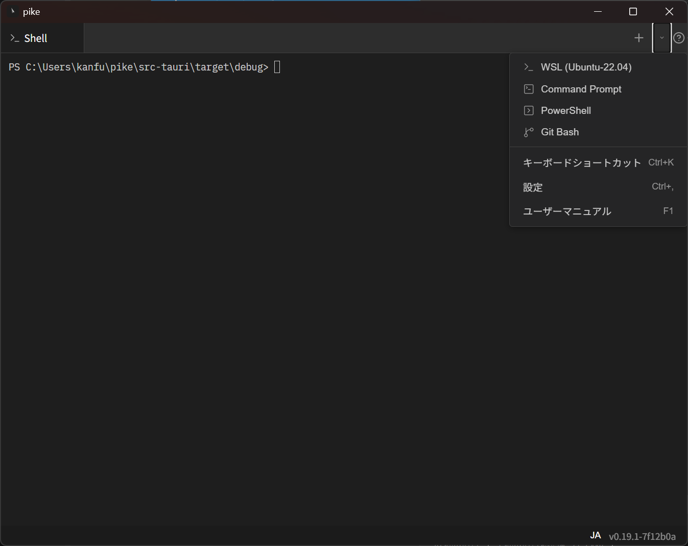

# グローバルモード

- [概要](#概要)
- [ファイルを開く](#ファイルを開く)
- [ターミナルとして使う](#ターミナルとして使う)
- [プロジェクトを開く](#プロジェクトを開く)
- [GIT_EDITOR 連携](#git_editor-連携)

## 概要

グローバルモードは、プロジェクトに依らないウィンドウです。サイドバーを持たず、開いたタブのためだけに存在します。タブをすべて閉じると、ウィンドウも自動で閉じます。

次の操作で開きます。

- **ファイルを開く**：`pike file.txt` などのファイル引数、`pike.exe` へのドラッグ&ドロップ、エクスプローラーの「プログラムから開く」
- **ターミナルを開く**：Pike が起動済みのときに、引数なしで `pike` を実行
- **GIT_EDITOR 連携**：`pike --wait` によるコミットメッセージ編集

該当プロジェクトのウィンドウが開いている場合、ファイルはそちらで開きます。グローバルモードは、どのプロジェクトにも属さない（またはウィンドウが開いていない）場合の受け皿です。

## ファイルを開く

- 複数ファイルを渡すと、1 ファイル 1 タブで開きます（`pike a.rs b.md` や複数選択のドラッグ&ドロップ）。
- 拡張子に応じて開き方が変わります。画像は画像ビューア、PDF は PDF プレビュー、それ以外はエディタです。
- **存在しないパス**は空の新規ファイルとして開きます。タブに「new」バッジが付き、最初の保存（`Ctrl+S`）でファイルが作成されます。
- **バイナリファイル**（実行ファイルや ZIP など）は、文字化けした内容をそのまま開かずエラーを表示します。

Pike が起動していない状態でファイルを渡した場合も、プロジェクトを復元せずグローバルモードで起動します。テキストファイルの関連付け先としても使えます。

## ターミナルとして使う

Pike が起動済みのときに引数なしで `pike` を実行すると、ターミナルタブだけのウィンドウが開きます。Windows Terminal の代わりに使えます。

- **起動時のシェル**：実行時のディレクトリで自動判定します。WSL 上のディレクトリならその distro の WSL シェル、それ以外は PowerShell です。カレントディレクトリも引き継ぎます。
- **「+」ボタン**：設定の「グローバルモードの既定シェル」で選んだシェルを開きます。→ [設定](settings.md#ターミナル)
- **「▾」ボタン**：WSL（検出された各ディストロ）/ Command Prompt / PowerShell / Git Bash から選んで開けます。区切り線の下には、キーボードショートカット・設定・マニュアルを開くメニューもあります（サイドバーが無いグローバルモード用の導線）。
- シェルを `exit` すると、タブが閉じます。最後のタブならウィンドウも閉じます。

## プロジェクトを開く

グローバルモードでも **`Ctrl+Shift+P`** でプロジェクトスイッチャーが開きます。プロジェクトを選ぶと**新しいウィンドウ**で開き、グローバルモードのウィンドウはそのまま残ります。

## GIT_EDITOR 連携

`pike --wait` で開くコミットメッセージのエディタも、このモードのウィンドウです。設定方法と挙動は [ショートカットと CLI](shortcuts-and-cli.md#git_editor-連携pike---wait) を参照してください。

関連: [ショートカットと CLI](shortcuts-and-cli.md) / [プロジェクトとウィンドウ](projects-and-windows.md)
