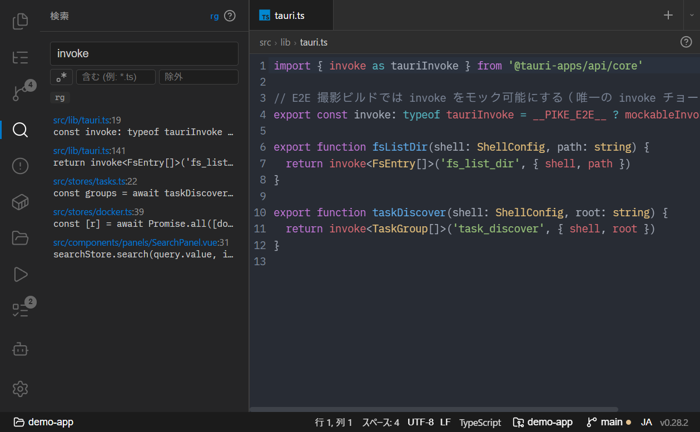
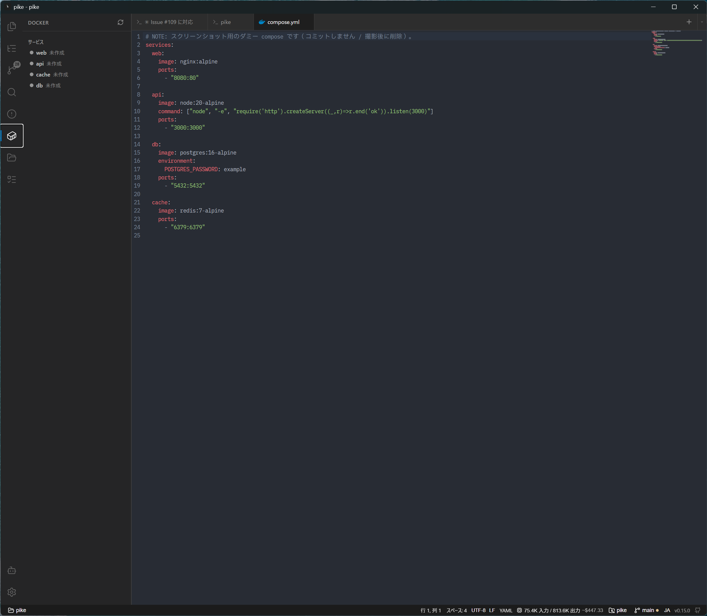
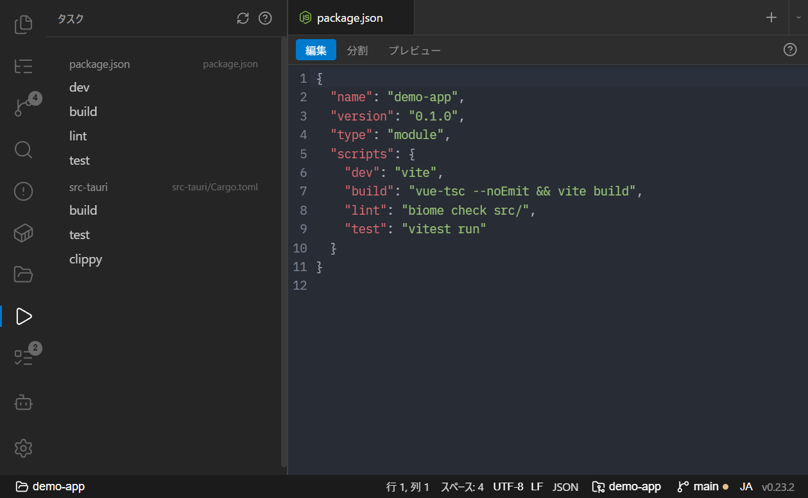
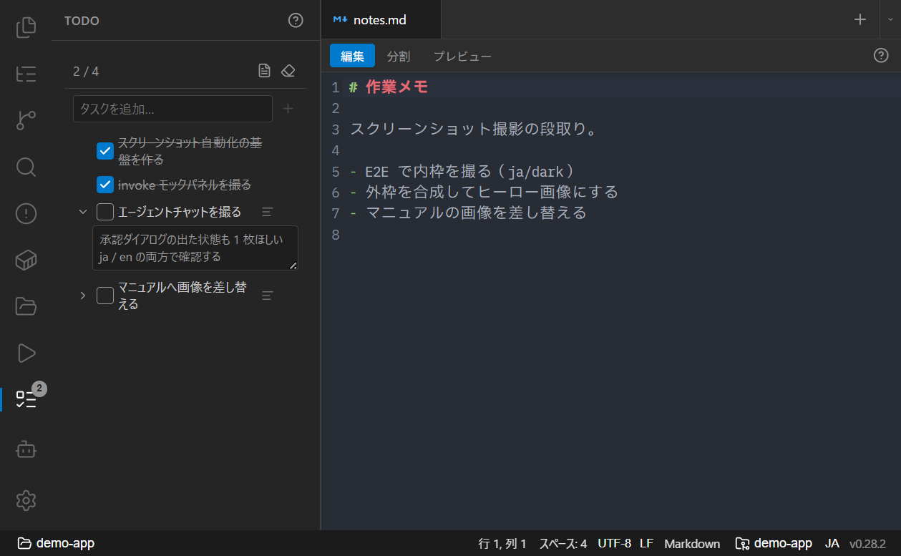

# サイドバーパネル

左サイドバーのアイコンで各パネルを切り替えます。ここでは Git 以外のパネルと、ファイル添付についてまとめます（Git は [Git](git.md)、プロジェクトは [プロジェクトとウィンドウ](projects-and-windows.md)）。

- [ファイルツリー](#ファイルツリー)
- [検索（ripgrep / grep）](#検索ripgrep--grep)
- [Docker](#docker)
- [タスク](#タスク)
- [TODO（やること）](#todoやること)
- [アウトライン](#アウトライン)
- [Problems（診断）](#problems診断)
- [ファイル添付（クリップボード / ドラッグ&ドロップ）](#ファイル添付クリップボード--ドラッグドロップ)

## ファイルツリー

**🗂 ファイル** アイコンで開きます。

- ファイルをクリックすると、種別に応じてエディタ / 画像ビューア / PDF プレビューで開きます。
- **git ステータス色**を表示します。
- **コンテキストメニュー**：リネーム（インライン入力）、削除（確認ダイアログ）、相対パスのコピー、Git History。
- **ドラッグ&ドロップ**で移動、`Ctrl` を押しながらでコピー。
- ファイル監視により、外部の変更で自動リフレッシュします（WSL では `inotify-tools` が必要）。
- ヘッダのボタンから新規ファイル / 新規フォルダ / 再読み込みができます。

## 検索（ripgrep / grep）

**🔍 検索** アイコンで開きます。プロジェクト全体をテキスト検索します。

- バックエンドは起動時に判定: **ripgrep（システム → 同梱版）→ grep** の順でフォールバック（WSL プロジェクトでは WSL 側の rg/grep）。使用中のバックエンドはバッジで表示されます。
- 結果は最大 500 件、入力は 300ms デバウンス。
- 結果をクリックすると該当行をエディタで開きます。

## Docker

**🐋 Docker** アイコンで開きます。Docker API（`bollard`）に接続します（named pipe → TCP の順でフォールバック。Docker Desktop が無くても WSL2 の dockerd が TCP を公開していれば接続可能）。

- `compose.yml` を解析してサービス一覧を表示します。
- **start / stop / restart / refresh** を UI から実行（5 秒ポーリングで状態更新）。
- **ログ**：ライブログを読み取り専用のタブでストリーミング表示。
- **シェル**：コンテナ内シェル（bash → sh フォールバック）を検出し、プロジェクトのシェル内で `docker exec -it` を起動します。
- **ポートフォワード**：`ports` を公開していないコンテナ内のサービスへ、コンテナを作り直さずにホストからアクセスできます。実行中のサービスのケーブルアイコンをクリックし、コンテナ内ポートを指定すると `127.0.0.1` の空きポートへ転送します。転送中はサービスの下に転送先が表示され、ブラウザで開くボタンと停止ボタンを使えます。転送は `alpine/socat` の一時コンテナで行い（初回はイメージを自動取得）、アプリ終了時に自動で片付きます。

## タスク

**📋 タスク** アイコンで開きます。プロジェクトを最大深さ 5 まで走査し、`package.json` の scripts / Makefile のターゲット / `deno.json` の tasks を検出して一覧表示します。

- サブディレクトリのタスクには相対ディレクトリ名が付きます。
- タスクを実行すると、正しい作業ディレクトリでプロジェクトのデフォルトシェルで起動し、完了するとタブが自動クローズします。
- ripgrep がある場合は `.gitignore` を尊重します。

## TODO（やること）

**✅ TODO** アイコンで開きます。プロジェクトごとの簡易チェックリストです（タスクランナーの「タスク」とは別物）。

- 実体は `.pike/todo.md`（プロジェクト固定・`.gitignore` 済みのローカル専用）。GitHub 互換のタスクリスト（`- [ ]` / `- [x]`）で保存します。
- 追加 / チェック / インライン編集 / 削除 / **ドラッグ並べ替え**ができます。ヘッダに進捗（完了数 / 総数）を表示します。
- ヘッダの **todo.md を開く** から、エディタタブで直接編集できます。
- 外部エディタや別ウィンドウでの変更は、ファイル監視で自動反映されます。
- 見出し（`## ...`）や自由記述の行はそのまま保持されるため、手編集と併用できます。

## アウトライン

**🔭 アウトライン** アイコンで開きます。18 言語（Markdown / TypeScript+JSX / Vue / HTML / CSS+SCSS / Rust / Python / Go / Perl / YAML / JSON / Ruby / Kotlin / Swift / PHP / Dockerfile / TOML / Makefile）のシンボルを抽出して表示します。

- カーソル位置に追従してハイライト・祖先を自動展開・スクロール。
- **Outline / History** の 2 タブ構成。History はファイル別 git log で、行クリックで diff を開きます。

## Problems（診断）

**問題** パネルでは、設定したチェッカーの診断結果を一覧表示します。各行のホバーで表示される **🤖** ボタンから、その問題の修正依頼文をターミナルのエージェントへ送れます。→ [ターミナルと AI エージェント](terminal-and-agents.md#エディタ選択範囲診断をターミナルへ送る)

## ファイル添付（クリップボード / ドラッグ&ドロップ）

クリップボードや OS / ファイルツリーからの**任意のファイル**（画像・PDF など）を、貼り付け / ドロップで添付できます。

- ファイルは `.pike/uploads/` に保存され、**相対パス**が挿入されます（エージェントチャットは `@パス` メンション、ターミナルは bare path）。
- 元のファイル名を保持します（衝突時は短いハッシュを付与）。
- 初回保存時に、各プロジェクトへ `.pike/.gitignore`（中身 `*`）を書き込み、退避ファイルを repo から除外します。
- **テキストの貼り付け**は、長さに関係なくそのままインライン貼り付けです。
- **小さいテキストファイルのインライン展開**（設定 `inlineSmallTextFiles`、既定 OFF / 既定 4KB 以下）は **エージェントチャット限定**。サイズ上限以下かつ UTF-8 テキストなら、アップロードせず内容を直接挿入します。PDF・画像などのバイナリは常にアップロードされます。
- ターミナルへの任意ファイル投入はドラッグ&ドロップが主経路です。

関連: [エディタとプレビュー](editor-and-preview.md) / [ターミナルと AI エージェント](terminal-and-agents.md)
