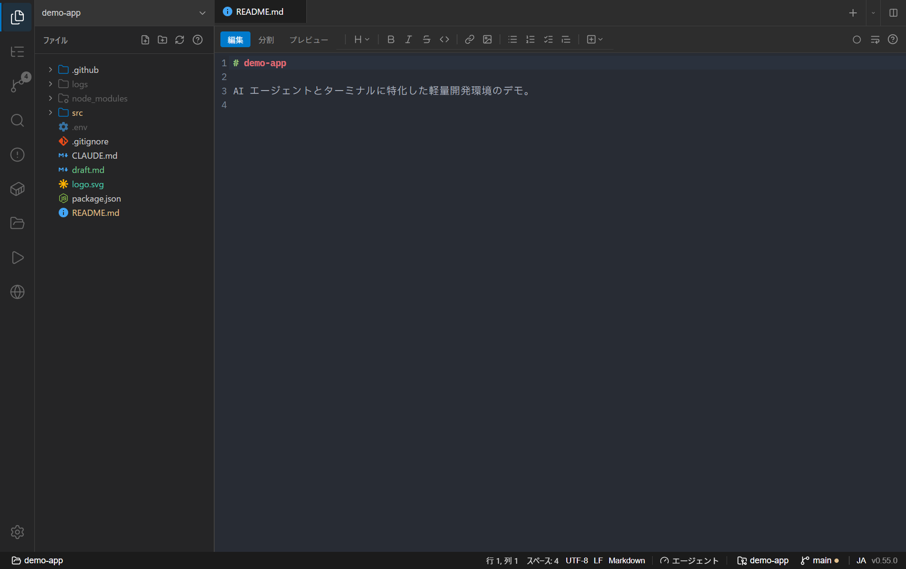
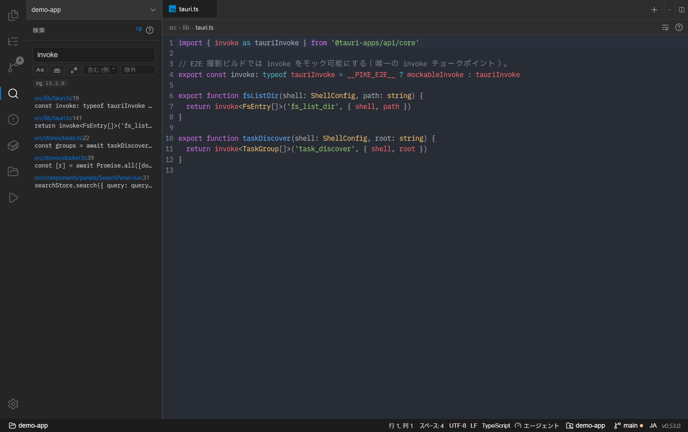
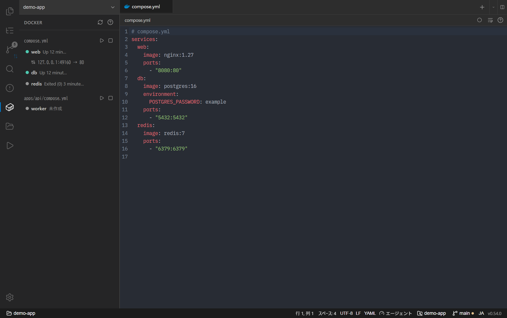
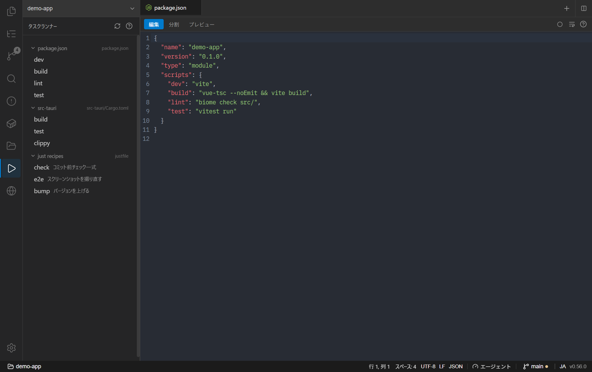
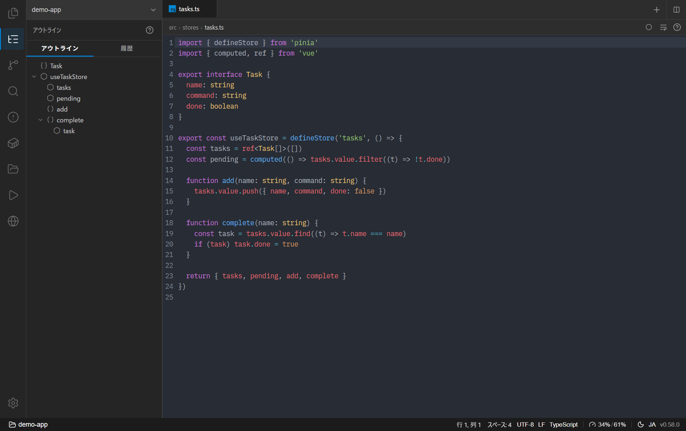
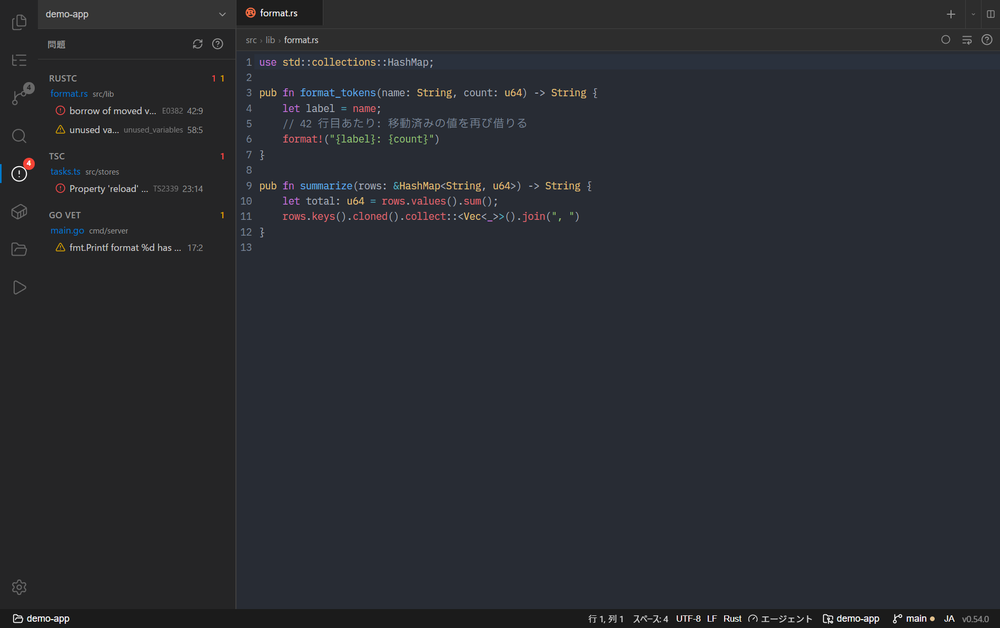

# サイドバーパネル

左サイドバーのアイコンで各パネルを切り替えます。Git パネルは [Git](git.md)、プロジェクトパネルは [プロジェクトとウィンドウ](projects-and-windows.md) にあります。

- [ファイルツリー](#ファイルツリー)
- [検索（ripgrep / grep）](#検索ripgrep--grep)
- [Docker](#docker)
- [タスク](#タスク)
- [アウトライン](#アウトライン)
- [Problems（診断）](#problems診断)
- [Issue（GitHub）](#issuegithub)
- [ファイル添付（クリップボード / ドラッグ&ドロップ）](#ファイル添付クリップボード--ドラッグドロップ)

## ファイルツリー

**🗂 ファイル** アイコンで開きます。

<picture>
  <source media="(prefers-color-scheme: light)" srcset="img/file-panel-light.png">
  
</picture>

- ファイルをクリックすると、種別に応じてエディタ / 画像ビューア / PDF プレビューで開きます。
- **git ステータス色**：変更（黄）・追加（緑）・未追跡（緑）・コンフリクト（赤）などを色で示します。変更を含むディレクトリにも色が伝播します。
- **`.gitignore` のファイル/ディレクトリ**はグレーの淡色で示します。ディレクトリは展開できます。
- **除外ディレクトリ**（`node_modules` / `target` / `dist` / `.git` など）は歯車付きのフォルダアイコンと淡色で示します。中を開いて見られますが、ファイル監視・検索・タスク検出の対象外である点は変わりません。開いているあいだに中身が変わっても自動では反映されないので、ヘッダの再読み込みを使ってください。
- **コンテキストメニュー**：リネーム（インライン入力）、削除（確認ダイアログ）、相対パスのコピー、Git History。フォルダでは「エクスプローラーで開く」も使えます（WSL のフォルダは `\\wsl.localhost\` 経由で開きます）。
- **ドラッグ&ドロップ**で移動、`Ctrl`（macOS では `Option`）を押しながらでコピー。エクスプローラーからドロップしたファイルは、落としたフォルダにコピーします。ツリーの空いている場所へ落とすとプロジェクトルートにコピーします。
- **いま開いているファイル**の行を塗って示します。タブを切り替えると追従し、畳んであるフォルダは自動で開きます（VSCode の explorer と同じ挙動です）。
- ファイル監視により、外部の変更で自動リフレッシュします（WSL では `inotify-tools` が必要）。
- ヘッダのボタンから新規ファイル / 新規フォルダ / 再読み込みができます。

## 検索（ripgrep / grep）

**🔍 検索** アイコンで開きます。プロジェクト全体をテキスト検索します。

<picture>
  <source media="(prefers-color-scheme: light)" srcset="img/search-light.png">
  
</picture>

- **開き方**：サイドバーのアイコンのほか、`Ctrl+Shift+F`（macOS では `⇧⌘F`）で開きます。**キーで開くと入力欄にフォーカスが移り、エディタで文字列を選んでいればそれが入って検索まで走ります**。開いているときにもう一度押しても閉じず、入力欄に戻ります（選んだ内容は全選択されるので、打てばそのまま置き換わります）。アイコンのクリックはこれまでどおり、もう一度押すと閉じます。
- **バックエンド**：**ripgrep → grep** の順でフォールバックします。ripgrep は PATH 上のものと Pike が同梱するものを見比べて、**新しいほうを使います**（同じ版なら PATH 上のもの）。WSL プロジェクトでは WSL 側の rg/grep だけが対象です。使用中のバックエンドと、ripgrep ならその版がバッジに出ます。
- **絞り込みのトグル**：入力欄の下に 3 つ（条件によっては 4 つ）並びます。
  - **大文字と小文字を区別**：既定は区別しません。押したときだけ区別します。
  - **単語単位で検索**：`get` が `getUser` に当たらなくなります。
  - **正規表現**：オフのときは入力をそのままの文字列として探します。
  - **PCRE2**：正規表現がオンで、かつ使っている ripgrep がこの機能を持つときだけ出ます。先読み（`(?=...)` / `(?!...)`）や後方参照が使えます。
- **含む / 除外**：グロブで対象を絞ります。`*.ts` のような書き方のほか、**ripgrep 15 以降なら入れ子の波括弧**（`**/{lib/{a,b},test}/*.ts`）も書けます。
- 結果は最大 500 件、入力は 300ms デバウンス。
- 結果をクリックすると該当行をエディタで開きます。

> **ripgrep の版で使えるものが変わります。** 入れ子の波括弧は 15 以降、PCRE2 はその機能を含めてビルドされた ripgrep が必要です。PCRE2 を持たない ripgrep では、トグルそのものが出ません。
>
> Windows と macOS では Pike が同梱する ripgrep が下限になるので、これらは基本的に使えます。**WSL プロジェクトではそのディストロに入っている ripgrep** だけが対象なので、古ければトグルや欄が出ません。`sudo apt install ripgrep` などで入る版は配布元より古いことがあります。出るはずのものが出ないときは、バッジの版を確認してください。

## Docker

**🐋 Docker** アイコンで開きます。Docker API へは、まず OS ごとの既定の口（Windows は named pipe、macOS は Unix ソケット）で接続します。Windows ではそのあと TCP も試すので、Docker Desktop が無くても WSL2 の dockerd が TCP を公開していれば接続できます。

<picture>
  <source media="(prefers-color-scheme: light)" srcset="img/docker-light.png">
  
</picture>

- compose ファイルを解析してサービス一覧を表示します。対象は `compose.yml` / `compose.yaml` / `docker-compose.yml` / `docker-compose.yaml` です。
- 探索範囲はプロジェクト直下とサブディレクトリ 2 階層までで、`apps/web/compose.yml` のようなモノレポ構成も拾います。1 つのディレクトリに複数ある場合は、Docker Compose 自身と同じ優先順で 1 つだけ使います。
- 見つかった compose ファイルごとにグループを分け、見出しにプロジェクトルートからの相対パスを表示します。パスをクリックするとその compose ファイルをエディタで開きます。
- **start / stop / restart / refresh** を UI から実行（5 秒ポーリングで状態更新）。
- **compose up / down**：グループ見出しの再生 / 停止ボタンで `docker compose up -d` / `docker compose down` を実行します。作業ディレクトリはその compose ファイルのある場所です。確認ダイアログ付きで、出力はターミナルタブに表示されます。
- **ログ**：ライブログを読み取り専用のタブでストリーミング表示。
- **シェル**：コンテナ内シェル（bash → sh フォールバック）を検出し、プロジェクトのシェル内で `docker exec -it` を起動します。
- **ポートフォワード**：`ports` を公開していないコンテナ内のサービスへ、コンテナを作り直さずにホストからアクセスできます。実行中のサービスのケーブルアイコンをクリックし、コンテナ内ポートを指定すると `127.0.0.1` の空きポートへ転送します。転送中はサービスの下に転送先が表示され、ブラウザで開くボタンと停止ボタンを使えます。転送は `alpine/socat` の一時コンテナで行い（初回はイメージを自動取得）、アプリ終了時に自動で片付きます。

## タスク

**📋 タスク** アイコンで開きます。プロジェクトを最大深さ 5 まで走査してタスク定義を探し、一覧表示します。対象は `package.json` の scripts、Makefile のターゲット、`justfile` のレシピ、`deno.json` の tasks、`Cargo.toml` です。

- **`package.json`**：npm 固定ではありません。`packageManager` フィールドと lock ファイルからパッケージマネージャを判別し、`pnpm run build` のように対応するコマンドで実行します。lock ファイルはリポジトリのルートだけにあれば十分なので、pnpm ワークスペースのサブパッケージも正しく判別します。
- **`justfile`**：`just` を実行せずに読むため、just が入っていないマシンでも一覧に出ます。レシピの直前に書いた `#` コメントは説明として名前の右に表示し、`_` で始まる名前と `[private]` を付けたレシピは表示しません。
- **`Cargo.toml`**：build・test・clippy などの標準サブコマンドと、`run` / `run --bin` などの実行タスクを表示します。Tauri アプリ（`tauri.conf.json` があるディレクトリ）では `tauri dev` / `tauri build` も加えます。
- **`.cargo/config.toml` の `[alias]`**：同じディレクトリの cargo タスク一覧の先頭に表示します。`Cargo.toml` が無いディレクトリのエイリアスは「cargo alias」グループになります。

<picture>
  <source media="(prefers-color-scheme: light)" srcset="img/tasks-light.png">
  
</picture>

- サブディレクトリのタスクには相対ディレクトリ名が付きます。
- タスクを実行すると、正しい作業ディレクトリでプロジェクトのデフォルトシェルで起動し、完了するとタブが自動クローズします。
- グループ見出しをクリックすると、そのファイルのタスクを畳めます。畳んでいるあいだは右側に件数を出します。開閉の状態はプロジェクトごとにこのマシンで保存し、次に開いたときも保たれます。
- グループ見出し右のファイル名（`package.json` など）をクリックすると、その定義ファイルをエディタタブで開きます。
- ripgrep がある場合は `.gitignore` を尊重します。

## アウトライン

**🔭 アウトライン** アイコンで開きます。18 言語（Markdown / TypeScript+JSX / Vue / HTML / CSS+SCSS / Rust / Python / Go / Perl / YAML / JSON / Ruby / Kotlin / Swift / PHP / Dockerfile / TOML / Makefile）のシンボルを抽出して表示します。
<picture>
  <source media="(prefers-color-scheme: light)" srcset="img/outline-panel-light.png">
  
</picture>


- カーソル位置に追従してハイライト・祖先を自動展開・スクロール。
- 行をクリックするとエディタがその位置へ移動します。Markdown をプレビューまたは分割で見ているときは、プレビュー側も一緒にスクロールします。見出しは正確に位置合わせし、見出し以外は行の位置からおおよその場所へ動きます。
- **Outline / History** の 2 タブ構成。History はファイル別 git log で、行クリックで diff を開きます。

## Problems（診断）

**Problems** パネルは、プロジェクトで使っているツールチェインのチェッカーを実行して、エラーと警告を一覧表示します。常駐する言語サーバーは持たず、パネルを開いたときに 1 回だけ走らせる方式です（Pike が軽い理由のひとつ）。
<picture>
  <source media="(prefers-color-scheme: light)" srcset="img/problems-panel-light.png">
  
</picture>


| 言語 | 実行するコマンド | 検出の目印 |
|------|------------------|------------|
| Rust | `cargo check` | `Cargo.toml` |
| Go | `go vet ./...` | `go.mod` |
| Go（任意） | `golangci-lint run ./...` | `.golangci.yml` などの設定ファイル、または golangci-lint を参照する `go.mod` |
| TypeScript / JavaScript | `tsc --noEmit` | `tsconfig.json` |

- マニフェストはプロジェクトルートから 4 階層まで探し、見つけたディレクトリでコマンドを実行します。モノレポでも各パッケージが対象になります。
- 行をクリックすると該当箇所をエディタで開きます。件数が多い場合は 2000 件で打ち切ります。
- 診断コード（`E0382`、`TS2304`、golangci-lint の linter 名など）が取れる場合は、行末の位置表示の手前に薄字で出します。
- チェッカーが失敗した場合（未インストールなど）は、パネル上部にそのチェッカー名を出します。マウスを乗せると、実行したコマンドとエラー内容を確認できます。
- 各行のホバーで表示される **🤖** ボタンから、その問題の修正依頼文をターミナルのエージェントへ送れます。→ [ターミナルと AI エージェント](terminal-and-agents.md#エディタ選択範囲診断をターミナルへ送る)

### golangci-lint（Go）

Go モジュールが golangci-lint を使う設定（上の表の「Go（任意）」の目印）になっていると、パネル上部に **golangci-lint** ボタンが出ます。設定ファイルはモジュールと同じ階層か、その上にあれば拾います。

ボタンを押すと、以後のチェックに golangci-lint が加わります。もう一度押すと外れます。設定はプロジェクトごとに覚えるので、あるプロジェクトで有効にしても別のプロジェクトでは走りません。アプリを再起動しても残ります。

- 既定はオフです。golangci-lint はモジュール全体の型検査を伴い、他のチェッカーより時間がかかるためです。
- 実行には golangci-lint 本体が要ります。`go.mod` に Go 1.24 の `tool` ディレクティブがあれば `go tool golangci-lint` で、なければ PATH 上の `golangci-lint` を呼びます。見つからないときはパネル上部にエラーを出します。
- 検出した linter 名（`revive`、`errcheck` など）を各行に添えます。`typecheck` はコンパイルエラーなのでエラー扱い、それ以外は警告扱いです。

#### コンテナの中で lint する

lint の入口を Docker に置いているプロジェクトでは、プロジェクトの編集フォームの **golangci-lint コマンド** に実行したいコマンドを書きます。

```
docker compose exec -T golang make lint
```

- 設定すると、`go.mod` から組み立てる代わりにこのコマンドを実行します。`make lint` のようにチェックを束ねたターゲットも指定できます。
- コマンドは Go モジュールのディレクトリで実行します。コンテナの作業ディレクトリにそのモジュールをマウントしていれば、出力のパスはそのまま解決できます。`docker compose` は親ディレクトリの compose ファイルも探すため、`-f` は多くの場合不要です。
- 1 つのリポジトリに Go モジュールが複数ある場合でも、実行は 1 回だけです（いちばん浅いモジュールのディレクトリ）。コマンドを設定した時点で lint の入口は 1 つ、という扱いになります。
- 出力形式は golangci-lint の既定テキストのままにしてください。パスと行番号を持たない行は読み飛ばすので、`echo` を挟むターゲットでも問題ありません。
- コマンドを設定したプロジェクトでは、設定ファイルや `go.mod` の内容にかかわらずボタンが出ます。ボタンにマウスを乗せると、実行するコマンドを確認できます。
- この設定は同期ファイルに載ります。マシン固有の情報ではないためです。→ [設定の同期](settings.md#設定の同期)

## Issue（GitHub）

**✅ Issue** アイコンで開きます。open な issue を更新の新しい順に一覧します。

このアイコンは、次の 2 つを満たすときだけ出ます。

- プロジェクトの origin が GitHub である
- [`gh`](https://cli.github.com/)（GitHub CLI）が入っている。WSL プロジェクトでは WSL 側、それ以外では Windows / macOS 側の `gh` を見ます

認証は `gh` に任せるため、Pike 側でトークンを設定する必要はありません。`gh auth login` を済ませてあれば、private リポジトリの issue も読めます。

- sub-issue（親子）はツリーで出します。ヘッダの右のボタンで**ツリーとフラットを切り替え**られ、ツリーのときは**すべて展開 / すべて畳む**のボタンも出ます。行の左の三角で 1 つずつ開閉できます。
  - 親が一覧に無いとき（closed になっている、取得件数の枠外など）は、その子をトップレベルに出します。
  - 絞り込みでは、一致した issue の親も残します（親が消えると、どこにぶら下がっていたか読めなくなるためです）。フラット表示では一致したものだけを並べます。
- ラベルは色のドットで出します。パネルの幅ではラベル名を並べるとタイトルが隠れるためです。名前は行にマウスを乗せると出ます。
- 上部の入力で、番号・タイトル・ラベルを絞り込めます。他のパネルと同じあいまい一致なので、`308` は「3・0・8 をこの順に含む」ものに当たります（`#308` と書いても同じです）。
- 行をクリックすると、本文とコメントを読む**タブ**で開きます。読み取り専用で、コメントやクローズはできません。タブ右上のボタンからブラウザへ移れます。
  - 本文やコメントの中の `#123` は、その issue のタブを開くリンクになります。同じリポジトリの issue / PR の URL も同じように開きます。
- ヘッダの **+** から、新規 issue の作成ページをブラウザで開けます。
- 取得は最初にパネルを開いたときと、ヘッダの更新ボタンを押したときだけです。定期的な取得はしません（開き直しても取り直しません）。
- `gh auth` が切れている、private リポジトリへの権限がない、といった場合は、一覧の上に理由を出します。どちらも結果が 0 件になるため、「issue が無い」と区別できるようにしています（`gh` そのものが入っていない場合は、上の条件を満たさないのでアイコンが出ません）。

## ファイル添付（クリップボード / ドラッグ&ドロップ）

クリップボードや OS / ファイルツリーからの**任意のファイル**（画像・PDF など）を、貼り付け / ドロップで添付できます。

- ファイルは `.pike/uploads/` に保存され、ターミナルへ**相対パス**が挿入されます。
- 元のファイル名を保持します（衝突時は短いハッシュを付与）。
- 初回保存時に、各プロジェクトへ `.pike/.gitignore`（中身 `*`）を書き込み、退避ファイルを repo から除外します。
- **テキストの貼り付け**は、長さに関係なくそのままインライン貼り付けです。
- ターミナルへの任意ファイル投入はドラッグ&ドロップが主経路です。

関連: [エディタとプレビュー](editor-and-preview.md) / [ターミナルと AI エージェント](terminal-and-agents.md)
