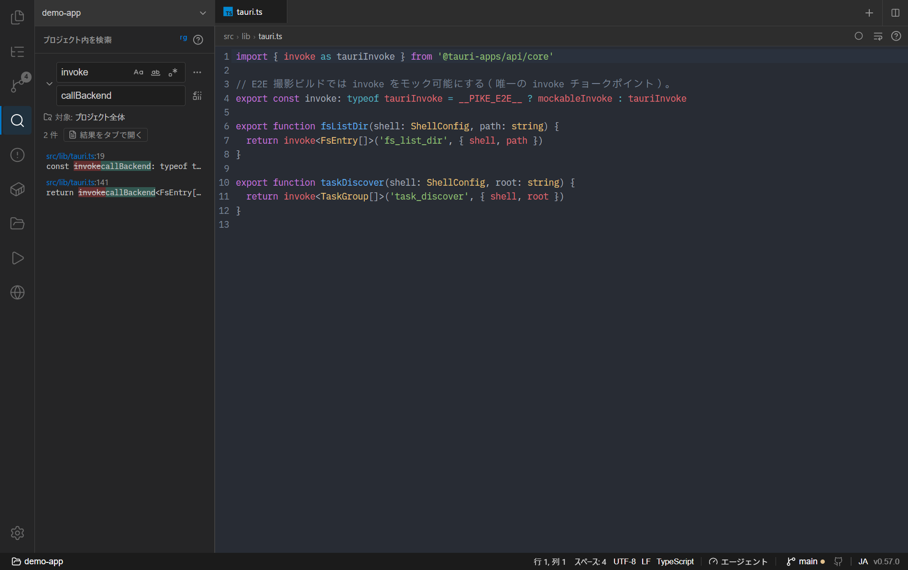
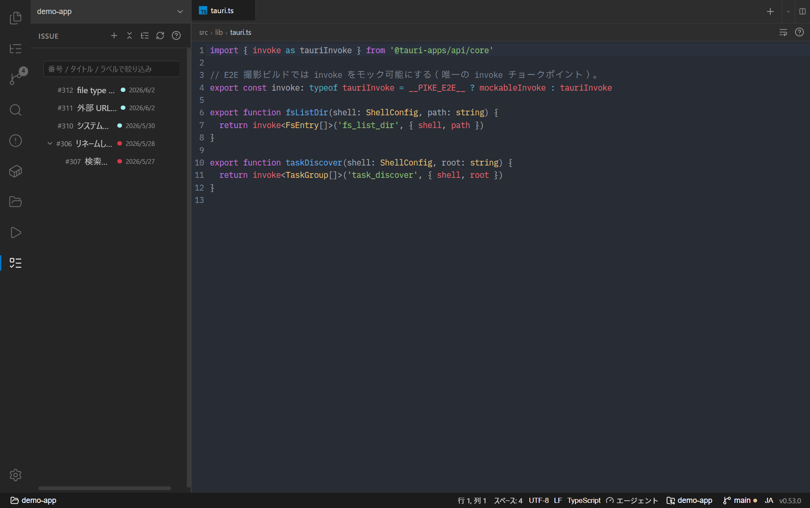

# サイドバーパネル

左サイドバーのアイコンで各パネルを切り替えます。Git パネルは [Git](git.md)、プロジェクトパネルは [プロジェクトとウィンドウ](projects-and-windows.md)、ブラウザパネルは [ブラウザのタブ](browser.md#ブラウザパネル) にあります。

- [アイコンの並び替えと非表示](#アイコンの並び替えと非表示)
- [ファイルツリー](#ファイルツリー)
- [検索（ripgrep / grep）](#検索ripgrep--grep)
- [Docker](#docker)
- [タスクランナー](#タスクランナー)
- [アウトライン](#アウトライン)
- [Problems（診断）](#problems診断)
- [Issue（GitHub）](#issuegithub)
- [ファイル添付（クリップボード / ドラッグ&ドロップ）](#ファイル添付クリップボード--ドラッグドロップ)

## アイコンの並び替えと非表示

- **並び替え**：アイコンを上下にドラッグします。
- **非表示**：アイコンを右クリックして「非表示」を選びます。開いていたパネルは閉じます。
- **再表示**：アイコン列を右クリックすると、すべてのパネルがチェック付きで並びます。チェックの無いものを選ぶと、また表示されます。アイコンの無い空いたところを右クリックしても同じメニューが開きます。
- **元に戻す**：同じメニューの「並び順と表示を元に戻す」で、既定の並びとすべて表示の状態に戻ります。

非表示にしてもパネルは使えます。コマンドパレット（`Ctrl+P` のあとに `>`）や `Ctrl+Shift+F`（検索）からは、これまでどおり開けます。並びと表示は設定の一部として保存され、[設定の同期](settings.md#設定の同期)の対象です。

## ファイルツリー

**🗂 ファイル** アイコンで開きます。

<picture>
  <source media="(prefers-color-scheme: light)" srcset="img/file-panel-light.png">
  
</picture>

- ファイルをクリックすると、種別に応じてエディタ / 画像ビューア / PDF プレビューで開きます。
- **git ステータス色**：変更（黄）・追加（緑）・未追跡（緑）・コンフリクト（赤）などを色で示します。変更を含むディレクトリにも色が伝播します。
- **`.gitignore` のファイル/ディレクトリ**はグレーの淡色で示します。ディレクトリは展開できます。
- **除外ディレクトリ**（`node_modules` / `target` / `dist` / `.git` など）は歯車付きのフォルダアイコンと淡色で示します。中を開いて見られますが、ファイル監視・検索・タスク検出の対象外である点は変わりません。開いているあいだに中身が変わっても自動では反映されないので、ヘッダの再読み込みを使ってください。
- **コンテキストメニュー**：リネーム（インライン入力）、削除（確認ダイアログ）、相対パスのコピー、Git History。フォルダでは「このフォルダ内を検索」も使えます（→ [検索](#検索ripgrep--grep)）。フォルダでは「エクスプローラーで開く」、ファイルでは「関連付けられたアプリで開く」も使えます（WSL のものは `\\wsl.localhost\` 経由で開きます）。
- **ドラッグ&ドロップ**で移動、`Ctrl`（macOS では `Option`）を押しながらでコピー。エクスプローラーからドロップしたファイルは、落としたフォルダにコピーします。ツリーの空いている場所へ落とすとプロジェクトルートにコピーします。
- **いま開いているファイル**の行を塗って示します。タブを切り替えると追従し、畳んであるフォルダは自動で開きます（VSCode の explorer と同じ挙動です）。
- ファイル監視により、外部の変更で自動リフレッシュします（WSL では `inotify-tools` が必要）。
- ヘッダのボタンから新規ファイル / 新規フォルダ / 再読み込みができます。

## 検索（ripgrep / grep）

**🔍 プロジェクト内を検索** アイコンで開きます。プロジェクト全体をテキスト検索します。入力欄の下の「対象」に、検索する範囲（プロジェクト全体か、絞ったフォルダ）が出ます。

<picture>
  <source media="(prefers-color-scheme: light)" srcset="img/search-light.png">
  
</picture>

- **開き方**：サイドバーのアイコンのほか、`Ctrl+Shift+F`（macOS では `⇧⌘F`）で開きます。**キーで開くと入力欄にフォーカスが移り、エディタで文字列を選んでいればそれが入って検索まで走ります**。開いているときにもう一度押しても閉じず、入力欄に戻ります（選んだ内容は全選択されるので、打てばそのまま置き換わります）。アイコンのクリックはこれまでどおり、もう一度押すと閉じます。
- **バックエンド**：**ripgrep → grep** の順でフォールバックします。ripgrep は PATH 上のものと Pike が同梱するものを見比べて、**新しいほうを使います**（同じ版なら PATH 上のもの）。WSL プロジェクトでは WSL 側の rg/grep だけが対象です。使用中のバックエンドはパネルの見出しのバッジに出ます。ripgrep の版は、バッジにカーソルを合わせると出ます。
- **WSL の ripgrep を入れる・更新する**：WSL プロジェクトで ripgrep が無いとき、または 13 以前のときは、検索パネルを開いたときに 1 度だけインストール（更新）するか聞きます。断ったあとも、パネルの帯のボタンから同じことができます。ターミナルが開き、GitHub の公式リリースを取得して `/usr/local/bin` に置きます（sudo のパスワードを聞かれます）。apt で入る版は古いことがあるため、apt は使いません。別の方法で入れた場合も、検索パネルを開き直せば新しい ripgrep に切り替わります。
- **絞り込みのトグル**：入力欄の中の右端に 3 つ（条件によっては 4 つ）並びます。
  - **大文字と小文字を区別**：既定は区別しません。押したときだけ区別します。
  - **単語単位で検索**：`get` が `getUser` に当たらなくなります。
  - **正規表現**：オフのときは入力をそのままの文字列として探します。
  - **PCRE2**：正規表現がオンで、かつ使っている ripgrep がこの機能を持つときだけ出ます。先読み（`(?=...)` / `(?!...)`）や後方参照が使えます。
- **含む / 除外**：入力欄の右の「⋯」で開き、1 行ずつグロブを書きます。`*.ts` のような書き方のほか、**ripgrep 15 以降なら入れ子の波括弧**（`**/{lib/{a,b},test}/*.ts`）も書けます。畳んでいても指定は効いたままで、そのあいだ「⋯」は青く出ます。
- **フォルダに絞る**：ファイルツリーでフォルダを右クリックし、「このフォルダ内を検索」を選ぶと、そのフォルダの中だけを検索する状態でパネルが開きます。「対象」の右の ✕ でプロジェクト全体に戻ります。別のプロジェクトや worktree に切り替えると、絞り込みは外れます。
    - **「対象」を押す**と、ファイルツリーのパネルに切り替わり、いまの対象のフォルダを選んだ状態になります。畳まれていた親フォルダは開きます。絞り込みと解除はファイルツリーの右クリックから行うので、そこまで移動する近道になります。
- 結果は最大 500 件（1 ファイルにつき 20 件まで）、入力は 300ms デバウンス。
- 結果をクリックすると該当行をエディタで開きます。
- **結果をタブで開く**：件数の隣の「結果をタブで開く」を押すと、同じ条件で検索し直し、結果を grep の出力と同じ形（`パス:行: 内容`）で新しいエディタのタブに書き出します。このときは最大 10,000 件で、1 ファイルあたりの制限はありません。タブの中の `パス:行` は `Ctrl+クリック`（macOS は `⌘+クリック`）か F12 で、そのファイルの該当行を開きます。行頭が `パス:行` で始まる行なら、保存したファイルなど他のエディタのタブでも同じように開けます。無題のタブなので、残したいときは保存してください。
- **置換**：入力欄の左端の「▸」で置換の行を開きます。置換の文字列を入れると、結果の各行に置換後の姿が出ます（消える部分に打ち消し線、入る部分に緑の背景）。
  - **行ごとに置換**：結果の行にカーソルを合わせると右端にボタンが出ます。押すとその行の一致をすべて置換します。
  - **すべて置換**：置換の入力欄の右のボタンです。同じ条件で最大 10,000 件まで検索し直し、件数とファイル数を確かめるダイアログを出してから置換します。1 ファイルあたりの制限はありません。
  - 正規表現がオンのときは `$1` や `${name}` でキャプチャを使えます。オフのときは入力をそのまま入れます。
  - 置換はファイルへ直接書き込みます。エディタの「元に戻す」では戻せないので、戻すときは Git を使ってください。
  - **エディタで未保存のファイルは置換しません**（飛ばしたファイルはダイアログで知らせます）。検索のあとに書き換わった行も、そのまま残します。
  - 置換できるのは ripgrep を使っているときだけです。grep では「▸」が出ません。UTF-8 以外のファイルと 10MB を超えるファイルも対象外です。

<picture>
  <source media="(prefers-color-scheme: light)" srcset="img/search-replace-light.png">
  
</picture>

- **同じプロジェクトでの 2 回目以降は速くなります。** ripgrep はインデックスを作らず毎回ファイルを読むので、初回は OS がディスクから読む時間がそのまま出ます。2 回目からは OS のファイルキャッシュに載っているぶん速くなります。大きなリポジトリを開いた直後の 1 回目が遅いのはこのためで、Pike 側に貯めているものはありません。

> **ripgrep の版で使えるものが変わります。** 入れ子の波括弧は 15 以降、PCRE2 はその機能を含めてビルドされた ripgrep が必要です。PCRE2 を持たない ripgrep では、トグルそのものが出ません。
>
> Windows と macOS では Pike が同梱する ripgrep が下限になるので、これらは基本的に使えます。**WSL プロジェクトではそのディストロに入っている ripgrep** だけが対象なので、古ければトグルや欄が出ません。`sudo apt install ripgrep` などで入る版は配布元より古いことがあります。出るはずのものが出ないときは、パネルの見出しのバッジにカーソルを合わせて版を確認してください。13 以前なら、パネルの帯から更新できます。

## Docker

**🐋 Docker** アイコンで開きます。Docker API へは、まず OS ごとの既定の口（Windows は named pipe、macOS は Unix ソケット）で接続します。Windows ではそのあと TCP も試すので、Docker Desktop が無くても WSL2 の dockerd が TCP を公開していれば接続できます。

<picture>
  <source media="(prefers-color-scheme: light)" srcset="img/docker-light.png">
  
</picture>

- compose ファイルを解析してサービス一覧を表示します。対象は `compose.yml` / `compose.yaml` / `docker-compose.yml` / `docker-compose.yaml` です。
- 探索範囲はプロジェクト直下とサブディレクトリ 2 階層までで、`apps/web/compose.yml` のようなモノレポ構成も拾います。1 つのディレクトリに複数ある場合は、Docker Compose 自身と同じ優先順で 1 つだけ使います。
- 見つかった compose ファイルごとにグループを分け、見出しにプロジェクトルートからの相対パスを表示します。パスをクリックするとその compose ファイルをエディタで開きます。
- **start / stop / restart / refresh** を UI から実行（5 秒ポーリングで状態更新）。
- **compose up / down**：グループ見出しの再生 / 停止ボタンで `docker compose up -d` / `docker compose down` を実行します。作業ディレクトリはその compose ファイルのある場所です。確認ダイアログ付きで、出力はターミナルタブに表示されます。
- **ログ**：ライブログを読み取り専用のタブでストリーミング表示。
- **シェル**：コンテナ内シェル（bash → sh フォールバック）を検出し、プロジェクトのシェル内で `docker exec -it` を起動します。
- **ポートフォワード**：`ports` を公開していないコンテナ内のサービスへ、コンテナを作り直さずにホストからアクセスできます。実行中のサービスのケーブルアイコンをクリックし、コンテナ内ポートを指定すると `127.0.0.1` の空きポートへ転送します。転送中はサービスの下に転送先が表示され、ブラウザで開くボタンと停止ボタンを使えます。転送は `alpine/socat` の一時コンテナで行い（初回はイメージを自動取得）、アプリ終了時に自動で片付きます。

## タスクランナー

**📋 タスクランナー** アイコンで開きます。プロジェクトを最大深さ 5 まで走査してタスク定義を探し、一覧表示します。対象は `package.json` の scripts、Makefile のターゲット、`justfile` のレシピ、`deno.json` の tasks、`Cargo.toml` です。

- **`package.json`**：npm 固定ではありません。`packageManager` フィールドと lock ファイルからパッケージマネージャを判別し、`pnpm run build` のように対応するコマンドで実行します。lock ファイルはリポジトリのルートだけにあれば十分なので、pnpm ワークスペースのサブパッケージも正しく判別します。
- **scripts の説明**：JSON にコメントを書けないため、`"//build": "バンドルして dist へ"` のように名前の頭へ `//` を付けたキーを説明として置く書き方があります。これは npm の仕様ではなく、`npm run //build` を実行するとキーの値がコマンドとして走ります。Pike はこのキーを一覧から外し、`//` を外した名前のスクリプト（この例では `build`）の説明として名前の右に表示します。`"// build"` のように空白を挟んだ書き方も同じ扱いです。
- **`justfile`**：`just` を実行せずに読むため、just が入っていないマシンでも一覧に出ます。レシピの直前に書いた `#` コメントは説明として名前の右に表示し、`_` で始まる名前と `[private]` を付けたレシピは表示しません。
- **`deno.json`**：tasks の値には文字列のほか、`{ "description": "解析して結果を出す", "command": "deno run scripts/analyze.js" }` のように説明を添えた形も書けます。`description` は名前の右に表示します。`"//build"` の書き方も使えますが、両方あるときは `description` を採ります。
- **`Cargo.toml`**：build・test・clippy などの標準サブコマンドと、`run` / `run --bin` などの実行タスクを表示します。Tauri アプリ（`tauri.conf.json` があるディレクトリ）では `tauri dev` / `tauri build` も加えます。
- **`.cargo/config.toml` の `[alias]`**：同じディレクトリの cargo タスク一覧の先頭に表示します。`Cargo.toml` が無いディレクトリのエイリアスは「cargo alias」グループになります。

<picture>
  <source media="(prefers-color-scheme: light)" srcset="img/tasks-light.png">
  
</picture>

- サブディレクトリのタスクには相対ディレクトリ名が付きます。
- タスクを実行すると、正しい作業ディレクトリでプロジェクトのデフォルトシェルで起動し、完了するとタブが自動クローズします。
- グループ見出しをクリックすると、そのファイルのタスクを畳めます。畳んでいるあいだは右側に件数を出します。開閉の状態はプロジェクトごとにこのマシンで保存し、次に開いたときも保たれます。
- グループ見出し右のファイル名（`package.json` など）をクリックすると、その定義ファイルをエディタタブで開きます。
- ripgrep がある場合は `.gitignore` を尊重します。

## アウトライン

**🔭 アウトライン** アイコンで開きます。18 言語（Markdown / TypeScript+JSX / Vue / HTML / CSS+SCSS / Rust / Python / Go / Perl / YAML / JSON / Ruby / Kotlin / Swift / PHP / Dockerfile / TOML / Makefile）のシンボルを抽出して表示します。
<picture>
  <source media="(prefers-color-scheme: light)" srcset="img/outline-panel-light.png">
  
</picture>


- カーソル位置に追従してハイライト・祖先を自動展開・スクロール。
- 行をクリックするとエディタがその位置へ移動します。Markdown をプレビューまたは分割で見ているときは、プレビュー側も一緒にスクロールします。見出しは正確に位置合わせし、見出し以外は行の位置からおおよその場所へ動きます。
- **Outline / History** の 2 タブ構成。History はファイル別 git log で、行クリックで diff を開きます。

## Problems（診断）

**Problems** パネルは、プロジェクトで使っているツールチェインのチェッカーを実行して、エラーと警告を一覧表示します。常駐する言語サーバーは持たず、パネルを開いたときに 1 回だけ走らせる方式です（Pike が軽い理由のひとつ）。
<picture>
  <source media="(prefers-color-scheme: light)" srcset="img/problems-panel-light.png">
  
</picture>


| 言語 | 実行するコマンド | 検出の目印 |
|------|------------------|------------|
| Rust | `cargo check` | `Cargo.toml` |
| Go | `go vet ./...` | `go.mod` |
| Go（任意） | `golangci-lint run ./...` | `.golangci.yml` などの設定ファイル、または golangci-lint を参照する `go.mod` |
| TypeScript / JavaScript | `tsc --noEmit` | `tsconfig.json` |

- マニフェストはプロジェクトルートから 4 階層まで探し、見つけたディレクトリでコマンドを実行します。モノレポでも各パッケージが対象になります。
- 行をクリックすると該当箇所をエディタで開きます。件数が多い場合は 2000 件で打ち切ります。
- 診断コード（`E0382`、`TS2304`、golangci-lint の linter 名など）が取れる場合は、行末の位置表示の手前に薄字で出します。
- チェッカーが失敗した場合（未インストールなど）は、パネル上部にそのチェッカー名を出します。マウスを乗せると、実行したコマンドとエラー内容を確認できます。
- 各行のホバーで表示される **🤖** ボタンから、その問題の修正依頼文をターミナルのエージェントへ送れます。→ [ターミナルと AI エージェント](terminal-and-agents.md#ほかの画面からターミナルへ送る)

### golangci-lint（Go）

Go モジュールが golangci-lint を使う設定（上の表の「Go（任意）」の目印）になっていると、パネル上部に **golangci-lint** ボタンが出ます。設定ファイルはモジュールと同じ階層か、その上にあれば拾います。

ボタンを押すと、以後のチェックに golangci-lint が加わります。もう一度押すと外れます。設定はプロジェクトごとに覚えるので、あるプロジェクトで有効にしても別のプロジェクトでは走りません。アプリを再起動しても残ります。

- 既定はオフです。golangci-lint はモジュール全体の型検査を伴い、他のチェッカーより時間がかかるためです。
- 実行には golangci-lint 本体が要ります。`go.mod` に Go 1.24 の `tool` ディレクティブがあれば `go tool golangci-lint` で、なければ PATH 上の `golangci-lint` を呼びます。見つからないときはパネル上部にエラーを出します。
- 検出した linter 名（`revive`、`errcheck` など）を各行に添えます。`typecheck` はコンパイルエラーなのでエラー扱い、それ以外は警告扱いです。

#### コンテナの中で lint する

lint の入口を Docker に置いているプロジェクトでは、プロジェクトの編集フォームの **golangci-lint コマンド** に実行したいコマンドを書きます。

```
docker compose exec -T golang make lint
```

- 設定すると、`go.mod` から組み立てる代わりにこのコマンドを実行します。`make lint` のようにチェックを束ねたターゲットも指定できます。
- コマンドは Go モジュールのディレクトリで実行します。コンテナの作業ディレクトリにそのモジュールをマウントしていれば、出力のパスはそのまま解決できます。`docker compose` は親ディレクトリの compose ファイルも探すため、`-f` は多くの場合不要です。
- 1 つのリポジトリに Go モジュールが複数ある場合でも、実行は 1 回だけです（いちばん浅いモジュールのディレクトリ）。コマンドを設定した時点で lint の入口は 1 つ、という扱いになります。
- 出力形式は golangci-lint の既定テキストのままにしてください。パスと行番号を持たない行は読み飛ばすので、`echo` を挟むターゲットでも問題ありません。
- コマンドを設定したプロジェクトでは、設定ファイルや `go.mod` の内容にかかわらずボタンが出ます。ボタンにマウスを乗せると、実行するコマンドを確認できます。
- この設定は同期ファイルに載ります。マシン固有の情報ではないためです。→ [設定の同期](settings.md#設定の同期)

## Issue（GitHub）

**✅ Issue** アイコンで開きます。open な issue を issue 番号の降順（新しいものが上）に一覧します。GitHub のサイトの一覧と同じ並びで、誰かが issue を更新しても行の順番は動きません。

<picture>
  <source media="(prefers-color-scheme: light)" srcset="img/issues-light.png">
  
</picture>

このアイコンは、次の 2 つを満たすときだけ出ます。

- プロジェクトの origin が GitHub である
- [`gh`](https://cli.github.com/)（GitHub CLI）が入っている。WSL プロジェクトでは WSL 側、それ以外では Windows / macOS 側の `gh` を見ます

認証は `gh` に任せるため、Pike 側でトークンを設定する必要はありません。`gh auth login` を済ませてあれば、private リポジトリの issue も読めます。

このパネルを開いたまま、origin が GitHub ではないプロジェクトへ切り替えると、**ファイルツリーに自動で切り替わります**。そうしないと、アイコンの消えたパネルだけが残るためです。**覚えている選択は変わらない**ので、次に Pike を起動したときは issue パネルが開きます。`gh` が入っていないときは切り替えず、パネルにその旨を出します（入れれば使えるためです）。

- sub-issue（親子）はツリーで出します。ヘッダの右のボタンで**ツリーとフラットを切り替え**られ、ツリーのときは**すべて展開 / すべて畳む**のボタンも出ます。行の左の三角で 1 つずつ開閉できます。
  - ツリーでは子 issue が親の下に入るため、番号の降順そのままの並びにはなりません。番号順で通して見たいときはフラットに切り替えてください。
  - 親が一覧に無いとき（closed になっている、取得件数の枠外など）は、その子をトップレベルに出します。
  - 絞り込みでは、一致した issue の親も残します（親が消えると、どこにぶら下がっていたか読めなくなるためです）。フラット表示では一致したものだけを並べます。
- ラベルは色のドットで出します。パネルの幅ではラベル名を並べるとタイトルが隠れるためです。名前は行にマウスを乗せると出ます。
- 上部の入力で、番号・タイトル・ラベルを絞り込めます。他のパネルと同じあいまい一致なので、`308` は「3・0・8 をこの順に含む」ものに当たります（`#308` と書いても同じです）。
- 行をクリックすると、その issue の GitHub のページを[ブラウザのタブ](browser.md)で開きます。コメントやラベルの変更も、そのまま GitHub の画面でできます。初めて開くときは、Pike の中で GitHub へのログインが要ります。
- 右クリックの「簡易表示で開く」では、本文とコメントを `gh` で取ってきて Pike の中に描きます。GitHub へログインしなくても読めますが、コメントやクローズはできません。タブ右上のボタンから外部ブラウザへ移れます。
  - 本文やコメントの中の `#123` は、その issue の読み取り専用のタブを開くリンクになります。同じリポジトリの issue / PR の URL も同じように開きます。
- 各行のホバーで表示される **🤖** ボタン（タブでは右上）から、「この issue に着手して」という指示をターミナルのエージェントへ送れます。番号と題名を含む 1 行で、本文はエージェントが `gh issue view` で読みます。→ [ターミナルと AI エージェント](terminal-and-agents.md#ほかの画面からターミナルへ送る)
- 行を右クリックすると、「ブラウザのタブで開く」「簡易表示で開く」「外部ブラウザで開く」「エージェントに着手を指示」「着手の指示文をコピー」を選べます。最後の項目は、文字列の流し込みが効かないエージェント向けです。同じ文面をクリップボードへ入れるので、自分で貼り付けて使えます。
- ヘッダの **+** から、新規 issue の作成ページをブラウザで開けます。
- 取得は最初にパネルを開いたときと、ヘッダの更新ボタンを押したときだけです。定期的な取得はしません（開き直しても取り直しません）。

### Pull request

パネル上部の **Issue / Pull request** で、open な pull request の一覧に切り替えられます。issue と混ぜずに、どちらか一方を出します。選んだほうは次に開いたときも残ります。

- 並び・絞り込み・ラベルのドットは issue と同じです。pull request には親子が無いので、ツリー表示の切り替えボタンは出ません。
- ドラフトの pull request は題名を淡い色で出します（行にマウスを乗せると「ドラフト」と出ます）。
- CI の状態を、行の右にアイコンで出します。緑のチェックが成功、赤の × が失敗、灰色の破線の丸が実行中です。チェックが 1 つでも失敗していれば失敗、次に 1 つでも実行中なら実行中として出します。どのジョブが失敗したかは、行をクリックして GitHub のページで確認してください。チェックが無い pull request にはアイコンを出しません。
  - CI の状態は一覧と一緒に取るため、pull request が多いリポジトリでは issue の一覧より表示まで時間がかかります。
- 行をクリックすると、その pull request の GitHub のページをブラウザのタブで開きます。
- **🤖** ボタンからは、「pull request #123 をマージしたいのでレビューして」という指示をターミナルのエージェントへ送れます。差分と説明はエージェントが `gh pr view` と `gh pr diff` で読みます。右クリックから同じ文面をクリップボードへ入れることもできます。
- 右クリックの「簡易表示で開く」も使えます。表示するのは本文と会話のコメントで、レビューのコメントと差分は出ません。
- ヘッダの **+**（新規作成）は issue の一覧でだけ出ます。
- 取得は、初めて pull request の一覧に切り替えたときと、更新ボタンを押したときです。更新ボタンは表示中の一覧だけを取り直します。
- `gh auth` が切れている、private リポジトリへの権限がない、といった場合は、一覧の上に理由を出します。どちらも結果が 0 件になるため、「issue が無い」と区別できるようにしています（`gh` そのものが入っていない場合は、上の条件を満たさないのでアイコンが出ません）。

## ファイル添付（クリップボード / ドラッグ&ドロップ）

クリップボードや OS / ファイルツリーからの**任意のファイル**（画像・PDF など）を、貼り付け / ドロップで添付できます。

- ファイルは `.pike/uploads/` に保存され、ターミナルへ**相対パス**が挿入されます。
- 元のファイル名を保持します（衝突時は短いハッシュを付与）。
- 初回保存時に、各プロジェクトへ `.pike/.gitignore`（中身 `*`）を書き込み、退避ファイルを repo から除外します。
- **テキストの貼り付け**は、長さに関係なくそのままインライン貼り付けです。
- ターミナルへの任意ファイル投入はドラッグ&ドロップが主経路です。

関連: [エディタとプレビュー](editor-and-preview.md) / [ターミナルと AI エージェント](terminal-and-agents.md)
