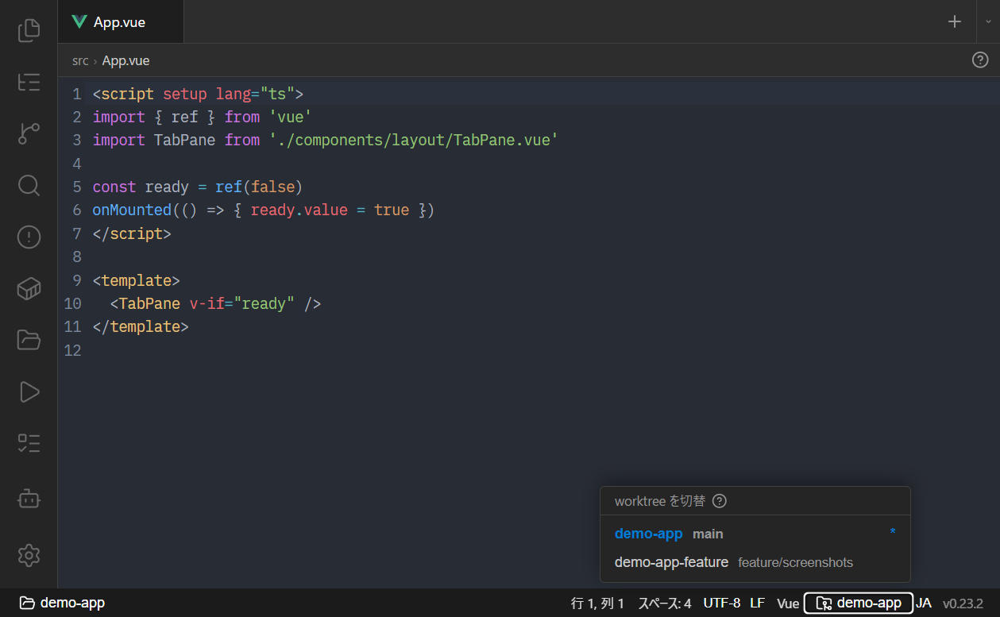

# プロジェクトとウィンドウ

- [プロジェクトの登録と編集](#プロジェクトの登録と編集)
- [グループで整理する](#グループで整理する)
- [プロジェクトの切り替え](#プロジェクトの切り替え)
- [マルチウィンドウ](#マルチウィンドウ)
- [Git worktree の切り替え](#git-worktree-の切り替え)
- [セッションの永続化](#セッションの永続化)

## プロジェクトの登録と編集

左サイドバーの **📁 プロジェクト** パネルでプロジェクトを管理します。

- **新規作成**：パネル上部の新規作成から登録。WSL / Windows の 2 プラットフォームに対応します。
  - **WSL**：ディストロを指定、ルートは WSL パス
  - **Windows**：デフォルトシェル（cmd / PowerShell / PowerShell 7 / Git Bash）を選択、ルートは Windows パス
- **編集 / 削除**：各プロジェクト項目から行えます。
- **カラー**：作成・編集フォームのドロップダウンでプリセット 8 色から選べます。設定するとプロジェクト一覧とプロジェクトスイッチャー（Ctrl+Shift+P）にカラードットが付き、ウィンドウ左端にアクセントラインが表示されます。複数ウィンドウで別プロジェクトを開いたときの取り違え防止に使えます。

プロジェクト設定はアプリのデータフォルダ（`%APPDATA%/com.pike.dev/projects/{id}/project.json`）に保存されます。

## グループで整理する

プロジェクトが増えてきたら**グループ**にまとめられます。

- 未分類のプロジェクトはリスト直下にそのまま並びます。
- 「+ グループを追加」で空グループを作成できます（プロジェクトを入れる前でも保持されます）。
- グループバーの**鉛筆**アイコンで一括リネーム、**✕** で削除（中のプロジェクトは未分類に戻ります）。
- プロジェクト項目を**グループバーにドラッグ&ドロップ**すると所属を変更できます。
- グループの折りたたみ状態は記憶されます。

プロジェクトの編集フォームでは、コンボボックスで「グループなし / 既存グループ / + 新規グループ…」を選べます。

## プロジェクトの切り替え

- パネルでプロジェクトをクリックすると、現在のウィンドウで切り替わります。
- **`Ctrl+Shift+P`** で fzf 風のプロジェクトスイッチャーが開きます。入力で絞り込み、`Enter` で切り替え。
- 切り替え時は全タブを一度閉じ、固定タブ（pinnedTabs）を復元します（無ければ Claude Code 固定タブを自動作成）。

## マルチウィンドウ

プロジェクトを**別ウィンドウ**で開けます。

- プロジェクトスイッチャーで **`Ctrl+Enter`**、またはプロジェクトパネルの「別ウィンドウで開く」ボタン。
- 同じプロジェクトを二重に開こうとすると、既存のウィンドウにフォーカスします。
- 各ウィンドウは独立して動作し、開いていた全プロジェクトは次回起動時に**自動復元**されます。
- **設定変更はすべてのウィンドウへ即座に反映**されます（フォント・配色・ダークモードなどを片方で変えると、他方の表示も追従します）。
- このほかに、プロジェクトに依らないサイドバー無しのウィンドウもあります。→ [グローバルモード](global-mode.md)

## Git worktree の切り替え

複数の git worktree を使って並行作業（例: 複数の AI エージェントに別ブランチを担当させる）をしている場合、ステータスバーの **worktree セレクタ**（フォルダのアイコン、worktree が 2 つ以上あるときのみ表示）で参照先を切り替えられます。

切り替えると、**ファイルツリー / Git / 検索 / タスク / Docker / エディタ**の参照ルートが選んだ worktree へ一斉に切り替わります。1 つのウィンドウで複数 worktree のレビューができます。

- 起動時は常にメイン worktree から始まります（セッションをまたいで保持はしません）。
- 同じウィンドウ内のターミナルで `git worktree add` した変更も、フォーカス連動のポーリングで一覧に反映されます。

## セッションの永続化

- タブの並び順・アクティブタブ・種別はプロジェクトごとに保存され、再起動時に復元されます。
- AI エージェントの会話は、各ツールの resume 機能に委譲して復帰します（例: ターミナルの `claude` 固定タブは `claude --continue` として再開）。

関連: [はじめに](getting-started.md) / [Git](git.md) / [設定](settings.md)
