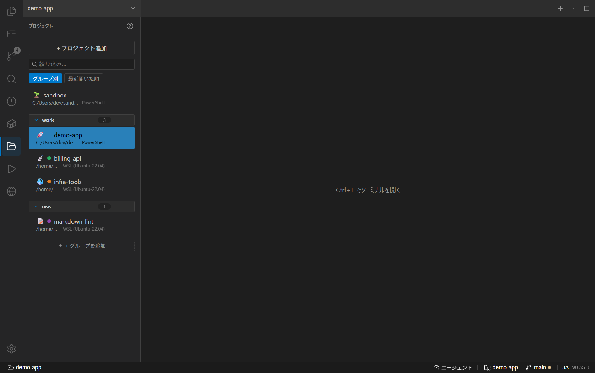
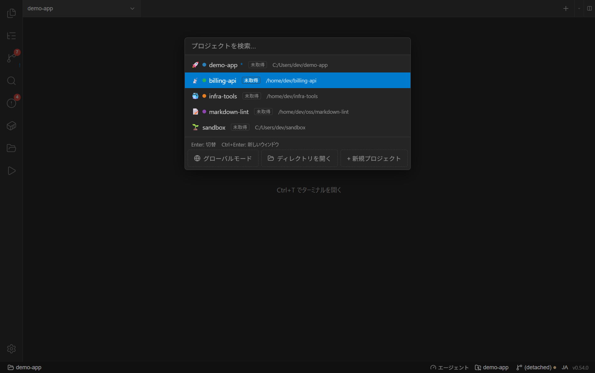
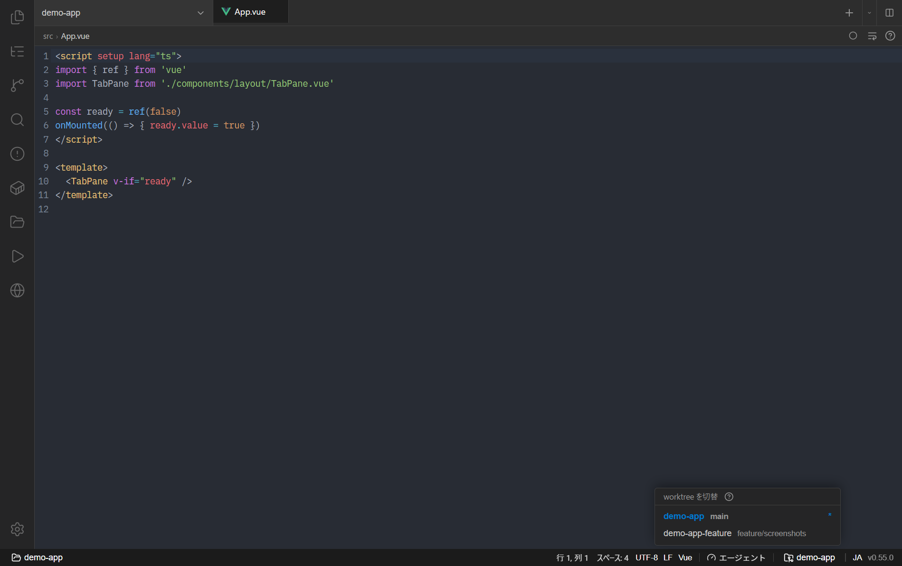

# プロジェクトとウィンドウ

- [プロジェクトの登録と編集](#プロジェクトの登録と編集)
- [登録せずにディレクトリを開く](#登録せずにディレクトリを開く)
- [手元に無いプロジェクトを clone する](#手元に無いプロジェクトを-clone-する)
- [グループで整理する](#グループで整理する)
- [プロジェクトの切り替え](#プロジェクトの切り替え)
- [マルチウィンドウ](#マルチウィンドウ)
- [Git worktree の切り替え](#git-worktree-の切り替え)
- [セッションの永続化](#セッションの永続化)

## プロジェクトの登録と編集

左サイドバーの **📁 プロジェクト** パネルでプロジェクトを管理します。

- **新規作成**：パネル上部の新規作成から登録。WSL / Windows の 2 プラットフォームに対応します。
  - **WSL**：ディストロを指定、ルートは WSL パス
  - **Windows**：デフォルトシェル（cmd / PowerShell / PowerShell 7 / Git Bash）を選択、ルートは Windows パス
- **編集 / 削除**：各プロジェクト項目から行えます。
- **カラー**：作成・編集フォームのドロップダウンでプリセット 8 色から選べます。設定するとプロジェクト一覧とプロジェクトスイッチャー（Ctrl+Shift+P）にカラードットが付き、ウィンドウ左端にアクセントラインが表示されます。今のウィンドウで開いているプロジェクトは、一覧の行がその色で塗られます（カラー未設定なら青）。複数ウィンドウで別プロジェクトを開いたときの取り違え防止に使えます。
- **アイコン**：作成・編集フォームで絵文字を 1 つ設定できます。パレットは検索できます（`docker`、`ドッカー` のように日英どちらでも引けます）。一覧に無い絵文字は、検索欄に貼り付けて Enter で設定できます。設定するとプロジェクト一覧とプロジェクトスイッチャーで名前の前に出ます。
- **golangci-lint コマンド**：編集フォームで設定すると、問題パネルがそのコマンドで lint を実行します。→ [Problems（診断）](panels.md#golangci-lintgo)

### 探す・並べる

<picture>
  <source media="(prefers-color-scheme: light)" srcset="img/project-panel-light.png">
  
</picture>

プロジェクトが増えてきたときは、パネル上部の絞り込みと表示モードを使います。

- **絞り込み**：入力欄にキーワードを入れると、名前・パス・グループ名で絞り込みます。`Esc` または右端の `✕` でクリアします。
- **グループ別**（既定）：グループごとに並べます。並び順は自分で決められます（後述）。
- **最近開いた順**：グループでまとめず 1 列に並べます。所属グループは各行にバッジで出ます。

プロジェクト設定はアプリのデータフォルダ（`%APPDATA%/com.pike.dev/projects/{id}/project.json`）に保存されます。

## 登録せずにディレクトリを開く

中を見たいだけのディレクトリは、プロジェクトとして登録せずに開けます。サイドバー、ファイルツリー、Git は通常どおり使えます。ただし設定は保存されず、プロジェクト一覧や同期ファイルにも残りません。ステータスバーのプロジェクト名の横に「未登録」と出て、ウィンドウのタイトルも `pike - ディレクトリ名（未登録）` になります。

開き方は 2 とおりです。

- プロジェクトスイッチャー（Ctrl+Shift+P）の **ディレクトリを開く** からフォルダを選ぶ
- `pike path/to/dir` を未登録のディレクトリに対して実行する

コマンドラインから開いたときは、プロジェクトとして登録するか 1 度だけ確認します。「いいえ」を選ぶとそのディレクトリは記録され、次からは確認せずそのまま開きます。同じディレクトリをもう一度開くと、すでに開いているウィンドウにフォーカスします。

あとで登録したくなったら、プロジェクトパネル上部の **プロジェクトに登録** を押します。タブの構成はその時点から保存されます。

## 手元に無いプロジェクトを clone する

プロジェクトパネルを開くと、登録されているルートがこのマシンに存在するかを確認します。存在しないプロジェクトには「未取得」の印が付き、ルートのパスに取り消し線が入ります。別マシンで登録したリポジトリ、移動したリポジトリ、削除したリポジトリが対象です。

clone 元の URL には git の remote origin を使います。パネルを開いたときに、URL が未登録でルートが存在するプロジェクトの origin をまとめて読み取り、プロジェクト設定に保存します。以前から登録していたプロジェクトも、パネルを一度開けば URL が入ります。

URL が登録されているプロジェクトは、名前の右に**雲アイコン**が付きます（アイコンにマウスを重ねると URL が出ます）。未取得のプロジェクトに URL があれば、右側の**雲に矢印のアイコン**から clone できます。

- clone はターミナルタブで `git clone` として実行します。パスフレーズや 2 要素認証のプロンプトにそのまま応答できます。
- 失敗したときは内容を読めるようタブが残ります。成功したタブは自動で閉じます。
- 成功すると一覧を更新して「未取得」の印を消し、そのプロジェクトに切り替えるかを確認します。

### 開こうとしたときに clone する

未取得のプロジェクトはプロジェクトスイッチャー（Ctrl+Shift+P）にも「未取得」の印が付きます。パネルの clone ボタンを使わずに開こうとしたときは、clone するかどうかを先に確認します。

- 確認して OK を選ぶと clone を実行し、終わったらそのプロジェクトを開きます。キャンセルすると何も開きません。
- プロジェクトパネルの行をクリックしたときや「新しいウィンドウで開く」を選んだときも同じ確認が出ます。
- タスクバーのジャンプリストやトレイの「最近のプロジェクト」、起動時のセッション復元では、ウィンドウが先に開いてから確認します。clone が終わった時点でプロジェクトを開き直します。
- clone 元の URL が記録されていないプロジェクトは取得できないので、その旨を表示して開きません。ルートを実際の場所に直すか、手動で clone してください。
- 新規作成のときは確認しません。これから作るパスを指定できるようにするためです。

## グループで整理する

プロジェクトが増えてきたら**グループ**にまとめられます。

- 未分類のプロジェクトはリスト直下にそのまま並びます。
- 「+ グループを追加」で空グループを作成できます（プロジェクトを入れる前でも保持されます）。
- グループバーの**鉛筆**アイコンで一括リネーム、**✕** で削除（中のプロジェクトは未分類に戻ります）。
- プロジェクト項目を**グループバーにドラッグ&ドロップ**すると、そのグループの末尾に移動します。
- グループの折りたたみ状態は記憶されます。

### 並び順をドラッグで変える

**グループ別**表示で絞り込みをしていないとき、ドラッグで並び順を決められます。

- プロジェクトを**他のプロジェクトの間**にドロップすると、その位置に移動します。別のグループの行に落とすと、所属もそのグループに変わります。未分類の行に落とせば未分類に戻せます。
- **グループバー同士**をドラッグすると、グループの順番が変わります。
- 一度も動かしていないグループの中身は名前順のままです。
- 決めた順番はプロジェクト設定に保存され、[プロジェクト一覧の同期](settings.md#プロジェクト一覧の同期)を使っていれば他のマシンにも反映されます（順番だけは後から保存した側が優先されます）。

プロジェクトの編集フォームでは、コンボボックスで「グループなし / 既存グループ / + 新規グループ…」を選べます。

## プロジェクトの切り替え

- パネルでプロジェクトをクリックすると、現在のウィンドウで切り替わります。
- **`Ctrl+Shift+P`** で fzf 風のプロジェクトスイッチャーが開きます。入力で絞り込み、`Enter` で切り替え。
- 切り替え時は全タブを一度閉じ、固定タブを復元します（無ければ Claude Code 固定タブを自動作成）。
- 起動直後（復元するプロジェクトが無いとき）は、このスイッチャーが自動で開きます。プロジェクトを開くほか、「グローバルモード」ボタンでサイドバー無しの [グローバルモード](global-mode.md) に切り替えられます（起動直後は今のウィンドウ、プロジェクトを開いた後は別ウィンドウで開きます）。

<picture>
  <source media="(prefers-color-scheme: light)" srcset="img/project-switcher-light.png">
  
</picture>

## マルチウィンドウ

プロジェクトを**別ウィンドウ**で開けます。

- プロジェクトスイッチャーで **`Ctrl+Enter`**、またはプロジェクトパネルの「別ウィンドウで開く」ボタン。
- 同じプロジェクトを二重に開こうとすると、既存のウィンドウにフォーカスします。
- プロジェクトパネルで選んだプロジェクトが別のウィンドウで開いている場合も、今のウィンドウを切り替えずそのウィンドウへフォーカスします。どこにも開いていなければ、今のウィンドウで切り替えます。
- 各ウィンドウは独立して動作し、開いていた全プロジェクトは次回起動時に**自動復元**されます。
- **設定変更はすべてのウィンドウへ即座に反映**されます（フォント・配色・ダークモードなどを片方で変えると、他方の表示も追従します）。
- このほかに、プロジェクトに依らないサイドバー無しのウィンドウもあります。→ [グローバルモード](global-mode.md)

## Git worktree の切り替え

複数の git worktree で並行作業しているとき（例: 複数のエージェントに別ブランチを担当させる）は、参照先を切り替えられます。ステータスバーの **worktree セレクタ**（フォルダのアイコン）を使います。worktree が 2 つ以上あるときだけ表示されます。

<picture>
  <source media="(prefers-color-scheme: light)" srcset="img/worktree-selector-light.png">
  
</picture>

切り替えると、**ファイルツリー / Git / 検索 / タスク / Docker / エディタ**の参照ルートが選んだ worktree へ一斉に切り替わります。1 つのウィンドウで複数 worktree のレビューができます。

- 起動時は常にメイン worktree から始まります（セッションをまたいで保持はしません）。
- 同じウィンドウ内のターミナルで `git worktree add` した変更も、フォーカス連動のポーリングで一覧に反映されます。

## セッションの永続化

- タブの並び順・アクティブタブ・種別はプロジェクトごとに保存され、再起動時に復元されます。
- **ウィンドウのサイズと位置もプロジェクトごとに覚えます**。次に同じプロジェクトを開くと前回の大きさと場所で開き、最大化して閉じた場合は最大化で開きます。保存したときのディスプレイが接続されていないときは、画面外に出ないよう位置だけ OS に任せます。
- AI エージェントの会話は、各ツールの resume 機能に委譲して復帰します（例: ターミナルの `claude` 固定タブは `claude --continue` として再開）。

関連: [はじめに](getting-started.md) / [Git](git.md) / [設定](settings.md)
