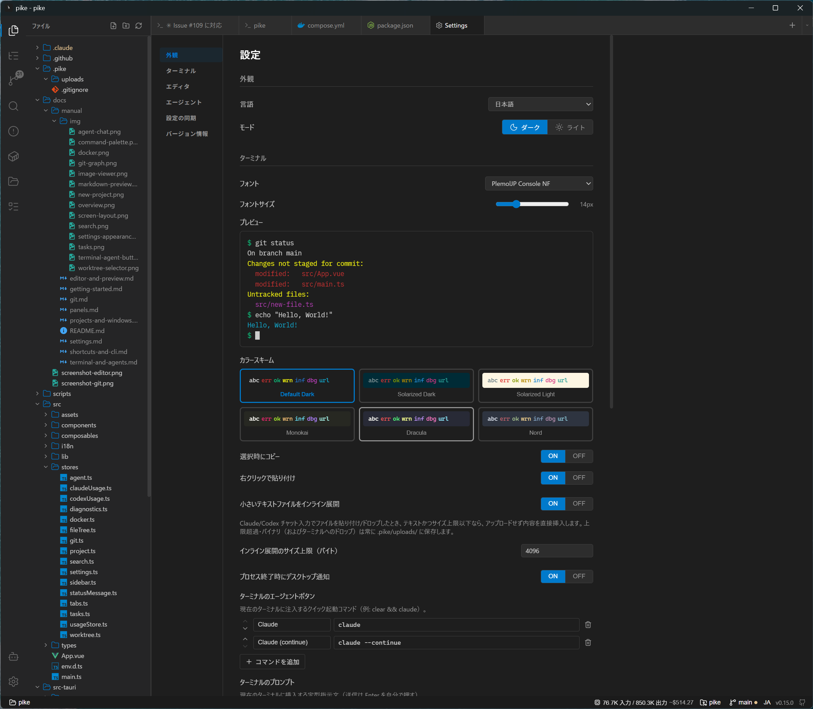

# 設定

設定は左下の**歯車アイコン**からシングルトンタブとして開きます。変更は自動保存され、**開いているすべての Pike ウィンドウに即座に反映**されます。

- [外観（テーマ・フォント・UI サイズ）](#外観テーマフォントui-サイズ)
- [ターミナル](#ターミナル)
- [エディタ](#エディタ)
- [エージェント](#エージェント)
- [設定の同期](#設定の同期)
- [更新（About）](#更新about)

設定タブの左側ナビで各セクションへジャンプできます。

## 外観（テーマ・フォント・UI サイズ）

- **言語**: 日本語 / English（UI 全体が即時に切り替わります）。
- **モード**: ダーク / ライト。
- **UI フォント**: アプリ画面（サイドバー・タブ・パネル・各種ダイアログ）のフォント。「システム既定」または任意のインストール済みフォントを選べます。
- **UI フォントサイズ**: アプリ画面の文字サイズ。クローム領域全体を比例スケールするため、サイズを変えてもレイアウトが崩れません（ターミナル / エディタの本文は各自の設定のまま）。
  - スライダーをドラッグ中は数値ラベルだけがサイズを先行表示し、指を離した時点で反映されます。

> **ターミナル / エディタのフォント**は、それぞれ Terminal / Editor セクションで別に設定します（UI フォントとは独立）。

## ターミナル

- **フォント / フォントサイズ**: ターミナルのフォント。システムのモノスペースフォントから選べます。変更は既存ターミナルに即反映されます。**この設定はエディタには影響しません**（エディタは Editor セクションで設定）。
- **カラースキーム**: 6 種（Default Dark, Solarized Dark/Light, Monokai, Dracula, Nord）。凡例はターミナルフォントで表示されます。
- **選択時にコピー / 右クリックで貼り付け**: ON/OFF。
- **小さいテキストファイルをインライン展開**: → [サイドバーパネル](panels.md#ファイル添付クリップボード--ドラッグドロップ)
- **プロセス終了時のデスクトップ通知**: ON/OFF。
- **ターミナルのエージェントボタン**: 起動コマンドの追加・編集・並べ替え。→ [ターミナルと AI エージェント](terminal-and-agents.md#エージェント起動ボタン--プロンプト挿入)
- **ターミナルのプロンプト**: 定型プロンプト（ラベルと本文）の追加・編集・並べ替え。

## エディタ

- **フォント / フォントサイズ**: エディタ本文のフォント（ターミナルとは独立）。
- **テーマ**: エディタの配色テーマ。凡例はエディタフォントで表示されます。
- **ミニマップ**: ON/OFF。
- **折り返し（Word Wrap）**: ON/OFF。
- **タブサイズ**: 2 / 4 / 8。

これらは CodeMirror に即時反映されます。

## エージェント

- **デフォルトエージェント**: 新規チャット時に Claude Code / Codex のどちらを使うか、または毎回選択。
- **エージェントのデスクトップ通知**: ON/OFF。

## 設定の同期

Pike 自体には同期サービスはありませんが、**環境に依存しない設定**（フォント・配色・エディタ・ターミナルのコマンド/プロンプトなど）を 1 つの JSON ファイルに書き出せます。

- 保存先を Dropbox / OneDrive / git で同期されるフォルダ内のパスにすると、複数 PC 間で設定を共有できます。
- **書き出し（Export）** / **読み込み（Load）** を手動で行えます。起動時にも同期ファイルから自動で読み込みます。
- プロジェクト一覧やグループ、同期ファイルのパス自体は同期対象外です（環境固有のため）。

## 更新（About）

- 現在のバージョンを表示します。
- **「更新を確認」**で GitHub Releases を参照し、新しいバージョンがあれば **「更新して再起動」**で適用できます。
- 起動時にもバックグラウンドで更新を確認し、ある場合は歯車アイコンに通知ドットが付きます。

関連: [はじめに](getting-started.md) / [プロジェクトとウィンドウ](projects-and-windows.md#マルチウィンドウ)
