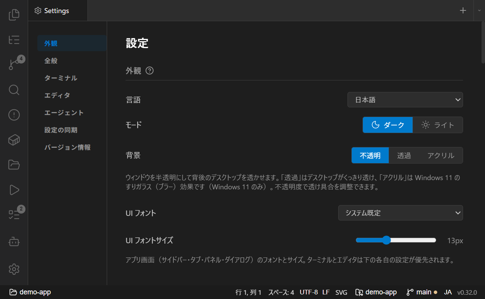
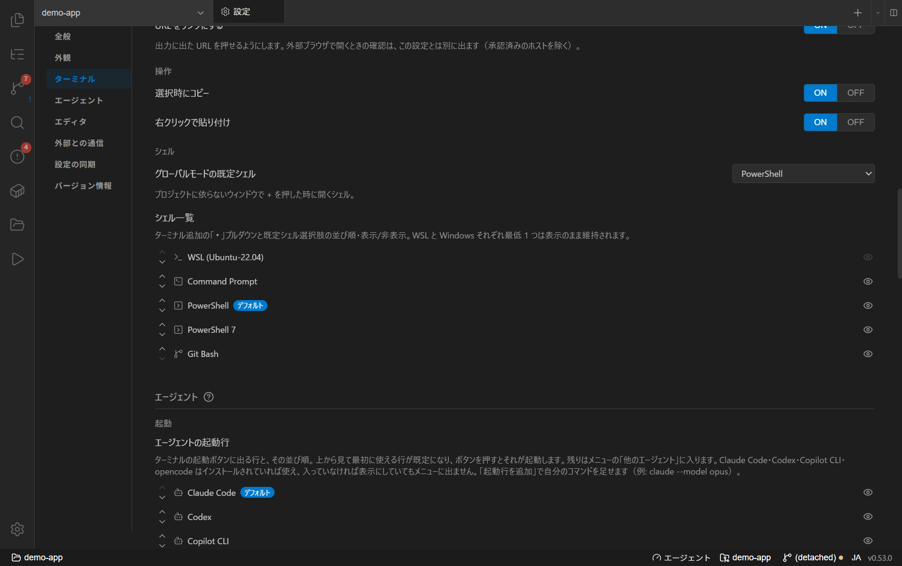

# 設定

設定は左下の**歯車アイコン**からシングルトンタブとして開きます。変更は自動保存され、**開いているすべての Pike ウィンドウへ即座に反映**されます。

- [外観（テーマ・フォント・UI サイズ）](#外観テーマフォントui-サイズ)
- [全般](#全般)
- [ターミナル](#ターミナル)
- [エージェント](#エージェント)
- [エディタ](#エディタ)
- [設定の同期](#設定の同期)
- [バージョン情報](#バージョン情報)

設定タブの左側ナビで各セクションへジャンプできます。

## 外観（テーマ・フォント・UI サイズ）

<picture>
  <source media="(prefers-color-scheme: light)" srcset="img/settings-appearance-light.png">
  
</picture>

- **言語**：日本語 / English（UI 全体が即時に切り替わります）。
- **モード**：ダーク / ライト / システム（新規インストール時の既定はシステム）。**システム**は OS の設定に追従し、OS 側で切り替えるとその場で変わります。カラースキームとエディタテーマで **Auto** を選ぶと、このモードに追従して配色が切り替わります。
    - 同期するのは選んだモードだけです。**システム**を選んだ状態を別のマシンへ持っていくと、そのマシンの OS 設定に従います。
- **背景**：ウィンドウを半透明にして背後のデスクトップを透かせます。「不透明（既定）/ 透過 / アクリル」から選べます。「透過」はデスクトップがくっきり透け、「アクリル」は Windows 11 のすりガラス効果です（Windows 11 で有効）。アクリルは非アクティブのあいだ Windows 側の仕様ですりガラスが外れます。透け方が変わりすぎないよう、そのあいだは自動で少し不透明側に寄せます。**不透明度**スライダー（10〜100%）で透け具合を調整できます。サイドバー・パネルだけでなく、ターミナルとエディタの本文も透過します。
- **UI フォント**：アプリ画面（サイドバー・タブ・パネル・各種ダイアログ）のフォント。「システム既定」または任意のインストール済みフォントを選べます。
- **UI フォントサイズ**：アプリ画面の文字サイズ。サイドバー・タブ・パネルをまとめて比例拡大するため、サイズを変えてもレイアウトが崩れません（ターミナル / エディタの本文は各自の設定のまま）。
  - スライダーをドラッグ中は数値ラベルだけがサイズを先行表示し、指を離した時点で反映されます。

> **ターミナル / エディタのフォント**は、それぞれ「ターミナル」「エディタ」セクションで別に設定します（UI フォントとは独立）。

## 全般

- **キーボードショートカット**：VSCode 互換（既定）/ IDEA 互換。使い慣れたエディタに合わせてキーの組を切り替えます。`Ctrl+K` で開く一覧の右上でも切り替えられます。変わるキーの一覧は [ショートカットと CLI（プリセット）](shortcuts-and-cli.md#プリセット)にあります。
- **未登録のディレクトリを開いたとき**：自動登録 / 確認する（既定）/ 登録しない。プロジェクトとして登録していないディレクトリの扱いです。「確認する」ではディレクトリごとに 1 度だけ確認します。ダイアログの **今後は確認せず、この選択を既定にする** をチェックすると、その回の答えに応じてこの設定が「自動登録」か「登録しない」へ切り替わります。→ [登録せずにディレクトリを開く](projects-and-windows.md#登録せずにディレクトリを開く)
- **閉じたときトレイに最小化**：ON/OFF。ON（既定）ではウィンドウを閉じても Pike はシステムトレイに常駐し、トレイアイコンから復帰できます（終了はトレイメニューの「終了」から）。OFF では最後のウィンドウを閉じたときに Pike を終了します。他のウィンドウが開いていればメインウィンドウを閉じてもそのウィンドウは残り、最後の 1 つを閉じた時点で終了します。→ [ショートカットと CLI（タスクバーとシステムトレイ）](shortcuts-and-cli.md#タスクバーとシステムトレイ)

## ターミナル

- **フォント / フォントサイズ**：ターミナルのフォント。システムのモノスペースフォントから選べます。変更は既存ターミナルに即反映されます。
- **カラースキーム**：6 種（Default Dark / Solarized Dark / Solarized Light / Monokai / Dracula / Nord）と **Auto（モード追従）**。Auto はアプリのダーク/ライトに合わせて Default Dark / Solarized Light を自動で選びます。凡例はターミナルフォントで表示されます。
- **選択時にコピー / 右クリックで貼り付け**：ON/OFF。
- **グローバルモードの既定シェル**：グローバルモードのウィンドウで「+」を押したときに開くシェル。Windows では Windows シェル（Command Prompt / PowerShell / PowerShell 7 / Git Bash）と検出済みの WSL ディストロから、macOS ではログインシェルから選べます。非表示にしたシェルはこの選択肢からも除外されます。マシンの WSL 構成に依存するため、この設定は設定同期の対象外です。→ [グローバルモード](global-mode.md#ターミナルとして使う)
- **シェル一覧**：ターミナル追加の「▾」プルダウンと既定シェル選択肢、それにタスクバーとトレイのメニューに出すシェルの並び順と表示/非表示を管理します。↑↓ で並べ替え、目のアイコンで表示/非表示を切り替えます。現在の既定シェルには「デフォルト」バッジが付きます。WSL と Windows それぞれ最低 1 つは表示のまま維持されます（macOS はログインシェル 1 つなので、この一覧も 1 行です）。この設定もマシン固有のため同期対象外です。

<picture>
  <source media="(prefers-color-scheme: light)" srcset="img/settings-shells-light.png">
  
</picture>

## エージェント

ターミナルの起動ボタンに関する設定です。→ [ターミナルと AI エージェント](terminal-and-agents.md#エージェント起動ボタン--プロンプト挿入)

- **エージェント一覧**：Claude Code・Codex・Copilot CLI・opencode の並び順と表示/非表示。↑↓ で並べ替え、目のアイコンで表示を切り替えます。**先頭が既定のエージェント**で、起動ボタンを押すとそれが走り、メニューの第 1 階層にもそれだけが出ます。残りはメニューの「他のエージェント」に入ります。インストールされていないものは、表示にしていてもメニューに出ません。最後の 1 つは隠せません。
- **ターミナルのエージェントボタン**：一覧に無いコマンドを足したいときに使います（例: `claude --model opus`）。ここに書いた行は、書いた順でメニューに並びます。
- **ターミナルのプロンプト**：定型プロンプト（ラベルと本文）の追加・編集・並べ替え。

## エディタ

- **フォント / フォントサイズ**：エディタ本文のフォント。
- **テーマ**：エディタの配色テーマ。**Auto（モード追従）** はアプリのダーク/ライトに合わせて One Dark / Default Light を自動で選びます。凡例はエディタフォントで表示されます。
- **ミニマップ**：ON/OFF。ここで決めるのは既定値で、タブごとにツールバーのボタンで上書きできます（[ミニマップの切り替え](editor-and-preview.md#ミニマップの切り替え)）。
- **自動保存**：OFF / フォーカスが外れたら / 一定時間後（既定は OFF）。保存の主体は変わらず、`Ctrl+S` の押し忘れを代わりに行う設定です。「一定時間後」を選ぶと待ち時間（ミリ秒）を指定できます。次の 4 つでは自動保存しません。
    - まだ保存していない無題のファイル（保存先を聞くダイアログが勝手に開くため）
    - 読み取り専用のタブ（コミットの内容を開いたときなど）
    - 「外部で変更されました」の警告が出ているとき（どうするか選ぶまで待ちます）
    - コンフリクトのマーカーが残っているファイル
- **折り返し（Word Wrap）**：ON/OFF。ここで決めるのは既定値で、タブごとにツールバーのボタンで上書きできます（[折り返しの切り替え](editor-and-preview.md#折り返しの切り替え)）。
- **diff の折り返し（Word Wrap）**：自動 / ON / OFF（既定は自動）。diff タブの折り返しはエディタとは別に決められます。自動は、画面幅の 2 倍を超えてはみ出す差分だけ折り返して開きます。OFF のとき、長い行は横スクロールで読みます（[diff タブ](git.md#diff-タブ)）。
- **タブサイズ**：2 / 4 / 8。
- **スムーススクロール（プレビュー）**：ON/OFF（既定は ON）。プレビュー内で見出しリンクや「先頭へ戻る」を押したときに、滑らかにスクロールするか一気に飛ぶかを選びます。
- **貼り付けた URL をタイトル付きリンクにする**：ON/OFF（既定は OFF）。ON にすると、Markdown に URL を貼るたびにそのページへ通信してタイトルを読み、`[タイトル](URL)` の形で挿入します（[URL の貼り付け](editor-and-preview.md#url-の貼り付け)）。
- **外部画像の許可ドメイン**：Markdown プレビューが画像を読み込むドメインの一覧。追加はプレビューのボタンから行い、この一覧では削除だけができます（[外部ドメインの画像](editor-and-preview.md#外部ドメインの画像)）。
- **リンクを確認なしで開くドメイン**：外部ブラウザで開くときの確認を省略するドメインの一覧。追加は確認ダイアログのチェックボックスから行い、この一覧では削除だけができます（[リンクを開く](editor-and-preview.md#リンクを開く)）。

これらは開いているエディタタブへ即時反映されます。

## 設定の同期

Pike 自体には同期サービスはありませんが、**環境に依存しない設定**（フォント・配色・エディタ・ターミナルのコマンド/プロンプトなど）を 1 つの JSON ファイルに書き出せます。

- 保存先を Dropbox / OneDrive / git で同期されるフォルダ内のパスにすると、複数 PC 間で設定を共有できます。
- **書き出し（Export）** / **読み込み（Load）** を手動で行えます。起動時にも同期ファイルから自動で読み込みます。
- 同期ファイルのパス自体、グローバルモードの既定シェルとシェル一覧は同期対象外です（環境固有のため）。

### プロジェクト一覧の同期

同じファイルでプロジェクト一覧も共有します。設定本体とは扱いが異なり、**プロジェクト id をキーにした合併**です。各マシンは自分のプロジェクトを足すだけで、他マシンの項目を消しません。

同期する項目は、名前・base からの相対パス・カラー・アイコン・グループ・グループ内の並び順・remote origin の URL・golangci-lint コマンド・プラットフォーム（WSL / Windows / macOS ローカル）です。実際のパス、シェル（ディストロ名を含む）、固定タブ、セッション、最終利用日時はマシンごとに保持します。

- **プロジェクトの base ディレクトリ**：このマシンでリポジトリを置いている場所を指定します。Windows では Windows 用と WSL 用の 2 つ、macOS ではローカル用の 1 つです。base が `C:\Users\me\src` で相対パスが `oss/pike` なら、実際のルートは `C:\Users\me\src\oss\pike` になります。WSL 側はディストロも選びます。この設定はマシン固有のため同期しません。
- base の外にルートがあるプロジェクトは相対パスを作れないので、同期せずこのマシン専用になります。件数は base 設定の下に出ます。
- 他マシンで登録されたプロジェクトは、base から解決したルートで作られます。ルートがまだ無ければ「未取得」として一覧に並び、[clone](projects-and-windows.md#手元に無いプロジェクトを-clone-する) で実体化できます。
- 書き出しは**手元の値をそのまま反映**します。名前・カラー・グループなどを変えれば同期ファイル側も変わり、項目を空にすればファイル側も空になります。複数の PC で同じプロジェクトを編集した場合は、最後に書き出したマシンの値が残ります。手元に無いプロジェクトの項目には触りません。
- 読み込みは、すでにこのマシンにあるプロジェクトについては**空いている項目を埋めるだけ**です。起動のたびに他マシンの値で手元の設定が置き換わらないようにするためです。無いプロジェクトは新規に作られます。
- **このマシンで非表示のプロジェクト**：プロジェクトを削除すると、このマシンでは非表示として記録します。同期は合併のみなので、これが無いと次回の読み込みで復活してしまうためです。記録にはルートと origin の URL も残します。同じリポジトリが別の id で同期ファイルに入っていても、削除したものが別名で作り直されないようにするためです。設定画面の一覧の目のアイコンで戻せます（同期ファイルの項目から作り直します）。
- 同期ファイルを読めなかったときは書き込みを中止し、エラーを表示します。読めた内容だけで上書きして他の項目を失わないためです。

## バージョン情報

- 現在のバージョンを表示します。
- 「更新を確認」で GitHub Releases を参照し、新しいバージョンがあれば「更新して再起動」で適用できます。
- 起動時にもバックグラウンドで更新を確認し、ある場合は歯車アイコンに通知ドットが付きます。

関連: [はじめに](getting-started.md) / [プロジェクトとウィンドウ](projects-and-windows.md#マルチウィンドウ)
