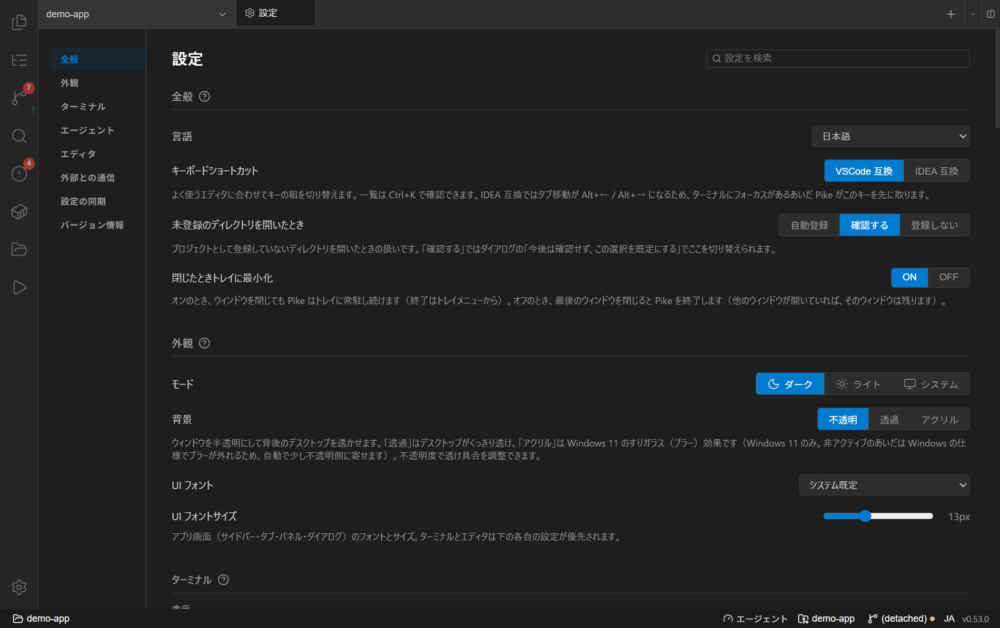
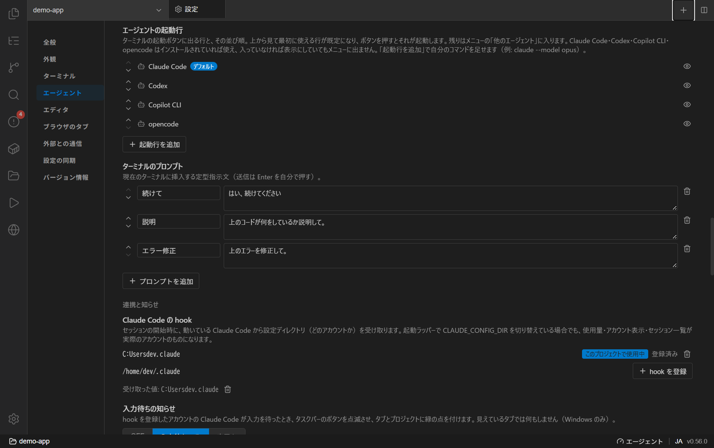
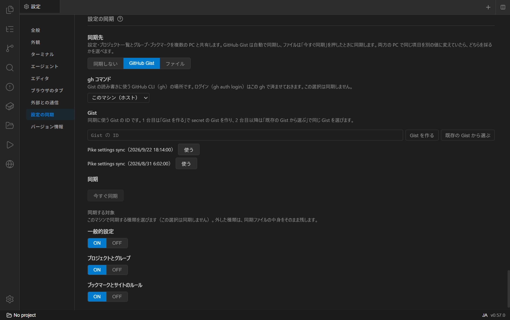
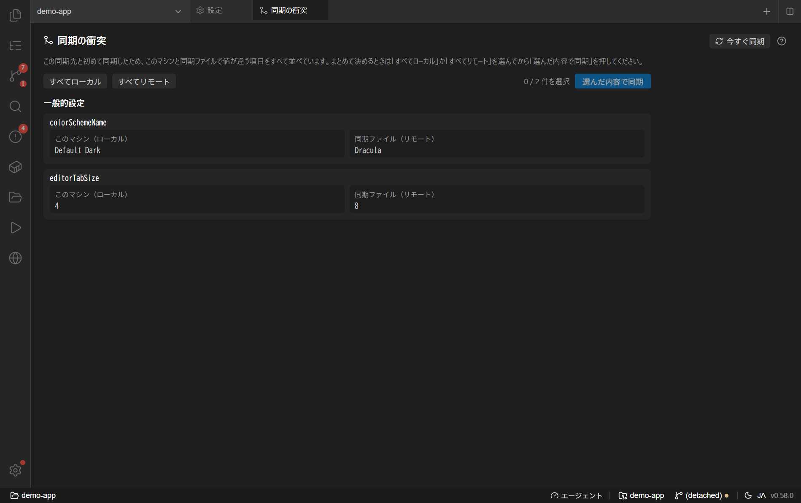

# 設定

設定は左下の**歯車アイコン**からシングルトンタブとして開きます。変更は自動保存され、**開いているすべての Pike ウィンドウへ即座に反映**されます。

<picture>
  <source media="(prefers-color-scheme: light)" srcset="img/settings-overview-light.png">
  
</picture>

- [設定を探す](#設定を探す)
- [全般](#全般)
- [外観](#外観)
- [ターミナル](#ターミナル)
- [エージェント](#エージェント)
- [エディタ](#エディタ)
- [ブラウザのタブ](#ブラウザのタブ)
- [外部との通信](#外部との通信)
- [設定の同期](#設定の同期)
- [バージョン情報](#バージョン情報)

設定タブの左側ナビで各セクションへジャンプできます。長いセクション（ターミナル・エージェント・エディタ）は「表示」「操作」のような小見出しで分かれています。

## 設定を探す

画面右上の**検索欄**で設定を絞り込めます。

- 探す対象は**項目名と説明文**、それに選択肢のラベルです（「アクリル」で外観の**背景**に当たります）。
- 各項目は、所属するセクション名（「エージェント」）と小見出し（「シェル」）も持っているものとして扱います。セクション名だけを入れると、その中身をすべて出します。
- 空白で区切ると、すべての語を含む項目だけが残ります。セクション名で範囲を絞ってから語を足せます（例: `エディタ 折り返し`）。
- 一致した箇所は色を付けて示します。該当が無いセクションは、本文と左側ナビの両方から消えます。
- 当たるのは**表示中の言語の文言**です。日本語の UI では日本語で、英語の UI では英語で入力します。

## 全般

- **言語**：日本語 / English（UI 全体が即時に切り替わります）。
- **キーボードショートカット**：VSCode 互換（既定）/ IDEA 互換。使い慣れたエディタに合わせてキーの組を切り替えます。`Ctrl+Shift+/`（macOS では `⌘K`）で開く一覧の右上でも切り替えられます。変わるキーの一覧は [ショートカットと CLI（プリセット）](shortcuts-and-cli.md#プリセット)にあります。
- **未登録のディレクトリを開いたとき**：自動登録 / 確認する（既定）/ 登録しない。プロジェクトとして登録していないディレクトリの扱いです。「確認する」ではディレクトリごとに 1 度だけ確認します。ダイアログの **今後は確認せず、この選択を既定にする** をチェックすると、その回の答えに応じてこの設定が「自動登録」か「登録しない」へ切り替わります。→ [登録せずにディレクトリを開く](projects-and-windows.md#登録せずにディレクトリを開く)
- **タブバーの「+」を押したとき**：メニューを出す（既定）/ ターミナル / エディタ / ブラウザ / エージェント。既定では「+」を押すと、何を開くかのメニューが出ます。種類を選ぶと「+」がそれをそのまま開き、メニューは横に出る `▾` から出します。エージェントは、エージェントの起動行の先頭を実行する新しいターミナルを開きます（使えるエージェントが無いときはターミナルを開きます）。`Ctrl+T`（新規ターミナル）はこの設定に関係なくターミナルを開きます。
- **閉じたときトレイに最小化**：ON/OFF。ON ではウィンドウを閉じても Pike はシステムトレイに常駐し、トレイアイコンから復帰できます（終了はトレイメニューの「終了」から）。OFF（既定）では最後のウィンドウを閉じたときに Pike を終了します。他のウィンドウが開いていればメインウィンドウを閉じてもそのウィンドウは残り、最後の 1 つを閉じた時点で終了します。→ [ショートカットと CLI（タスクバーとシステムトレイ）](shortcuts-and-cli.md#タスクバーとシステムトレイ)

## 外観

- **モード**：ダーク / ライト / システム（新規インストール時の既定はシステム）。**システム**は OS の設定に追従し、OS 側で切り替えるとその場で変わります。カラースキームとエディタテーマで **Auto** を選ぶと、このモードに追従して配色が切り替わります。
    - 同期するのは選んだモードだけです。**システム**を選んだ状態を別のマシンへ持っていくと、そのマシンの OS 設定に従います。
    - ステータスバーの右端にも切り替えのボタンがあります。押すたびにダーク → ライト → システムと巡り、アイコンが今のモードを示します。
- **背景**：ウィンドウを半透明にして背後のデスクトップを透かせます。「不透明（既定）/ 透過 / アクリル」から選べます。「透過」はデスクトップがくっきり透け、「アクリル」は Windows 11 のすりガラス効果です（Windows 11 で有効）。アクリルは非アクティブのあいだ Windows 側の仕様ですりガラスが外れます。透け方が変わりすぎないよう、そのあいだは自動で少し不透明側に寄せます。サイドバー・パネルだけでなく、ターミナルとエディタの本文も透過します。
- **不透明度**：10〜100%。透け具合を調整します。背景が「不透明」以外のときに出ます。
- **UI フォント**：アプリ画面（サイドバー・タブ・パネル・各種ダイアログ）のフォント。「システム既定」または任意のインストール済みフォントを選べます。
- **UI フォントサイズ**：アプリ画面の文字サイズ。サイドバー・タブ・パネルをまとめて比例拡大するため、サイズを変えてもレイアウトが崩れません（ターミナル / エディタの本文は各自の設定のまま）。
  - スライダーをドラッグ中は数値ラベルだけがサイズを先行表示し、指を離した時点で反映されます。

> **ターミナル / エディタのフォント**は、それぞれ「ターミナル」「エディタ」セクションで別に設定します（UI フォントとは独立）。

## ターミナル

**表示**

- **フォント / フォントサイズ**：ターミナルのフォント。システムのモノスペースフォントから選べます。変更は既存ターミナルに即反映されます。
- **カラースキーム**：6 種（Default Dark / Solarized Dark / Solarized Light / Monokai / Dracula / Nord）と **Auto（モード追従）**。Auto はアプリのダーク/ライトに合わせて Default Dark / Solarized Light を自動で選びます。凡例はターミナルフォントで表示されます。
- **プレビュー**：選んだフォントと配色の見本です。

**重ねて出すボタン**

ターミナルの右上に重なって出る 3 つのボタンを、それぞれ出す / 出さないで切り替えます。→ [エージェント起動ボタン / プロンプト挿入](terminal-and-agents.md#エージェント起動ボタン--プロンプト挿入)

- **エージェント起動ボタン**：オフにしても、コマンドを打てばエージェントは動きます。起動行の設定（「エージェント」セクション）はそのまま残ります。
- **プロンプト挿入ボタン**：定型プロンプトを差し込むボタン。
- **ヘルプボタン**：右端の「?」。上の 2 つを両方オフにしている間は OFF に固定され、切り替えられません。どちらかをオンに戻すと、元の設定に戻ります。

**リンク**

ターミナルの出力をクリックできるようにするかの設定です。→ [出力のパスをクリックして開く](terminal-and-agents.md#出力のパスをクリックして開く)

- **ファイルパスのリンク**：「確認して開く（既定）/ すぐ開く / リンクにしない」。`src/main.rs:42` のようなパスを押せるようにします。「確認して開く」では、押しても即座には開かず、開く先を出して一度確認します（確認のチェックボックスからも「すぐ開く」へ切り替えられます）。「リンクにしない」では下線も出ません。
- **URL をリンクにする**：ON/OFF（既定は ON）。出力に出た URL を押せるようにします。外部ブラウザで開くときの確認は、この設定とは別に出ます（承認済みのホストを除く）。

**操作**

- **選択時にコピー**：ターミナルで文字を選択したとき、その内容をクリップボードへコピーするか。
  - **常にコピー**：確認せずにコピーします。
  - **毎回確認**（既定）：選択するたびに確認します。確認のダイアログで「常にコピー」「毎回確認」「OFF」を選ぶと、それがこの設定になります。「毎回確認」を選ぶと今回はコピーし、次の選択でもまた確認します。Esc で閉じたときはコピーしません。
  - **OFF**：コピーしません。
- **右クリックで貼り付け**：ON/OFF。

**シェル**

- **グローバルモードの既定シェル**：グローバルモードのウィンドウで「+」を押したときに開くシェル。Windows では Windows シェル（Command Prompt / PowerShell / PowerShell 7 / Git Bash）と検出済みの WSL ディストロから、macOS ではログインシェルから選べます。非表示にしたシェルはこの選択肢からも除外されます。マシンの WSL 構成に依存するため、この設定は設定同期の対象外です。→ [グローバルモード](global-mode.md#ターミナルとして使う)
- **シェル一覧**：タブバーの「+」のメニューと既定シェル選択肢、それにタスクバーとトレイのメニューに出すシェルの並び順と表示/非表示を管理します。↑↓ で並べ替え、目のアイコンで表示/非表示を切り替えます。現在の既定シェルには「デフォルト」バッジが付きます。WSL と Windows それぞれ最低 1 つは表示のまま維持されます（macOS はログインシェル 1 つなので、この一覧も 1 行です）。この設定もマシン固有のため同期対象外です。

<picture>
  <source media="(prefers-color-scheme: light)" srcset="img/settings-shells-light.png">
  
</picture>

## エージェント

ターミナルの起動ボタンに関する設定です。→ [ターミナルと AI エージェント](terminal-and-agents.md#エージェント起動ボタン--プロンプト挿入)

<picture>
  <source media="(prefers-color-scheme: light)" srcset="img/settings-agents-light.png">
  
</picture>

**起動**

- **エージェントの起動行**：起動ボタンのメニューに出る行と、その並び順。↑↓ で並べ替え、目のアイコンで表示を切り替えます。**上から見て最初に使える行が既定**で、起動ボタンを押すとそれが走り、メニューの第 1 階層にもそれだけが出ます。残りはメニューの「他のエージェント」に入ります。最後の 1 つは隠せません。
  - Claude Code・Codex・Copilot CLI・opencode の 4 行は最初から並んでいます。**使えるのはインストールされているものだけ**で、入っていなければ表示にしていてもメニューに出ません。
  - 「起動行を追加」で自分のコマンドを足せます（例: `claude --model opus`）。追加した行も同じ一覧で並べ替えられるので、先頭に上げればそれが既定になります。ゴミ箱で消せるのは追加した行だけです。
- **ターミナルのプロンプト**：定型プロンプト（ラベルと本文）の追加・編集・並べ替え。

**連携と知らせ**

- **Claude Code の hook**：どのアカウント（設定ディレクトリ）で動いているかを、Claude Code 自身に知らせてもらう設定です。→ [Claude Code のアカウントを知らせる](terminal-and-agents.md#claude-code-のアカウントを知らせる)
- **入力待ちの知らせ**：オフ / 入力待ちのみ（既定）/ 完了も。上の hook を登録したアカウントで、エージェントが答えを待ったときにタスクバーを点滅させ、タブとプロジェクトに緑の点を付けます（Windows のみ）。→ [入力待ちを知らせる](terminal-and-agents.md#入力待ちを知らせる)
- **待たせているだけの知らせも出す**：オフ（既定）/ オン。エージェントが 60 秒なにも受け取っていないときにも知らせます。長く動くサブエージェントの終わりを待っているあいだにも出るため、既定では出しません。オフのあいだは、タブとプロジェクトの点も付きません。
- **デスクトップ通知**：オン（既定）/ オフ。上の知らせをデスクトップ通知でも出します。クリックすると、そのタブのウィンドウが前に出ます（Windows のみ）。

## エディタ

**表示**

- **フォント / フォントサイズ**：エディタ本文のフォント。
- **テーマ**：エディタの配色テーマ。**Auto（モード追従）** はアプリのダーク/ライトに合わせて One Dark / Default Light を自動で選びます。凡例はエディタフォントで表示されます。
- **ミニマップ**：ON/OFF。ここで決めるのは既定値で、タブごとにツールバーのボタンで上書きできます（[ミニマップの切り替え](editor-and-preview.md#ミニマップの切り替え)）。
- **折り返し（Word Wrap）**：ON/OFF。ここで決めるのは既定値で、タブごとにツールバーのボタンで上書きできます（[折り返しの切り替え](editor-and-preview.md#折り返しの切り替え)）。
- **タブサイズ**：2 / 4 / 8。
- **CSV プレビューの表示件数**：100 / 500 / 1,000 / 5,000 行（既定は 1,000 行）。CSV プレビューの 1 ページに表示する行数です。プレビューの表の上でも切り替えられます（[プレビュー](editor-and-preview.md#プレビューmarkdown--rst--csv--json--mermaid--svg--html)）。
- **エディタで開けるファイルの大きさ**：2 / 5 / 10 / 20 / 50 MB（既定は 10 MB）。これより大きいファイルを開くと、先頭から読み取り専用で読み込むか、ほかのアプリで開くかを選ぶ画面になります（[大きいファイル](editor-and-preview.md#コード編集)）。
- **`.sql` の SQL 方言**：標準 SQL / MySQL / PostgreSQL / SQLite（既定は標準 SQL）。`.sql` を開いたときにどの方言としてハイライトするかを決めます。ステータスバーの[ファイルタイプ](editor-and-preview.md#文字コードと改行コード)から手動で選ぶ場合は、この設定に関係なく方言を選べます。

**保存**

- **自動保存**：OFF / フォーカスが外れたら / 一定時間後（既定は OFF）。保存の主体は変わらず、`Ctrl+S` の押し忘れを代わりに行う設定です。「一定時間後」を選ぶと待ち時間（ミリ秒）を指定できます。次の 4 つでは自動保存しません。
    - まだ保存していない無題のファイル（保存先を聞くダイアログが勝手に開くため）
    - 読み取り専用のタブ（コミットの内容を開いたときなど）
    - 「外部で変更されました」の警告が出ているとき（どうするか選ぶまで待ちます）
    - コンフリクトのマーカーが残っているファイル

**diff とプレビュー**

- **diff の折り返し（Word Wrap）**：自動 / ON / OFF（既定は自動）。diff タブの折り返しはエディタとは別に決められます。自動は、画面幅の 2 倍を超えてはみ出す差分だけ折り返して開きます。OFF のとき、長い行は横スクロールで読みます（[diff タブ](git.md#diff-タブ)）。
- **スムーススクロール（プレビュー）**：ON/OFF（既定は ON）。プレビュー内で見出しリンクや「先頭へ戻る」を押したときに、滑らかにスクロールするか一気に飛ぶかを選びます。

これらは開いているエディタタブへ即時反映されます。

## ブラウザのタブ

- **Jira の拡張機能**：Jira Cloud のページに、列の色分けや自動の再読み込みなどを差し込みます（既定はオン）。中身は [ブラウザのタブ](browser.md#jira-の拡張機能) にあります。
- **ドメインごとの JS と CSS**：指定したドメインのページに、書いた JS と CSS を差し込みます。項目と動きは [ブラウザのタブ](browser.md#ドメインごとの-js-と-css) にあります。

## 外部との通信

Pike が外部のホストへ接続する機能の設定です。どれも既定では通信しません。

- **貼り付けた URL をタイトル付きリンクにする**：ON/OFF（既定は OFF）。ON にすると、Markdown に URL を貼るたびにそのページへ通信してタイトルを読み、`[タイトル](URL)` の形で挿入します（[URL の貼り付け](editor-and-preview.md#url-の貼り付け)）。
- **外部画像の許可ドメイン**：Markdown プレビューが画像を読み込むドメインの一覧。追加はプレビューのボタンから行い、この一覧では削除だけができます（[外部ドメインの画像](editor-and-preview.md#外部ドメインの画像)）。
- **リンクを確認なしで開くドメイン**：外部ブラウザで開くときの確認を省略するドメインの一覧。追加は確認ダイアログのチェックボックスから行い、この一覧では削除だけができます（[リンクを開く](editor-and-preview.md#リンクを開く)）。

## 設定の同期

設定・プロジェクト一覧とグループ・ブックマークを 1 つの JSON ファイルに入れて、複数の PC で共有します。**同期先**で、そのファイルをどこに置くかを選びます。

- **GitHub Gist**：自分の GitHub アカウントの secret Gist に置きます。自動で同期します（後述）。
- **ファイル**：指定したパスに置きます。Dropbox / OneDrive / git で同期されるフォルダを指定すると、複数の PC で使えます。**今すぐ同期**を押したときだけ同期します。
- **同期しない**：同期を止めます。

<picture>
  <source media="(prefers-color-scheme: light)" srcset="img/settings-sync-light.png">
  
</picture>

共通の動きは次のとおりです。

- 最後に同期した時刻と、プロジェクトを追加・更新・削除した件数が **今すぐ同期** の横に出ます。
- 同期先の設定、グローバルモードの既定シェルとシェル一覧、閲覧履歴は同期しません（環境固有のため）。
- 同期ファイルを JSON として読めなかったときは、何も書き込まずにエラーを表示します。

### GitHub Gist で同期する

Gist の読み書きには GitHub CLI（`gh`）を使います。Pike は GitHub のトークンを扱いません。

1. `gh` を入れ、ターミナルで `gh auth login` を実行してログインしておきます。
2. **同期先**で **GitHub Gist** を選びます。
3. **gh コマンド**で、使う `gh` の場所を選びます。既定は**このマシン（ホスト）**です。WSL にだけ入れている場合は、その distro を選びます。
4. 1 台目の PC では **Gist を作る** を押します。secret の Gist を作り、同期を始めます。
5. 2 台目以降の PC では **既存の Gist から選ぶ** を押し、一覧から同じ Gist の **使う** を押します。

Gist を選んだあとは、次のときに自動で同期します。

- Pike を起動したとき
- 設定やプロジェクトを変えてから数秒たったとき
- ウィンドウを前に出したとき（前回の同期より 5 分以上あとのとき）

衝突が出たときは自動では決めず、[衝突の解消](#衝突の解消)で選ぶまで保留にします。

### 同期のしかた

同期するたびに、**前回同期した時点の内容**をこのマシンに覚えておきます。次の同期では項目ごとに、このマシン・同期ファイル・前回の内容の 3 つを比べます。

- このマシンだけが変えた項目は、このマシンの値を同期ファイルへ書きます。
- 他のマシンだけが変えた項目は、同期ファイルの値をこのマシンに取り込みます。
- 両方が別の値に変えた項目は**衝突**として残します（次の節）。
- プロジェクトは項目ごと（名前・カラー・グループなど）に比べます。別々の PC で名前とカラーを変えても衝突しません。
- 削除も伝わります。このマシンでプロジェクトやグループを消すと、同期したときに同期ファイルと他のマシンからも消えます。
- 読んでから書くまでのあいだに同期ファイルが書き換わったときは、読み直してやり直します。

### 衝突の解消

衝突があると、ボタンの横に件数が出て、歯車アイコンに通知ドットが付きます。**衝突を解消**（歯車メニューからも開けます）で**同期の衝突**タブを開きます。

<picture>
  <source media="(prefers-color-scheme: light)" srcset="img/sync-conflicts-light.png">
  
</picture>

- 衝突した項目ごとに、このマシンの値（ローカル）と同期ファイルの値（リモート）を並べて表示します。採るほうを押して選びます。
- **すべてローカル** / **すべてリモート** で全部をまとめて選べます。
- **選んだ内容で同期** を押すと、選んだとおりに同期し直します。選ばなかった項目は、次に選ぶまでそれぞれの値のまま残ります。
- 片方の PC でプロジェクトを消し、もう片方で変えていた場合は、「プロジェクトの有無」として 1 件にまとめて出ます。リモートを選ぶとプロジェクトを残し、ローカルを選ぶと消します。
- この同期ファイルと初めて同期したときは、値が違う項目をすべて衝突として並べます。どちらかにそろえたいときは、すべてローカルかすべてリモートを選びます。

### 同期する対象

**同期する対象**で、このマシンで同期する種類を選べます。この選択は同期しません。同期先が「同期しない」のときは出ません。

- **一般的設定**：配色・エディタ・ターミナル・エージェントの起動行・Jira の列の色など。
- **プロジェクトとグループ**：プロジェクト一覧・グループ・並び順。
- **ブックマークとサイトのルール**：ブラウザのタブのブックマークと、ドメインごとの JS と CSS のルール。
- **フォントと文字サイズ**：UI・ターミナル・エディタのフォント名とサイズ。**既定では同期しません。** フォントは OS ごとに入っているものが違い、文字サイズも画面によって見え方が変わるためです。構成のそろったマシンどうしで合わせたいときに入れてください。

外した種類は、同期ファイルの中身をそのまま残します（他のマシンは引き続き同期できます）。

### プロジェクト一覧の同期

同期する項目は、名前・base からの相対パス・カラー・アイコン・グループ・グループ内の並び順・remote origin の URL・golangci-lint コマンド・プラットフォーム（WSL / Windows / macOS ローカル）です。実際のパス、シェル（ディストロ名を含む）、固定タブ、セッション、最終利用日時はマシンごとに保持します。

- **プロジェクトの base ディレクトリ**：このマシンでリポジトリを置いている場所を指定します。Windows では Windows 用と WSL 用の 2 つ、macOS ではローカル用の 1 つです。base が `C:\Users\me\src` で相対パスが `oss/pike` なら、実際のルートは `C:\Users\me\src\oss\pike` になります。WSL 側はディストロも選びます。この設定はマシン固有のため同期しません。
- base の外にルートがあるプロジェクトは相対パスを作れないので、同期せずこのマシン専用になります。件数は base 設定の下に出ます。
- 他マシンで登録されたプロジェクトは、base から解決したルートで作られます。ルートがまだ無ければ「未取得」として一覧に並び、[clone](projects-and-windows.md#手元に無いプロジェクトを-clone-する) で実体化できます。
- **そのマシンに存在しえないプラットフォームのプロジェクトは、存在するほうへ作ります**。たとえば Windows や WSL で登録したプロジェクトは、macOS ではローカル用の base の下に置かれます。シェルもそのマシンの流儀になります。
- このマシンで作れないプロジェクト（base が無い、WSL のディストロが無い）は、同期ファイルに残したまま作りません。消すこともありません。Windows で WSL の base だけを設定している場合、Windows 側のプロジェクトは作られません。
- 相対パスとプラットフォームは、プロジェクトを作るときにだけ使います。マシンごとに置き場所が違っても衝突しません。
- 同じリポジトリを別の id で登録していた場合は、ルートか origin の URL で同じものと見なし、二重に作りません。origin で照合するのはプラットフォームが一致するときだけです。同じリポジトリを WSL と Windows の両方に clone して別々に登録していれば、他のマシンにも 2 つとも作られます。
- **プロジェクトの削除**：どの PC で削除しても、同期したときにすべての PC から消えます。以前のバージョンで削除したプロジェクトも同じ扱いです。消したプロジェクトを戻すときは、登録し直すか、[インポート](#エクスポートとインポート)で取り込みます。
- **remote origin の URL**：同期で URL が変わったプロジェクトは、このマシンのリポジトリの origin も同じ URL に差し替えます。`git@github.com:owner/repo.git` と `https://github.com/owner/repo` のように書き方だけが違う場合も、同期された書き方にそろえます。差し替えた件数は **今すぐ同期** の横に出ます。fork と upstream のように別のリポジトリを指している場合と、origin を持たないディレクトリ（まだ clone していないもの）には何もしません。

### エクスポートとインポート

同期先とは別に、設定をファイルへ書き出したり、ファイルから取り込んだりできます。同期先が「同期しない」のときも使えます。どちらも毎回ファイルを選びます。

- **エクスポート**：同期ファイルと同じ形の JSON を書き出します。同期する対象の選択に依らず、すべての種類を書き出します。
- **インポート**：選んだファイルと手元を比べ、値が違う項目を「設定のインポート」タブに一覧で出します。項目ごとに「取り込むファイル」か「このマシン」を選び、**選んだ項目を取り込む**を押すと、ファイルの側を選んだ項目だけが手元に入ります。
- 手元にだけある項目は消しません。古いバックアップを取り込んでも、あとから足したプロジェクトは残ります。
- 手元に無いプロジェクトは 1 行にまとめて出ます。取り込むと名前や色なども一緒に入ります。
- 取り込んだ内容は手元の変更として扱われ、Gist で同期していれば次の自動の同期で同期先にも出ます。

## バージョン情報

- 現在のバージョンを表示します。
- 「更新を確認」で GitHub Releases を参照し、新しいバージョンがあれば「更新して再起動」で適用できます。
- 起動時とその後 1 時間ごとにバックグラウンドで更新を確認し、ある場合は歯車アイコンに通知ドットが付きます。
- 更新が見つかったあとも、確認のたびに最新のリリースを取り直します。起動したままでも、さらに新しいバージョンが出ればそちらに切り替わります。
- 「ログのフォルダを開く」で、エラーの記録を残すフォルダを開きます。不具合を報告するときは、この中の `Pike.log` を添えてください。
    - 場所は、Windows が `%LOCALAPPDATA%\com.pike.dev\logs`、macOS が `~/Library/Logs/com.pike.dev` です。
    - [管理者権限で開いた](global-mode.md#管理者権限で開く)ウィンドウの記録は `Pike-elevated.log` に分けて書きます。
    - 記録するのは、画面の処理で起きたエラーと、ブラウザのタブの応答が遅れたときの記録です。同じエラーが続くときは 1 分に 1 件だけ書きます。
    - 1 ファイルが 1MB を超えると日付の付いた名前で退避し、退避したファイルは 2 つまで残します。
    - ファイルのパスや、ブラウザのタブで開いたページの URL が含まれます。ログはこのパソコンの中へ書くだけで、外部には送りません。人へ渡す前に中身を確認してください。

関連: [はじめに](getting-started.md) / [プロジェクトとウィンドウ](projects-and-windows.md#マルチウィンドウ)
