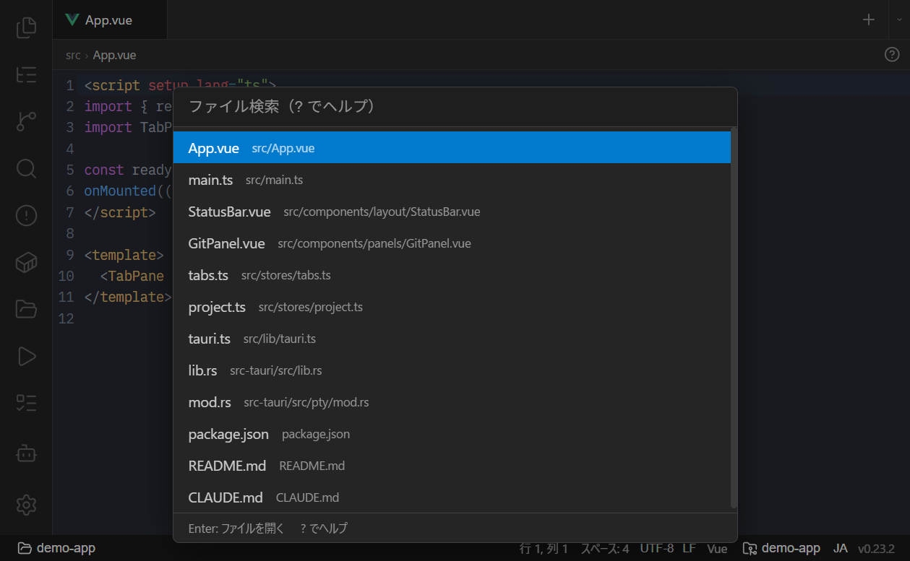

# ショートカットと CLI

- [コマンドパレット（Ctrl+P）](#コマンドパレットctrlp)
- [主なキーボードショートカット](#主なキーボードショートカット)
- [pike CLI](#pike-cli)
- [グローバルモード（サイドバー無しウィンドウ）](#グローバルモードサイドバー無しウィンドウ)
- [GIT_EDITOR 連携（pike --wait）](#git_editor-連携pike---wait)

ショートカットの一覧は、左下の歯車メニュー →「キーボードショートカット」、または **`Ctrl+K`** でいつでも表示できます。

## コマンドパレット（Ctrl+P）

**`Ctrl+P`** でコマンドパレットを開きます。先頭の文字でモードが切り替わります。

<picture>
  <source media="(prefers-color-scheme: light)" srcset="img/command-palette-light.png">
  
</picture>

| 先頭 | モード | 例 |
|------|--------|-----|
| （無印） | ファイルを fuzzy 検索して開く | `tab.ts` |
| `>` | タスク実行 / 新規エージェント | `> Claude`、`> Codex`、`> build` |
| `@` | タブ切り替え | `@settings` |
| `:` | 行ジャンプ | `:42` |
| `!` | Git ブランチ切り替え | `!main` |
| `?` | ヘルプ | `?` |

ファイル名に `:42` のように行番号を付けるとその行へジャンプします（例: `main.rs:42`）。

## 主なキーボードショートカット

| キー | 動作 |
|------|------|
| `Ctrl+P` | コマンドパレット |
| `Ctrl+Shift+P` | プロジェクトスイッチャー |
| `Ctrl+T` | 新規ターミナル |
| `Ctrl+N` | 新規エディタ |
| `Ctrl+W` | タブを閉じる |
| `Ctrl+S` | 保存（エディタ） |
| `Ctrl+Z` / `Ctrl+Shift+Z` | Undo / Redo（エディタ） |
| `Ctrl+F` / `Ctrl+H` | エディタ内 検索 / 置換 |
| `Ctrl+Click` / `F12` | 定義へジャンプ |
| `Alt+H` | エディタで Git History を開く |
| `Ctrl+K` | キーボードショートカット一覧 |
| `Ctrl+,` | 設定を開く |

> `Ctrl+R` / `Ctrl+Shift+R` / `F5` による WebView のリロードは、誤操作（全ターミナルセッションの破棄＝実質再起動）を防ぐため無効化されています。ターミナル内の `Ctrl+R`（bash の履歴検索）は通常どおり使えます。

## pike CLI

インストールすると `pike` コマンドが使えます（`pike.exe`）。二重起動は防止され、引数は既存のインスタンスに転送されます。

```bash
# ファイルを開く（42 行目へジャンプ）
pike src/main.rs:42

# 複数ファイルをまとめて開く（1 ファイル 1 タブ）
pike a.rs b.md c.txt

# サブコマンドでファイルを開く
pike open path/to/file.ts

# カレントディレクトリをプロジェクトとして開く / 切り替える
pike .
pike path/to/dir

# 引数なし（起動済みの場合）: ターミナルだけのウィンドウを開く
pike

# グローバルモードのターミナルで起動する（未起動の状態からでも）
pike --terminal
```

- ファイル引数は、そのファイルを含むプロジェクトのウィンドウが開いていればそこで開きます。なければサイドバー無しのグローバルモードウィンドウで開きます。
- ディレクトリ引数は該当プロジェクトに切り替えます。未登録なら ad-hoc プロジェクトを自動作成します。
- 既にエディタタブで開いている場合はフォーカスしてリロードします。
- **`--terminal`**：グローバルモードのターミナルで開きます。引数なしの `pike` と違い、Pike が未起動の状態からでもプロジェクトを復元せずグローバルモードで起動します。カレントディレクトリを引き継ぎます（WSL 上ならその distro の WSL シェル、それ以外は設定の既定シェル）。

## グローバルモード（サイドバー無しウィンドウ）

ファイル引数・引数なし起動・`--wait` で開くウィンドウは、プロジェクトに依らない**グローバルモード**で動作します。ファイルの開き方、ターミナルとしての使い方、シェル選択は [グローバルモード](global-mode.md) を参照してください。

## GIT_EDITOR 連携（pike --wait）

`pike` をコミットメッセージ等のエディタとして使えます。

```bash
# パスはスラッシュ区切り + 引用符で書く（git はエディタコマンドを sh 経由で
# 実行するため、バックスラッシュはエスケープとして消費されます）
export GIT_EDITOR='"C:/path/to/pike.exe" --wait'
```

`git commit` などでエディタが必要になると、Pike がサイドバー無しのウィンドウで該当ファイルを開きます。そのエディタタブを閉じると待機していた git プロセスが解放され、ウィンドウも自動で閉じます。

関連: [はじめに](getting-started.md) / [ターミナルと AI エージェント](terminal-and-agents.md)
