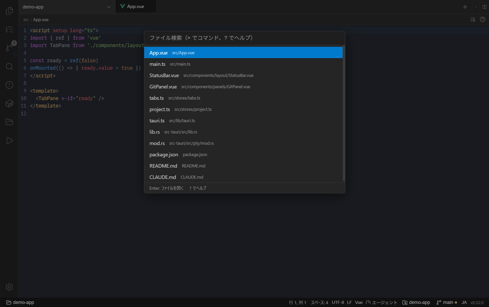

# ショートカットと CLI

- [コマンドパレット（Ctrl+P）](#コマンドパレットctrlp)
- [主なキーボードショートカット](#主なキーボードショートカット)
  - [全般](#全般)
  - [タブ](#タブ)
  - [エディタ](#エディタ)
  - [ターミナル](#ターミナル)
  - [画像プレビュー](#画像プレビュー)
- [pike CLI](#pike-cli)
  - [pike todo（TODO パネルの操作）](#pike-todotodo-パネルの操作)
- [タスクバーとシステムトレイ](#タスクバーとシステムトレイ)
- [グローバルモード（サイドバー無しウィンドウ）](#グローバルモードサイドバー無しウィンドウ)
- [GIT_EDITOR 連携（pike --wait）](#git_editor-連携pike---wait)

ショートカットの一覧は、左下の歯車メニュー →「キーボードショートカット」、または **`Ctrl+K`** でいつでも表示できます。

## コマンドパレット（Ctrl+P）

**`Ctrl+P`** でコマンドパレットを開きます。先頭の文字でモードが切り替わります。

<picture>
  <source media="(prefers-color-scheme: light)" srcset="img/command-palette-light.png">
  
</picture>

| 先頭 | モード | 例 |
|------|--------|-----|
| （無印） | ファイルを fuzzy 検索して開く | `tab.ts` |
| `>` | タスク実行 / 新規エージェント | `> Claude`、`> Codex`、`> build` |
| `@` | タブ切り替え | `@settings` |
| `:` | 行ジャンプ | `:42` |
| `!` | Git ブランチ切り替え | `!main` |
| `?` | ヘルプ | `?` |

ファイル名に `:42` のように行番号を付けるとその行へジャンプします（例: `main.rs:42`）。`>` のタスク実行では、justfile のレシピに書いた説明文でも絞り込めます。

## 主なキーボードショートカット

### 全般

| キー | 動作 |
|------|------|
| `Ctrl+P` | コマンドパレット |
| `Ctrl+Shift+P` | プロジェクトスイッチャー |
| `Ctrl+K` | キーボードショートカット一覧 |
| `Ctrl+,` | 設定を開く |
| `F1` | マニュアルを開く |
| `Esc` | パレット・スイッチャー・ダイアログを閉じる |

### タブ

| キー | 動作 |
|------|------|
| `Ctrl+T` | 新規ターミナル |
| `Ctrl+N` | 新規エディタ |
| `Ctrl+W` | タブを閉じる |
| `Ctrl+Tab` / `Ctrl+Shift+Tab` | 次 / 前のタブへ |
| `Ctrl+PageDown` / `Ctrl+PageUp` | 次 / 前のタブへ |
| `Ctrl+Enter` | プロジェクトスイッチャーで、新しいウィンドウで開く |

### エディタ

| キー | 動作 |
|------|------|
| `Ctrl+S` | 保存 |
| `Ctrl+Z` | Undo |
| `Ctrl+Shift+Z` / `Ctrl+Y` | Redo |
| `Ctrl+F` | 検索（diff タブでも使えます） |
| `Ctrl+H` | 置換（検索パネルを置換行付きで開きます） |
| `F3` / `Shift+F3` | 次 / 前の一致へ |
| `Ctrl+D` | 次の一致も選択（マルチカーソル） |
| `Ctrl+/` | 選択行のコメントを切替 |
| `Alt+↑` / `Alt+↓` | 行を上下に移動 |
| `Tab` / `Shift+Tab` | インデント / アンインデント |
| `Ctrl+Click` / `F12` | 定義へジャンプ |
| `Alt+H` | エディタで Git History を開く |

### ターミナル

| キー | 動作 |
|------|------|
| `Ctrl+V` / `Ctrl+Shift+V` | 貼り付け（画像やファイルも可） |
| 選択 | クリップボードにコピー（設定で ON/OFF） |
| 右クリック | 貼り付け（設定で ON/OFF） |
| その他の `Ctrl` + 英字 | シェルへ渡す（`Ctrl+W` / `Ctrl+T` はタブ操作） |

### 画像プレビュー

| キー | 動作 |
|------|------|
| `+` / `-` | 拡大 / 縮小 |
| `0` | 100% に戻す |
| `f` | ウィンドウに合わせる |
| `r` / `Shift+R` | 右 / 左に回転 |
| `Ctrl+ホイール` | カーソル位置を中心に拡大縮小 |

> `Ctrl+R` / `Ctrl+Shift+R` / `F5` による WebView のリロードは、誤操作（全ターミナルセッションの破棄＝実質再起動）を防ぐため無効化されています。ターミナル内の `Ctrl+R`（bash の履歴検索）は通常どおり使えます。
>
> 上の表以外に、CodeMirror の標準キーバインドがそのまま使えます（`Ctrl+G` で行ジャンプ、`Ctrl+Shift+K` で行削除、`Ctrl+Alt+↑/↓` でカーソル追加など）。
>
> ターミナルにフォーカスがあるあいだ、`Ctrl` + 英字と `F1` はシェルへ届き、Pike 側では動きません（`Ctrl+K` で行末まで削除、`Ctrl+P` / `Ctrl+N` で履歴をたどる、など）。例外はタブの出し入れで、`Ctrl+W`（閉じる）・`Ctrl+T`（新規ターミナル）・`Ctrl+Tab` / `Ctrl+Shift+Tab` / `Ctrl+PageUp` / `Ctrl+PageDown`（切替）は Pike が処理します。
>
> ただし `Ctrl+W` は、vim や lazygit のような全画面のアプリが動いているあいだはシェルへ渡します（vim のウィンドウ操作が `Ctrl+W` で始まるため）。そのあいだタブを閉じるにはタブの ✕ を押してください。
>
> `Ctrl+Shift+P`（プロジェクト切替）と `Ctrl+,`（設定）はシェルが使わないキーなので、ターミナル上でもそのまま使えます。コマンドパレット（`Ctrl+P`）には代わりの操作が無いため、ターミナル以外のタブへ移ってから使ってください。

## pike CLI

インストールすると `pike` コマンドが使えます（`pike.exe`）。二重起動は防止され、引数は既存のインスタンスに転送されます。

```bash
# ファイルを開く（42 行目へジャンプ）
pike src/main.rs:42

# 複数ファイルをまとめて開く（1 ファイル 1 タブ）
pike a.rs b.md c.txt

# サブコマンドでファイルを開く
pike open path/to/file.ts

# カレントディレクトリをプロジェクトとして開く / 切り替える
pike .
pike path/to/dir

# 引数なし（起動済みの場合）: ターミナルだけのウィンドウを開く
pike

# グローバルモードのターミナルで起動する（未起動の状態からでも）
pike --terminal

# シェルを指定して開く（--shell=cmd / powershell / pwsh / git-bash / wsl:<ディストロ名>）
pike --terminal --shell=wsl:Ubuntu
```

- ファイル引数は、そのファイルを含むプロジェクトのウィンドウが開いていればそこで開きます。なければサイドバー無しのグローバルモードウィンドウで開きます。
- ディレクトリ引数は該当プロジェクトに切り替えます。未登録のディレクトリは登録せずに開き、プロジェクトとして登録するか 1 度だけ確認します。→ [登録せずにディレクトリを開く](projects-and-windows.md#登録せずにディレクトリを開く)
- 既にエディタタブで開いている場合はフォーカスしてリロードします。
- **`--terminal`**：グローバルモードのターミナルで開きます。引数なしの `pike` と違い、Pike が未起動の状態からでもプロジェクトを復元せずグローバルモードで起動します。カレントディレクトリを引き継ぎます（WSL 上ならそのディストロの WSL シェル、それ以外は設定の既定シェル）。
- **`--shell=<シェル>`**：`--terminal` と併せて使い、開くシェルを指定します。値は `cmd` / `powershell` / `pwsh` / `git-bash` / `wsl:<ディストロ名>` です。ジャンプリストとトレイのシェル選択も、この形で起動します。WSL のシェルを指定したときは、Windows 側のカレントディレクトリは引き継がずディストロのホームで開きます。

### pike todo（TODO パネルの操作）

`pike todo` は [TODO パネル](panels.md#todoやること) の実体である `.pike/todo.md` を端末から読み書きします。Pike が起動していなくても動き、起動していればファイル監視でパネルへ即座に反映されます。コーディングエージェントに使わせる用途を想定しています。

```bash
pike todo                       # 一覧（list と同じ）
pike todo add "ログイン画面を直す"
pike todo add "調査" -d "再現手順を書く" -d "ログを添付"
pike todo show 2                # 詳細込みで表示
pike todo detail 2 "追記したい本文"
pike todo detail 2 --append -   # 標準入力から追記
pike todo done 1 3              # 複数指定できる
pike todo undone 1
pike todo rm 2
pike todo clear                 # 全タスク削除
pike todo clear --done          # 完了したものだけ削除
```

- 番号は `list` の表示順です（1 始まり）。`--json` を付けると機械可読な出力になります。
- `add` と `detail` は `-d/--detail`（繰り返しで複数行、`-` で標準入力）、`-a/--append`、`--clear` を受け付けます。
- 対象ファイルはカレントディレクトリから上に辿って探します（既存の `.pike/` を優先し、無ければリポジトリのルート）。
- コーディングエージェント向けのスキルを `plugins/` に同梱しています（Claude Code プラグインと Codex スキル）。導入手順は `plugins/README.md` を参照してください。

## タスクバーとシステムトレイ

タスクバーとシステムトレイから、Pike の起動・プロジェクト切り替え・復帰を行えます（Windows 専用）。

### ジャンプリスト（タスクバー右クリック）

タスクバーの Pike アイコン（ピン留めしたもの、または起動中のボタン）を右クリックすると、ジャンプリストが開きます。

- **シェル名の項目**：設定の [シェル一覧](settings.md#ターミナル) にあるシェル（WSL の各ディストロ / Command Prompt / PowerShell / PowerShell 7 / Git Bash）が、その並び順で出ます。選ぶと、そのシェルでグローバルモードのターミナルウィンドウを開きます。WSL のディストロは、ターミナル追加の「▾」を一度開いて検出したあとに並びます。
- **プロジェクト**：登録済みのプロジェクトを最近開いた順に表示します。選ぶと、そのプロジェクトのウィンドウが開いていればフォーカスし、開いていなければ新しいウィンドウで開いてセッションを復元します。Pike を終了している状態から選んだときも、前回のセッションではなく選んだプロジェクトが開きます。ルートがこのマシンに無いプロジェクトは、開いたウィンドウで [clone するかを確認](projects-and-windows.md#開こうとしたときに-clone-する)します。
- **最近開いたファイル**：Windows が記録している最近開いたファイルです。

### システムトレイ

Pike は起動中、システムトレイ（通知領域）にアイコンを常駐させます。

- **左クリック**：メインウィンドウの表示と非表示を切り替えます。
- **右クリックメニュー**：Pike を表示 / 新しいターミナルウィンドウ（シェルを選ぶサブメニュー）/ 最近のプロジェクト（サブメニュー）/ プロジェクトを開く（プロジェクトスイッチャーを開きます）/ 終了。
- **アイコンにカーソルを合わせる**：Claude の 5 時間枠の使用率など、エージェントの使用量の概要をツールチップで表示します。

ウィンドウを閉じても、既定では Pike は終了せずトレイに常駐します（アプリの終了はトレイメニューの「終了」から行います）。この挙動は設定で切り替えられます。→ [設定（全般）](settings.md#全般)

## グローバルモード（サイドバー無しウィンドウ）

ファイル引数・引数なし起動・`--wait` で開くウィンドウは、プロジェクトに依らない**グローバルモード**で動作します。ファイルの開き方、ターミナルとしての使い方、シェル選択は [グローバルモード](global-mode.md) を参照してください。

## GIT_EDITOR 連携（pike --wait）

`pike` をコミットメッセージ等のエディタとして使えます。

```bash
# パスはスラッシュ区切り + 引用符で書く（git はエディタコマンドを sh 経由で
# 実行するため、バックスラッシュはエスケープとして消費されます）
export GIT_EDITOR='"C:/path/to/pike.exe" --wait'
```

`git commit` などでエディタが必要になると、Pike がサイドバー無しのウィンドウで該当ファイルを開きます。そのエディタタブを閉じると待機していた git プロセスが解放され、ウィンドウも自動で閉じます。

関連: [はじめに](getting-started.md) / [ターミナルと AI エージェント](terminal-and-agents.md)
