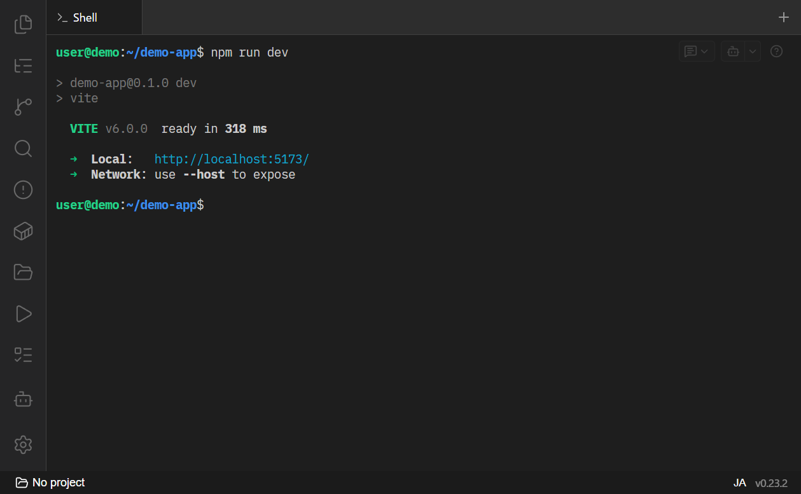
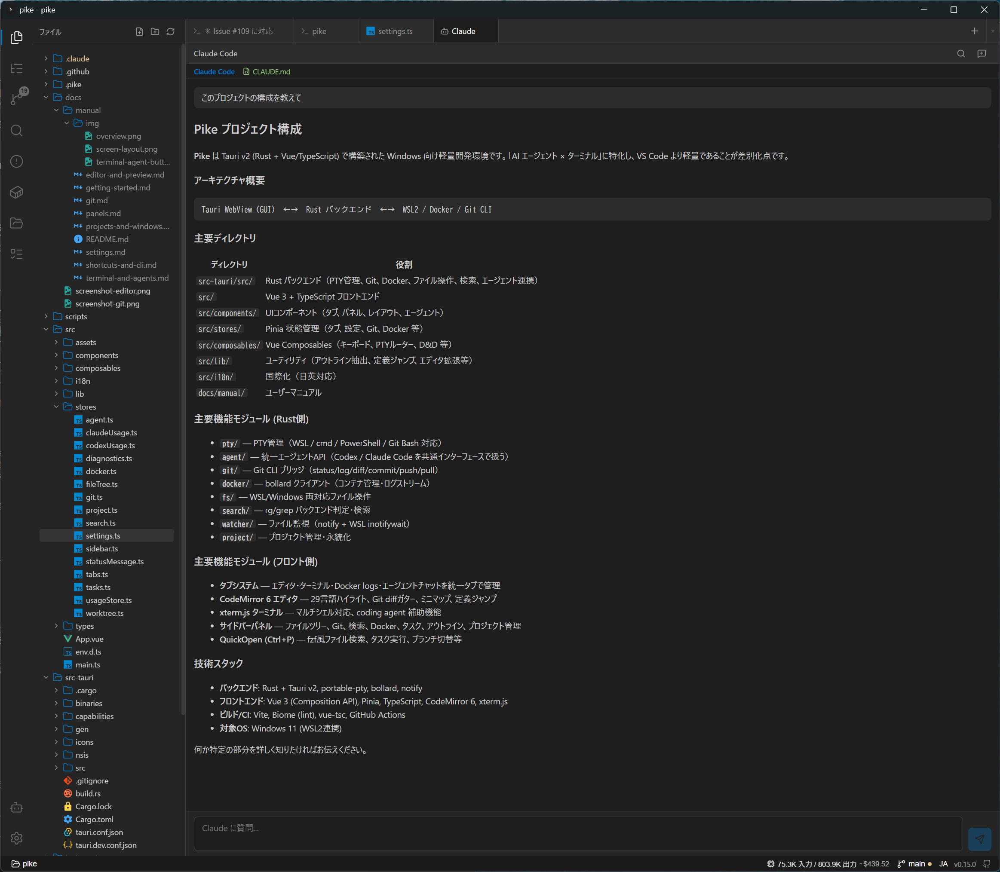

# ターミナルと AI エージェント

Pike は AI コーディングに特化しており、AI を **(A) ターミナルで直接使う** 運用と **(B) 専用チャットタブで使う** 運用の両方を、橋渡し機能とともにサポートします。

- [ターミナルの基本](#ターミナルの基本)
- [シェルの選択](#シェルの選択)
- [(A) ターミナルでエージェントを使う](#a-ターミナルでエージェントを使う)
  - [エージェント起動ボタン / プロンプト挿入](#エージェント起動ボタン--プロンプト挿入)
  - [出力の file:line をクリックして開く](#出力の-fileline-をクリックして開く)
  - [エディタ選択範囲・診断をターミナルへ送る](#エディタ選択範囲診断をターミナルへ送る)
- [(B) エージェントチャットタブ](#b-エージェントチャットタブ)
- [トークン使用量とコスト](#トークン使用量とコスト)
- [ターミナル終了の通知](#ターミナル終了の通知)

## ターミナルの基本

タブバーの `+` で新しいターミナルを開きます。ターミナルは xterm.js + PTY で動作し、`TERM=xterm-256color`（cmd 以外）で TUI も正しく描画されます。

- **コピー / 貼り付け**：選択でコピー、右クリックで貼り付け（設定で ON/OFF 切替可）。`Ctrl+V` も使えます。
- **リサイズ追従**：ウィンドウやペインのサイズに自動追従します。
- **フォント・配色**：設定タブの Terminal セクションで変更でき、既存ターミナルに即反映されます。→ [設定](settings.md)

## シェルの選択

プロジェクトの種別に応じて、以下のシェルに対応します。

- **WSL**：`wsl.exe [-d ディストロ] bash`
- **cmd**：`cmd.exe`
- **PowerShell**：`powershell.exe -NoLogo`（Windows PowerShell 5）
- **PowerShell 7**：`pwsh.exe -NoLogo`（PATH または既定のインストール先から自動検出）
- **Git Bash**：`C:\Program Files\Git\bin\bash.exe`（自動検出）

Windows プロジェクトでは、タブバーの `+` 横の **`▾`** からデフォルト以外のシェルも選んで開けます。

## (A) ターミナルでエージェントを使う

`claude` などをターミナルで使う運用を、Pike の既存機能（エディタ・診断）と橋渡しする一連の機能です。

### エージェント起動ボタン / プロンプト挿入

ターミナル右上にフローティングのボタンが 2 つあります（vim/less などの全画面 TUI 中は自動的に隠れます）。

- **起動ボタン（左）**：クリックで設定済みの起動コマンド（例: `claude` / `claude --continue`）を、シェルに合わせた画面クリア付き（cmd=`cls`、PowerShell=`clear; `、bash=`clear && `）で実行します。`▾` で一覧から選べます。
- **プロンプト挿入ボタン（右）**：定型プロンプト（例: 「続けて」「上のコードを説明して」）を**挿入のみ・Enter なし**で入力欄に差し込みます（複数行も途中確定しません）。送信は自分で `Enter` を押します。

起動コマンド・定型プロンプトは設定タブの Terminal セクションで追加・編集・並べ替えできます。→ [設定](settings.md)

### 出力の file:line をクリックして開く

ターミナル出力に含まれる **`path:line`（必要なら `:col` も）** をクリックすると、その場所をエディタで開きます。

- 拡張子付きパスを検出します（誤検出を避けるため拡張子が必要）。
- `rg` / `grep` の見出し付き出力（ファイル名見出し＋行番号）にも対応します。
- 相対パスはプロジェクト（または選択中の worktree）のルートを起点に解決されます。

### エディタ選択範囲・診断をターミナルへ送る

逆方向の橋渡しもできます。送り先は「直近にアクティブだったターミナル → アクティブタブ → ピン留め → 任意」の順で自動解決されます。

- **エディタ**：テキストを選択して右クリック → 「ターミナルに送る」。`相対パス:行` の参照と選択本文が挿入されます。
- **Problems パネル**：各診断行のホバーで表示される **🤖** ボタンから、その問題の修正依頼文をターミナルへ送れます（UI 言語に追従）。

## (B) エージェントチャットタブ

Claude Code と Codex を、統一されたチャット UI で使えます。

- **新規チャット**：左サイドバー下部の **🤖** アイコン（Claude Code / Codex を選択）、またはコマンドパレットで `> Claude` / `> Codex`。
- **統一インターフェース**：Codex（app-server）と ACP 対応エージェント（Claude Code 等）を、同じチャットタブで扱います。エージェントの対応機能（モデル選択、認証バー、sandbox 設定など）に応じて UI が変化します。
- **ファイル参照**：入力欄に `@パス` でファイルをメンションできます。クリップボード/ドラッグ&ドロップでファイルを添付すると `.pike/uploads/` に保存され、`@パス` が挿入されます（小さいテキストは設定により内容を直接挿入も可能）。→ [サイドバーパネル](panels.md#ファイル添付クリップボード--ドラッグドロップ)
- **承認ダイアログ**：エージェントがコマンド実行などの承認を求めると、専用ダイアログが表示されます。
- **セッション復帰**：会話は各ツールの resume 機能で復帰します。

## トークン使用量とコスト

ステータスバーに、アクティブな AI セッションの**入力/出力トークン数と推定コスト**を表示します。クリックするとモデル別の内訳ドロップダウンが開きます。

- **Claude Code**：`~/.claude` のログを解析して集計。あわせて `claude -p "/usage"` からサブスクリプションの**利用率（5 時間セッション枠と週間枠）**を取得し、「5時間 20%」のように表示します。内訳ドロップダウンには各枠の利用率・リセット時刻・取得時刻が並び、更新ボタンですぐに再取得もできます。取得には数十秒かかるため結果はキャッシュされ、Claude のセッションが動いている間は約 5 分ごと、動いていない間も約 1 時間ごとに更新されます。
- **Codex（チャットタブ）**：アクティブな Codex チャットのセッション使用量を表示。
- **間接 Codex（CLI）**：Claude の codex スキルや `codex` を呼ぶスクリプトなど、Pike を経由しない Codex も `~/.codex/sessions/...` を解析して集計します。Bot アイコンで「トークン in/out + 5h 利用率%」を並べて表示し、クリックでモデル・キャッシュ・5h/週間レートの内訳を開きます。

> WSL で動く `claude` のログは WSL ホーム側（`~/.claude`）に書かれるため、Pike は WSL 経由でそれを読みます。

## ターミナル終了の通知

- 非アクティブタブのターミナルに出力があると、タブに**ドット**が表示されます。
- プロセスが終了すると**終了コードのバッジ**が付きます（ピン留めしていないタブは終了 1 秒後に自動クローズ）。
- バックグラウンドタブのプロセス終了時には**デスクトップ通知**を出せます（クリックでそのタブにフォーカス）。設定で ON/OFF を切り替えられます。

関連: [エディタとプレビュー](editor-and-preview.md) / [設定](settings.md) / [ショートカットと CLI](shortcuts-and-cli.md)
