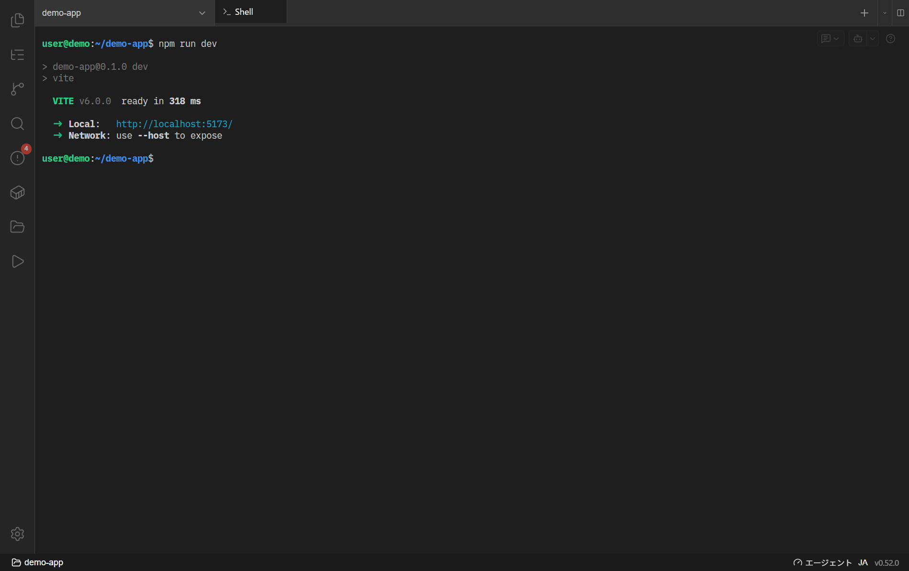
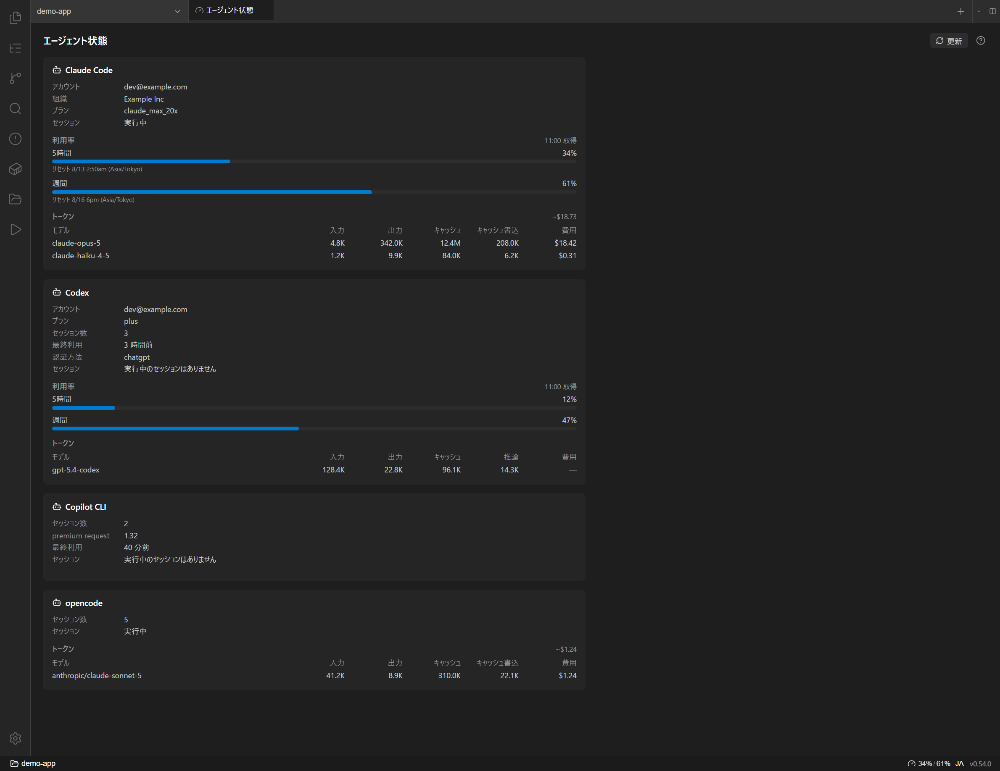

# ターミナルと AI エージェント

Pike は、`claude` などのコーディングエージェントを**ターミナルで直接使う**運用に対応します。エディタや診断との橋渡し機能も、この運用に合わせてあります。

- [ターミナルの基本](#ターミナルの基本)
- [シェルの選択](#シェルの選択)
- [ターミナルでエージェントを使う](#ターミナルでエージェントを使う)
  - [エージェント起動ボタン / プロンプト挿入](#エージェント起動ボタン--プロンプト挿入)
    - [過去のセッションを再開する](#過去のセッションを再開する)
  - [出力のパスをクリックして開く](#出力のパスをクリックして開く)
  - [エディタ選択範囲・診断をターミナルへ送る](#エディタ選択範囲診断をターミナルへ送る)
- [トークン使用量とコスト](#トークン使用量とコスト)
  - [エージェント状態タブ](#エージェント状態タブ)
- [ターミナルの状態表示](#ターミナルの状態表示)
- [macOS のプライバシー保護と許可](#macos-のプライバシー保護と許可)
  - [システム設定で追加が必要なもの](#システム設定で追加が必要なもの)
- [実行中のプロセスがあるときの確認](#実行中のプロセスがあるときの確認)

## ターミナルの基本

タブバーの `+` で新しいターミナルを開きます。ターミナルは xterm.js + PTY で動作し、`TERM=xterm-256color`（cmd 以外）で TUI も正しく描画されます。

- **コピー / 貼り付け**：選択でコピー、右クリックで貼り付け（設定で ON/OFF 切替可）。`Ctrl+V` も使えます。
- **リサイズ追従**：ウィンドウやペインのサイズに自動追従します。
- **フォント・配色**：設定タブの「ターミナル」セクションで変更でき、既存ターミナルに即反映されます。→ [設定](settings.md)

## シェルの選択

プロジェクトの種別に応じて、以下のシェルに対応します。

- **WSL**：`wsl.exe [-d ディストロ] bash`
- **cmd**：`cmd.exe`
- **PowerShell**：`powershell.exe -NoLogo`（Windows PowerShell 5）
- **PowerShell 7**：`pwsh.exe -NoLogo`（PATH または既定のインストール先から自動検出）
- **Git Bash**：`C:\Program Files\Git\bin\bash.exe`（自動検出）
- **ログインシェル（macOS）**：`$SHELL` を `-l` 付きで起動します（`$SHELL` が無ければ `/bin/zsh`）。Finder や Dock から起動したプロセスは最小限の `PATH` しか持たないため、ログインシェルとして起こして設定ファイルを読ませています。

Windows プロジェクトでは、タブバーの `+` 横の **`▾`** からデフォルト以外のシェルも選んで開けます。macOS ではログインシェル 1 つなので、この一覧も 1 行です。

## ターミナルでエージェントを使う

`claude` などをターミナルで使う運用を、Pike の既存機能（エディタ・診断）と橋渡しする一連の機能です。

### エージェント起動ボタン / プロンプト挿入

<picture>
  <source media="(prefers-color-scheme: light)" srcset="img/terminal-agent-buttons-light.png">
  
</picture>

ターミナル右上にフローティングのボタンが 2 つあります（vim/less などの全画面 TUI 中は自動的に隠れます）。

- **起動ボタン（左）**：クリックで**既定の起動行**を走らせます。`▾` で一覧から選べます。
- **プロンプト挿入ボタン（右）**：定型プロンプト（例: 「続けて」「上のコードを説明して」）を**挿入のみ・Enter なし**で入力欄に差し込みます（複数行も途中確定しません）。送信は自分で `Enter` を押します。

Pike が知っているのは **Claude Code・Codex・Copilot CLI・opencode** の 4 つで、**インストール済みのものだけ**がメニューに出ます。押しても `command not found` になる項目はありません。判定はそのターミナルのシェルで行い、WSL プロジェクトなら WSL の中を見ます。エージェントを入れた直後に出てこないときは、少し待ってからタブを開き直してください。

`▾` のメニューは次の順で並びます。

1. 既定の起動行（エージェントなら `claude` と `claude --continue` の 2 行、自分で足したコマンドならその 1 行）
2. **最近のセッション**：既定の行が起動するエージェントのもの。カーソルを合わせると横に開きます
3. **他のエージェント**：カーソルを合わせると横に開きます。エージェントごとに区切り線で分かれ、それぞれの下に**そのエージェントの最近のセッション**が入ります

起動行の並びと表示は、設定タブの「エージェント」セクションで変えられます。**上から見て最初に使える行が既定**で、自分で足したコマンド（例: `claude --model opus`）も同じ一覧に並ぶので、先頭へ上げればそれがボタンになります。定型プロンプトも同じ場所です。→ [設定](settings.md)

#### 過去のセッションを再開する

4 つのエージェントそれぞれについて、**最近のセッション**をサブメニューから再開できます。既定の行のものは `▾` の一覧の中ほど、それ以外は「他のエージェント」の各行の下にあります。会話のタイトル（Claude Code はブランチ名も）と最終更新の相対時刻が並び、選ぶとそのターミナルで再開のコマンドが走ります。

| エージェント | 記録の出どころ | 走るコマンド |
|---|---|---|
| Claude Code | `~/.claude` のセッション記録 | `claude --resume <ID>` |
| Codex | `~/.codex/sessions` のロールアウト | `codex resume <ID>` |
| Copilot CLI | `~/.copilot/session-state` | `copilot --resume <ID>` |
| opencode | `opencode db` の session テーブル | `opencode --session <ID>` |

- 対象はそのターミナルの現在のディレクトリです。`cd` したあとは移動先のセッションが並びます。
- 対話で使ったセッションだけが並びます。Claude Code の `claude -p` 経由の実行（Pike が利用状況の取得に使うものを含む）と、Codex の `codex exec` は除きます。Copilot CLI では、起動しただけでやり取りの無いセッションを除きます。
- 並ぶのは新しいものから 20 件までです。
- 読み込みは**そのサブメニューを開いたときだけ**行います。

### 出力のパスをクリックして開く

ターミナル出力に含まれるファイルのパスをクリックすると、エディタで開きます。**`path:line`（必要なら `:col` も）** ならその行へ、行番号が付いていなければ 1 行目へ移動します。

エージェントが書いたファイルの案内（`› [file] /tmp/…/test.md (7.7KB)` のような行）も、行の一部にあるパスとして拾います。

- 拡張子付きパスを検出します（誤検出を避けるため拡張子が必要）。
- 行番号の付かないパスは、区切り（`/` や `\`）を含むものだけを対象にします。文章中の `foo.md` という語をリンクにしないためです。`src/foo.md` や `/tmp/a/b.md` は開けます。
- `rg` / `grep` の見出し付き出力（ファイル名見出し＋行番号）にも対応します。
- 相対パスはプロジェクト（または選択中の worktree）のルートを起点に解決されます。
- 画像や PDF のパスは、エディタではなく画像ビューアや PDF タブで開きます。
- ディレクトリのパスをクリックすると、開き方を選ぶ画面が出ます。登録済みのプロジェクトなら「プロジェクトを開く」、未登録なら「ディレクトリを開く」（登録せずに開く）と「プロジェクトとして開く」（登録して開く）を選べます。既定は新しいウィンドウで、チェックを外すとこのウィンドウで開きます。このウィンドウで開く場合はプロジェクトの切り替えになるため、開いているタブはすべて閉じます。

### エディタ選択範囲・診断をターミナルへ送る

逆方向の橋渡しもできます。送り先は「直近にアクティブだったターミナル → アクティブタブ → ピン留めしたターミナル → 残りのいずれか」の順で自動解決されます。

- **エディタ**：テキストを選択して右クリック → 「ターミナルに送る」。`相対パス:行` の参照と選択本文が挿入されます。
- **Problems パネル**：各診断行のホバーで表示される **🤖** ボタンから、その問題の修正依頼文をターミナルへ送れます（UI 言語に追従）。

## トークン使用量とコスト

ステータスバーのメーターアイコンに、**5 時間枠と週間枠の利用率**を `25% / 5%` の形式で表示します（左が 5 時間枠、右が週間枠。カーソルを合わせると枠の名前付きで出ます）。クリックすると使っているエージェントの要約が並び、「詳細」からエージェント状態タブへ移動できます。

対象は起動ボタンと同じ 4 つですが、**何を取れるかはエージェントごとに違います**。記録はどれも Pike が読むだけで、集計のために外部へ送るものはありません。

- **Claude Code**：`~/.claude` のログを解析して集計。あわせて `claude -p "/usage"` からサブスクリプションの**利用率（5 時間セッション枠と週間枠）**を取得し、「5時間 20%」のように表示します。取得には数十秒かかるため結果はキャッシュされ、Claude のセッションが動いている間は約 5 分ごと、動いていない間も約 1 時間ごとに更新されます。ドロップダウンの更新ボタンですぐに再取得もできます。
- **複数アカウントの使い分け**：Claude Code の `CLAUDE_CONFIG_DIR` をシェルの設定ファイルか `.envrc` に書いていれば、Pike もその設定ディレクトリを見て集計します。ドロップダウンとエージェント状態タブにログイン中のアカウントが出るので、どのアカウントの数字かを確認できます。Windows のシェルでは Pike に引き継がれた環境変数を見るため、PowerShell のプロファイルの中だけで設定した値は反映されません。macOS も同じで、Finder や Dock から起動した場合はシェルの設定ファイルに書いた値を読めません（読めるのは `.envrc` と、ターミナルから起動した場合です）。この推測が当たらない構成では、次の hook で Claude Code 自身に知らせてもらえます。
- **Codex**：Pike を経由しない Codex も `~/.codex/sessions/...` を解析して集計します。Claude の codex スキルや、`codex` を呼ぶスクリプトが対象です。トークンと利用率の両方が出ます。
- **Copilot CLI**：`~/.copilot` に残るセッションの記録から、**消費した premium request（AI クレジット）**を出します。トークン数と残量は出ません。Copilot には残量を問い合わせるコマンドが無く、`/usage` は対話中のスラッシュコマンドだからです。
- **opencode**：`opencode db` からトークンと費用を読みます。**利用率は出ません**。opencode は自分のキーで各プロバイダに繋ぐ方式（BYOK）なので、「枠の何 %」という概念がありません。

集計に含まれるのは、そのプロジェクトのディレクトリで動いた**直近 24 時間**のセッションです。

### Claude Code のアカウントを知らせる

上の推測（シェルの設定ファイルと `.envrc`）では当たらない構成があります。たとえば `claude` の起動ラッパーをシェル関数で作り、リポジトリごとに `CLAUDE_CONFIG_DIR` を被せている場合、その値はどちらにも現れません。Pike は既定の `~/.claude` を見るので、使用量もアカウント表示もセッション一覧も別のアカウントのものになります。

**Claude Code の hook を登録すると、セッションの開始時に本人が設定ディレクトリを申告します。** 推測ではなくなるので、起動方法によらず正しいアカウントになります。

登録は設定タブの「エージェント」→「Claude Code の hook」から行います。

1. 設定ディレクトリ（`~/.claude`、`~/.claude-ai` など）が一覧に並びます。**Windows と WSL の両方**が対象で、今のプロジェクトで使っているものには印が付きます。Windows のプロジェクトを開いたまま、WSL 側のアカウントに登録できます。
2. 各行の「hook を登録」を押すと、書き足す内容を確認したうえで、そのディレクトリの `settings.json` の `SessionStart` に 1 行だけ追加します。他の設定は変更しません。
3. **アカウントを使い分けているなら、使うぶんだけ登録します。** hook は設定ディレクトリごとに持つものなので、1 つ登録しても他のアカウントには効きません。

登録しただけでは何も届きません。次にそのアカウントで Claude Code を起動したときに申告が届き、「受け取った値」に出ます。以降はプロジェクトごとに記憶するので、Pike を起動し直した直後（まだ Claude Code を起動していない状態）でも正しいアカウントを見ます。

ゴミ箱のボタンで登録を外せます。消えるのは Pike が足した行だけで、同じ `SessionStart` に並ぶ他の hook は残ります。受け取った値も一緒に捨てて、推測（`.envrc` とシェルの設定ファイル）に戻ります。

「受け取った値」の横のゴミ箱では、登録はそのままで値だけを捨てられます。**hook を入れていないアカウントへ切り替えたときに使います。** 申告は推測より優先されるので、そのままでは新しい申告が来ないまま古いアカウントを指し続けます。

> 申告は Pike のローカルの設定フォルダに記録されます。設定ディレクトリのパスだけで、会話の内容は読みません。

### エージェント状態タブ

<picture>
  <source media="(prefers-color-scheme: light)" srcset="img/agent-status-light.png">
  
</picture>

エージェントの状態をまとめて見る画面です。サイドバー下部の歯車メニューの「エージェント状態」か、ステータスバーのドロップダウンの「詳細」から開きます。設定タブと同じく、開き直すと同じタブに戻ります。

**記録のあるエージェントだけ**がカードになり、次を並べます。

- ログイン中のアカウント（メールアドレス、組織、プラン）
- そのエージェント固有の値（設定ディレクトリ、セッション数、最終利用、premium request、認証方法）
- 利用率を枠ごとに帯グラフで。リセット時刻はその下
- トークンの内訳と推定コスト（Claude はモデル別、他は合計）

**カードごとに出る項目が違います。** 上の一覧のとおり取れるものがエージェントで違うためで、無い項目は節ごと出しません。使っていないエージェントはカードごと出ません。

Codex のアカウントは `~/.codex/auth.json` から読みます。表示に使うのはメールアドレスとプランだけで、認証情報そのものは扱いません。

> WSL で動く `claude` のログは WSL ホーム側（`~/.claude`）に書かれるため、Pike は WSL 経由でそれを読みます。

## ターミナルの状態表示

- 非アクティブタブのターミナルがベル（BEL）を鳴らすと、タブに**ドット**が表示されます。エージェントやシェルが処理の完了・入力待ちを知らせるときに点きます。出力そのものでは点きません。
- プロセスが終了すると**終了コードのバッジ**が付きます（ピン留めしていないタブは終了 1 秒後に自動クローズ）。

## macOS のプライバシー保護と許可

macOS には、カレンダー・連絡先・写真などをアプリごとに保護する仕組みがあります。ターミナルで実行したコマンドがこれらにアクセスすると、**Pike に対して**許可を求めるダイアログが出ます。実行したのはコマンドですが、macOS から見た責任は Pike にあるためです。

一度許可すれば以後は聞かれません。Pike を更新しても許可は残ります。

### システム設定で追加が必要なもの

次の 3 つは、ダイアログで「許可」を押すだけでは有効になりません。`システム設定` → `プライバシーとセキュリティ` を開いて該当項目に Pike を追加してください。

| 項目 | 必要になる例 | ダイアログ |
|---|---|---|
| フルディスクアクセス | `~/Library/Mail` や Safari の履歴を読むコマンド | 出ません |
| 画面収録 | 画面を撮るコマンド | 出ますが、システム設定への誘導だけです |
| 入力監視 | キー入力を読むコマンド | 出ますが、システム設定への誘導だけです |

追加したあとは Pike を再起動してください。

許可していないリソースにアクセスするコマンドは、エラーにならず**空の結果**を返すことがあります。`Operation not permitted` が出ない場合もあるので、結果が空でおかしいと感じたらここを疑ってください。

## 実行中のプロセスがあるときの確認

シェル以外のプロセスが動いているターミナルを閉じようとすると、確認ダイアログが出ます。対象のターミナル名も表示するので、どれが動いているか分かります。プロンプトに戻っていれば確認は出ません。

確認が出る操作は次のとおりです。

- タブを閉じる（`✕` / `Ctrl+W`）
- 複数のタブをまとめて閉じる（他を閉じる / 右側を閉じる / すべて閉じる）
- 登録していないディレクトリから別のプロジェクトへ切り替える（そのタブは破棄されるため）
- 保持しているプロジェクトを手放す
- ウィンドウを閉じる

登録済みのプロジェクトどうしの切り替えでは確認は出ません。タブは閉じずにそのまま保持されます（[タブを保持したまま行き来する](projects-and-windows.md#タブを保持したまま行き来する)）。

設定の [閉じたときトレイに最小化](settings.md#全般) を切っている場合、最後のウィンドウの `✕` は Pike 自体の終了になります。このときは他のウィンドウを含めた実行中の件数を数えて確認します。他のウィンドウが残る `✕` は、そのウィンドウのタブだけを数えます。トレイに最小化する設定のままなら、メインウィンドウは隠れるだけでプロセスも動き続けるため、確認は出ません。

関連: [エディタとプレビュー](editor-and-preview.md) / [設定](settings.md) / [ショートカットと CLI](shortcuts-and-cli.md)
