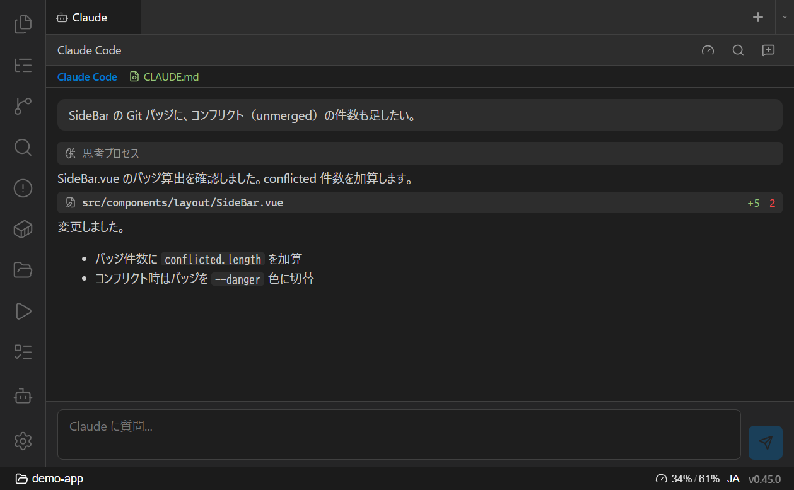

# ターミナルと AI エージェント

Pike は、`claude` などのコーディングエージェントを **(A) ターミナルで直接使う** 運用と **(B) 専用のチャットタブで使う** 運用の両方に対応します。どちらもエディタや診断との橋渡し機能を持ちます。

- [ターミナルの基本](#ターミナルの基本)
- [シェルの選択](#シェルの選択)
- [(A) ターミナルでエージェントを使う](#a-ターミナルでエージェントを使う)
  - [エージェント起動ボタン / プロンプト挿入](#エージェント起動ボタン--プロンプト挿入)
    - [過去のセッションを再開する](#過去のセッションを再開する)
  - [出力のパスをクリックして開く](#出力のパスをクリックして開く)
  - [エディタ選択範囲・診断をターミナルへ送る](#エディタ選択範囲診断をターミナルへ送る)
- [(B) エージェントチャットタブ](#b-エージェントチャットタブ)
- [トークン使用量とコスト](#トークン使用量とコスト)
  - [エージェント状態タブ](#エージェント状態タブ)
- [ターミナルの状態表示](#ターミナルの状態表示)
- [実行中のプロセスがあるときの確認](#実行中のプロセスがあるときの確認)

## ターミナルの基本

タブバーの `+` で新しいターミナルを開きます。ターミナルは xterm.js + PTY で動作し、`TERM=xterm-256color`（cmd 以外）で TUI も正しく描画されます。

- **コピー / 貼り付け**：選択でコピー、右クリックで貼り付け（設定で ON/OFF 切替可）。`Ctrl+V` も使えます。
- **リサイズ追従**：ウィンドウやペインのサイズに自動追従します。
- **フォント・配色**：設定タブの「ターミナル」セクションで変更でき、既存ターミナルに即反映されます。→ [設定](settings.md)

## シェルの選択

プロジェクトの種別に応じて、以下のシェルに対応します。

- **WSL**：`wsl.exe [-d ディストロ] bash`
- **cmd**：`cmd.exe`
- **PowerShell**：`powershell.exe -NoLogo`（Windows PowerShell 5）
- **PowerShell 7**：`pwsh.exe -NoLogo`（PATH または既定のインストール先から自動検出）
- **Git Bash**：`C:\Program Files\Git\bin\bash.exe`（自動検出）
- **ログインシェル（macOS）**：`$SHELL` を `-l` 付きで起動します（`$SHELL` が無ければ `/bin/zsh`）。Finder や Dock から起動したプロセスは最小限の `PATH` しか持たないため、ログインシェルとして起こして設定ファイルを読ませています。

Windows プロジェクトでは、タブバーの `+` 横の **`▾`** からデフォルト以外のシェルも選んで開けます。macOS ではログインシェル 1 つなので、この一覧も 1 行です。

## (A) ターミナルでエージェントを使う

`claude` などをターミナルで使う運用を、Pike の既存機能（エディタ・診断）と橋渡しする一連の機能です。

### エージェント起動ボタン / プロンプト挿入

<picture>
  <source media="(prefers-color-scheme: light)" srcset="img/terminal-agent-buttons-light.png">
  
</picture>

ターミナル右上にフローティングのボタンが 2 つあります（vim/less などの全画面 TUI 中は自動的に隠れます）。

- **起動ボタン（左）**：クリックで設定済みの起動コマンド（例: `claude` / `claude --continue`）をそのまま実行します。`▾` で一覧から選べます。
- **プロンプト挿入ボタン（右）**：定型プロンプト（例: 「続けて」「上のコードを説明して」）を**挿入のみ・Enter なし**で入力欄に差し込みます（複数行も途中確定しません）。送信は自分で `Enter` を押します。

起動コマンド・定型プロンプトは設定タブの「ターミナル」セクションで追加・編集・並べ替えできます。→ [設定](settings.md)

#### 過去のセッションを再開する

起動コマンドに `claude` を含めていると、`▾` の一覧の下に **最近の Claude セッション** が並びます。`claude -r` の選択画面と同じセッションが並び、Claude が付けたタイトル・最終更新の相対時刻・当時のブランチ名を表示します。選ぶとそのターミナルで `claude --resume <セッションID>` が走ります。

- 一覧は `~/.claude` に残るセッション記録から作ります。対象はそのターミナルの現在のディレクトリで、`cd` したあとは移動先のセッションが並びます。
- 対話で使ったセッションだけが並びます。`claude -p` 経由の実行（Pike が利用状況の取得に使うものを含む）は除外します。
- 読み込みは `▾` を開いたときだけ行います。

### 出力のパスをクリックして開く

ターミナル出力に含まれるファイルのパスをクリックすると、エディタで開きます。**`path:line`（必要なら `:col` も）** ならその行へ、行番号が付いていなければ 1 行目へ移動します。

エージェントが書いたファイルの案内（`› [file] /tmp/…/test.md (7.7KB)` のような行）も、行の一部にあるパスとして拾います。

- 拡張子付きパスを検出します（誤検出を避けるため拡張子が必要）。
- 行番号の付かないパスは、区切り（`/` や `\`）を含むものだけを対象にします。文章中の `foo.md` という語をリンクにしないためです。`src/foo.md` や `/tmp/a/b.md` は開けます。
- `rg` / `grep` の見出し付き出力（ファイル名見出し＋行番号）にも対応します。
- 相対パスはプロジェクト（または選択中の worktree）のルートを起点に解決されます。
- 画像や PDF のパスは、エディタではなく画像ビューアや PDF タブで開きます。
- ディレクトリのパスをクリックすると、開き方を選ぶ画面が出ます。登録済みのプロジェクトなら「プロジェクトを開く」、未登録なら「ディレクトリを開く」（登録せずに開く）と「プロジェクトとして開く」（登録して開く）を選べます。既定は新しいウィンドウで、チェックを外すとこのウィンドウで開きます。このウィンドウで開く場合はプロジェクトの切り替えになるため、開いているタブはすべて閉じます。

### エディタ選択範囲・診断をターミナルへ送る

逆方向の橋渡しもできます。送り先は「直近にアクティブだったターミナル → アクティブタブ → ピン留めしたターミナル → 残りのいずれか」の順で自動解決されます。

- **エディタ**：テキストを選択して右クリック → 「ターミナルに送る」。`相対パス:行` の参照と選択本文が挿入されます。
- **Problems パネル**：各診断行のホバーで表示される **🤖** ボタンから、その問題の修正依頼文をターミナルへ送れます（UI 言語に追従）。

## (B) エージェントチャットタブ

Claude Code と Codex を、統一されたチャット UI で使えます。

<picture>
  <source media="(prefers-color-scheme: light)" srcset="img/agent-chat-light.png">
  
</picture>

- **新規チャット**：左サイドバー下部の **🤖** アイコン（Claude Code / Codex を選択）、またはコマンドパレットで `> Claude` / `> Codex`。
- **対応エージェント**：Codex（app-server）と ACP 対応エージェント（Claude Code 等）。エージェントの対応機能（モデル選択、認証バー、sandbox 設定など）に応じて UI が変化します。

上の画像は Codex です。Claude Code では次のようになります。

<picture>
  <source media="(prefers-color-scheme: light)" srcset="img/agent-claude-light.png">
  
</picture>

- **ファイル参照**：入力欄に `@パス` でファイルをメンションできます。クリップボード/ドラッグ&ドロップでファイルを添付すると `.pike/uploads/` に保存され、`@パス` が挿入されます（小さいテキストは設定により内容を直接挿入も可能）。→ [サイドバーパネル](panels.md#ファイル添付クリップボード--ドラッグドロップ)
- **承認ダイアログ**：エージェントがコマンド実行などの承認を求めると、専用ダイアログが表示されます。
- **セッション復帰**：タブを開き直すと、Claude Code と Codex それぞれの resume 機能で前回の会話から続きます。

## トークン使用量とコスト

ステータスバーのメーターアイコンに、**5 時間枠と週間枠の利用率**を `25% / 5%` の形式で表示します（左が 5 時間枠、右が週間枠。カーソルを合わせると枠の名前付きで出ます）。クリックすると Claude と Codex の要約（アカウント・トークン合計・両方の枠の利用率）が開き、「詳細」からエージェント状態タブへ移動できます。

- **Claude Code**：`~/.claude` のログを解析して集計。あわせて `claude -p "/usage"` からサブスクリプションの**利用率（5 時間セッション枠と週間枠）**を取得し、「5時間 20%」のように表示します。取得には数十秒かかるため結果はキャッシュされ、Claude のセッションが動いている間は約 5 分ごと、動いていない間も約 1 時間ごとに更新されます。ドロップダウンの更新ボタンですぐに再取得もできます。
- **Codex（チャットタブ）**：アクティブな Codex チャットのセッション使用量を表示します。
- **複数アカウントの使い分け**：Claude Code の `CLAUDE_CONFIG_DIR` をシェルの設定ファイルか `.envrc` に書いていれば、Pike もその設定ディレクトリを見て集計します。Claude Code チャットタブも同じアカウントで起動します。ドロップダウンとエージェント状態タブにログイン中のアカウントが出るので、どのアカウントの数字かを確認できます。Windows のシェルでは Pike に引き継がれた環境変数を見るため、PowerShell のプロファイルの中だけで設定した値は反映されません。macOS も同じで、Finder や Dock から起動した場合はシェルの設定ファイルに書いた値を読めません（読めるのは `.envrc` と、ターミナルから起動した場合です）。
- **間接 Codex（CLI）**：Pike を経由しない Codex も `~/.codex/sessions/...` を解析して集計します。Claude の codex スキルや、`codex` を呼ぶスクリプトが対象です。ステータスバーのドロップダウンとエージェント状態タブの両方に、直近 24 時間の集計が出ます。最終利用時刻はタブ側で確認できます。

### エージェント状態タブ

<picture>
  <source media="(prefers-color-scheme: light)" srcset="img/agent-status-light.png">
  
</picture>

Claude と Codex の状態をまとめて見る画面です。サイドバー下部の歯車メニューの「エージェント状態」、ステータスバーのドロップダウンの「詳細」、エージェントチャットの上部のメーターアイコンから開きます。設定タブと同じく、開き直すと同じタブに戻ります。

Claude と Codex をそれぞれカードにして、次を並べます。

- ログイン中のアカウント（メールアドレス、組織、プラン）と設定ディレクトリ
- 利用率を枠ごとに帯グラフで。リセット時刻はその下
- トークンの内訳と推定コスト（Claude はモデル別、Codex は合計）

Codex のアカウントは `~/.codex/auth.json` から読みます。表示に使うのはメールアドレスとプランだけで、認証情報そのものは扱いません。

> WSL で動く `claude` のログは WSL ホーム側（`~/.claude`）に書かれるため、Pike は WSL 経由でそれを読みます。

## ターミナルの状態表示

- 非アクティブタブのターミナルがベル（BEL）を鳴らすと、タブに**ドット**が表示されます。エージェントやシェルが処理の完了・入力待ちを知らせるときに点きます。出力そのものでは点きません。
- プロセスが終了すると**終了コードのバッジ**が付きます（ピン留めしていないタブは終了 1 秒後に自動クローズ）。

## 実行中のプロセスがあるときの確認

シェル以外のプロセスが動いているターミナルを閉じようとすると、確認ダイアログが出ます。対象のターミナル名も表示するので、どれが動いているか分かります。プロンプトに戻っていれば確認は出ません。

確認が出る操作は次のとおりです。

- タブを閉じる（`✕` / `Ctrl+W`）
- 複数のタブをまとめて閉じる（他を閉じる / 右側を閉じる / すべて閉じる）
- プロジェクトを切り替える（全タブが閉じるため）
- ウィンドウを閉じる

設定の [閉じたときトレイに最小化](settings.md#全般) を切っている場合、最後のウィンドウの `✕` は Pike 自体の終了になります。このときは他のウィンドウを含めた実行中の件数を数えて確認します。他のウィンドウが残る `✕` は、そのウィンドウのタブだけを数えます。トレイに最小化する設定のままなら、メインウィンドウは隠れるだけでプロセスも動き続けるため、確認は出ません。

関連: [エディタとプレビュー](editor-and-preview.md) / [設定](settings.md) / [ショートカットと CLI](shortcuts-and-cli.md)
