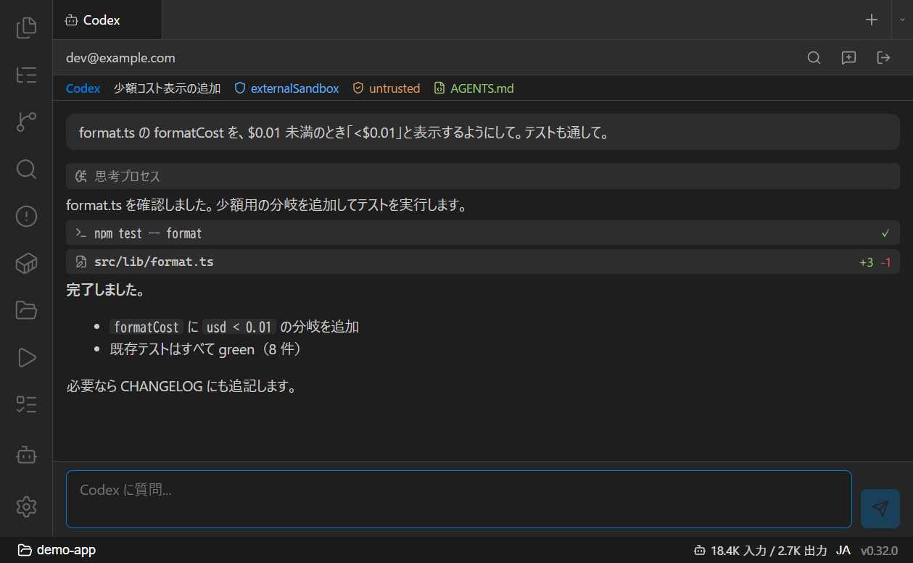

# ターミナルと AI エージェント

Pike は AI コーディングに特化しており、AI を **(A) ターミナルで直接使う** 運用と **(B) 専用チャットタブで使う** 運用の両方を、橋渡し機能とともにサポートします。

- [ターミナルの基本](#ターミナルの基本)
- [シェルの選択](#シェルの選択)
- [(A) ターミナルでエージェントを使う](#a-ターミナルでエージェントを使う)
  - [エージェント起動ボタン / プロンプト挿入](#エージェント起動ボタン--プロンプト挿入)
    - [過去のセッションを再開する](#過去のセッションを再開する)
  - [出力の file:line をクリックして開く](#出力の-fileline-をクリックして開く)
  - [エディタ選択範囲・診断をターミナルへ送る](#エディタ選択範囲診断をターミナルへ送る)
- [(B) エージェントチャットタブ](#b-エージェントチャットタブ)
- [トークン使用量とコスト](#トークン使用量とコスト)
  - [エージェント状態タブ](#エージェント状態タブ)
- [ターミナルの状態表示](#ターミナルの状態表示)
- [実行中のプロセスを巻き添えにしない](#実行中のプロセスを巻き添えにしない)

## ターミナルの基本

タブバーの `+` で新しいターミナルを開きます。ターミナルは xterm.js + PTY で動作し、`TERM=xterm-256color`（cmd 以外）で TUI も正しく描画されます。

- **コピー / 貼り付け**：選択でコピー、右クリックで貼り付け（設定で ON/OFF 切替可）。`Ctrl+V` も使えます。
- **リサイズ追従**：ウィンドウやペインのサイズに自動追従します。
- **フォント・配色**：設定タブの Terminal セクションで変更でき、既存ターミナルに即反映されます。→ [設定](settings.md)

## シェルの選択

プロジェクトの種別に応じて、以下のシェルに対応します。

- **WSL**：`wsl.exe [-d ディストロ] bash`
- **cmd**：`cmd.exe`
- **PowerShell**：`powershell.exe -NoLogo`（Windows PowerShell 5）
- **PowerShell 7**：`pwsh.exe -NoLogo`（PATH または既定のインストール先から自動検出）
- **Git Bash**：`C:\Program Files\Git\bin\bash.exe`（自動検出）

Windows プロジェクトでは、タブバーの `+` 横の **`▾`** からデフォルト以外のシェルも選んで開けます。

## (A) ターミナルでエージェントを使う

`claude` などをターミナルで使う運用を、Pike の既存機能（エディタ・診断）と橋渡しする一連の機能です。

### エージェント起動ボタン / プロンプト挿入

<picture>
  <source media="(prefers-color-scheme: light)" srcset="img/terminal-agent-buttons-light.png">
  
</picture>

ターミナル右上にフローティングのボタンが 2 つあります（vim/less などの全画面 TUI 中は自動的に隠れます）。

- **起動ボタン（左）**：クリックで設定済みの起動コマンド（例: `claude` / `claude --continue`）をそのまま実行します。`▾` で一覧から選べます。
- **プロンプト挿入ボタン（右）**：定型プロンプト（例: 「続けて」「上のコードを説明して」）を**挿入のみ・Enter なし**で入力欄に差し込みます（複数行も途中確定しません）。送信は自分で `Enter` を押します。

起動コマンド・定型プロンプトは設定タブの Terminal セクションで追加・編集・並べ替えできます。→ [設定](settings.md)

#### 過去のセッションを再開する

起動コマンドに `claude` を含めていると、`▾` の一覧の下に **最近の Claude セッション** が並びます。`claude -r` の選択画面と同じ顔ぶれで、Claude が付けたタイトル・最終更新の相対時刻・当時のブランチ名を表示します。選ぶとそのターミナルで `claude --resume <セッションID>` が走ります。

- 一覧は `~/.claude` に残るセッション記録から作ります。対象はそのターミナルの現在のディレクトリで、`cd` したあとは移動先のセッションが並びます。
- 対話で使ったセッションだけが並びます。`claude -p` 経由の実行（Pike が利用状況の取得に使うものを含む）は除外します。
- 読み込みは `▾` を開いたときだけ行います。

### 出力の file:line をクリックして開く

ターミナル出力に含まれる **`path:line`（必要なら `:col` も）** をクリックすると、その場所をエディタで開きます。

- 拡張子付きパスを検出します（誤検出を避けるため拡張子が必要）。
- `rg` / `grep` の見出し付き出力（ファイル名見出し＋行番号）にも対応します。
- 相対パスはプロジェクト（または選択中の worktree）のルートを起点に解決されます。

### エディタ選択範囲・診断をターミナルへ送る

逆方向の橋渡しもできます。送り先は「直近にアクティブだったターミナル → アクティブタブ → ピン留め → 任意」の順で自動解決されます。

- **エディタ**：テキストを選択して右クリック → 「ターミナルに送る」。`相対パス:行` の参照と選択本文が挿入されます。
- **Problems パネル**：各診断行のホバーで表示される **🤖** ボタンから、その問題の修正依頼文をターミナルへ送れます（UI 言語に追従）。

## (B) エージェントチャットタブ

Claude Code と Codex を、統一されたチャット UI で使えます。

<picture>
  <source media="(prefers-color-scheme: light)" srcset="img/agent-chat-light.png">
  
</picture>

- **新規チャット**：左サイドバー下部の **🤖** アイコン（Claude Code / Codex を選択）、またはコマンドパレットで `> Claude` / `> Codex`。
- **統一インターフェース**：Codex（app-server）と ACP 対応エージェント（Claude Code 等）を、同じチャットタブで扱います。エージェントの対応機能（モデル選択、認証バー、sandbox 設定など）に応じて UI が変化します。
- **ファイル参照**：入力欄に `@パス` でファイルをメンションできます。クリップボード/ドラッグ&ドロップでファイルを添付すると `.pike/uploads/` に保存され、`@パス` が挿入されます（小さいテキストは設定により内容を直接挿入も可能）。→ [サイドバーパネル](panels.md#ファイル添付クリップボード--ドラッグドロップ)
- **承認ダイアログ**：エージェントがコマンド実行などの承認を求めると、専用ダイアログが表示されます。
- **セッション復帰**：会話は各ツールの resume 機能で復帰します。

## トークン使用量とコスト

ステータスバーのメーターアイコンに、**5 時間枠の利用率**を表示します。クリックすると Claude と Codex の要約（アカウント・トークン合計・利用率）が開き、「詳細」からエージェント状態タブへ移動できます。

- **Claude Code**：`~/.claude` のログを解析して集計。あわせて `claude -p "/usage"` からサブスクリプションの**利用率（5 時間セッション枠と週間枠）**を取得し、「5時間 20%」のように表示します。取得には数十秒かかるため結果はキャッシュされ、Claude のセッションが動いている間は約 5 分ごと、動いていない間も約 1 時間ごとに更新されます。ドロップダウンの更新ボタンですぐに再取得もできます。
- **Codex（チャットタブ）**：アクティブな Codex チャットのセッション使用量を表示します。
- **複数アカウントの使い分け**：Claude Code の `CLAUDE_CONFIG_DIR` をシェルの設定ファイルか `.envrc` に書いていれば、Pike もその設定ディレクトリを見て集計します。Claude Code チャットタブも同じアカウントで起動します。ドロップダウンとエージェント状態タブにログイン中のアカウントが出るので、どのアカウントの数字かを確認できます。組織名と設定ディレクトリはタブ側に出ます。Windows のシェルでは Pike に引き継がれた環境変数を見るため、PowerShell のプロファイルの中だけで設定した値は反映されません。
- **間接 Codex（CLI）**：Pike を経由しない Codex も `~/.codex/sessions/...` を解析して集計します。Claude の codex スキルや、`codex` を呼ぶスクリプトが対象です。ステータスバーのドロップダウンとエージェント状態タブの両方に、直近 24 時間の集計が出ます。最終利用時刻はタブ側で確認できます。

### エージェント状態タブ

Claude と Codex の状態をまとめて見る画面です。サイドバー下部の歯車メニューの「エージェント状態」、ステータスバーのドロップダウンの「詳細」、エージェントチャットの上部のメーターアイコンから開きます。設定タブと同じく、開き直すと同じタブに戻ります。

Claude と Codex をそれぞれカードにして、次を並べます。

- ログイン中のアカウント（メールアドレス、組織、プラン）と設定ディレクトリ
- 利用率を枠ごとに帯グラフで。リセット時刻はその下
- トークンの内訳と推定コスト（Claude はモデル別、Codex は合計）

Codex のアカウントは `~/.codex/auth.json` から読みます。表示に使うのはメールアドレスとプランだけで、認証情報そのものは扱いません。

> WSL で動く `claude` のログは WSL ホーム側（`~/.claude`）に書かれるため、Pike は WSL 経由でそれを読みます。

## ターミナルの状態表示

- 非アクティブタブのターミナルがベル（BEL）を鳴らすと、タブに**ドット**が表示されます。エージェントやシェルが処理の完了・入力待ちを知らせるときに点きます。出力そのものでは点きません。
- プロセスが終了すると**終了コードのバッジ**が付きます（ピン留めしていないタブは終了 1 秒後に自動クローズ）。

## 実行中のプロセスを巻き添えにしない

シェル以外のプロセスが動いているターミナルを閉じようとすると、確認ダイアログが出ます。対象のターミナル名も表示するので、どれが動いているか分かります。プロンプトに戻っていれば確認は出ません。

確認が出る操作は次のとおりです。

- タブを閉じる（`✕` / `Ctrl+W`）
- 複数のタブをまとめて閉じる（他を閉じる / 右側を閉じる / すべて閉じる）
- プロジェクトを切り替える（全タブが閉じるため）
- ウィンドウを閉じる

設定の [閉じたときトレイに最小化](settings.md#全般) を切っている場合、最後のウィンドウの `✕` は Pike 自体の終了になります。このときは他のウィンドウを含めた実行中の件数を数えて確認します。他のウィンドウが残る `✕` は、そのウィンドウのタブだけを数えます。トレイに最小化する設定のままなら、メインウィンドウは隠れるだけでプロセスも動き続けるため、確認は出ません。

関連: [エディタとプレビュー](editor-and-preview.md) / [設定](settings.md) / [ショートカットと CLI](shortcuts-and-cli.md)
